<p align="center">
  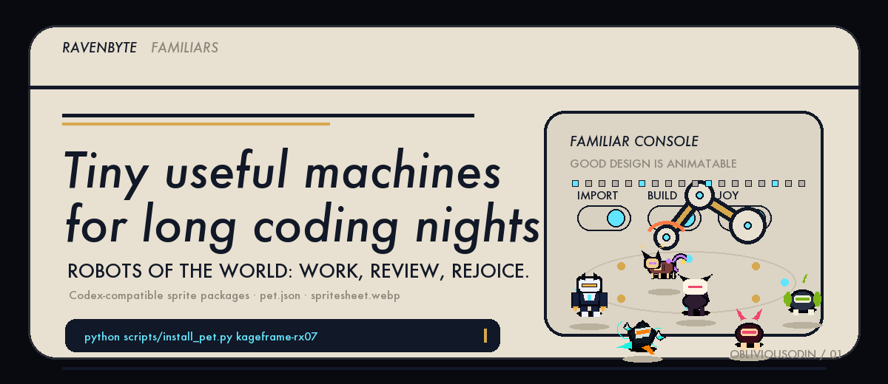
</p>

<p align="center">
  <strong>Tiny mythic coding companions for Codex-compatible and Open Design pet import workflows.</strong><br>
  Original animated familiars packaged with <code>pet.json</code> and <code>spritesheet.webp</code>.
</p>

<p align="center">
  <a href="#familiars">Familiars</a> ·
  <a href="#one-command-install">Install</a> ·
  <a href="#package-format">Package format</a> ·
  <a href="#variation-standard">Variation standard</a> ·
  <a href="#development-and-verification">Development</a>
</p>

---

## What this is

**Ravenbyte Familiars** is an **ObliviousOdin** sprite collection for long coding nights: raven-dark, rune-lit, wild-hearted little machines and spirits that can be imported through **Settings → Pets → Import Codex sprite**.

The repo is intentionally practical: each familiar ships as a complete import package, with animation previews, a per-familiar README, deterministic generation artifacts, and validation scripts.

## Design direction

The header animation is the visual north star: calm industrial product discipline, precise panels, useful machines, and tiny companions that make the workbench feel alive. The collection should feel premium and restrained, not childish or corporate.

| Principle | Meaning here |
| --- | --- |
| Useful first | Every familiar has a real importable package, not just preview art. |
| Less, but better | Strong silhouettes, few accents, readable motion at `64×64`. |
| More than idle | README cards use stitched showcase GIFs that move through idle, run, jump, review, fail, and wave states. |
| Original mythology | Broad mecha/spirit/adventure energy, no copied characters or logos. |
| Built to verify | `pet.json`, spritesheet dimensions, previews, showcase GIFs, and visual variation are checked before publishing. |

## Brand palette

| Token | Hex | Use |
| --- | --- | --- |
| Void Black | `#080A0F` | deep background |
| Raven Ink | `#111827` | panels and outlines |
| Bone White | `#E8E0D0` | readable text and masks |
| Rune Gold | `#D6A84F` | mythic accent |
| Plasma Cyan | `#62E6FF` | code energy and motion |
| Signal Ember | `#FF7A45` | warnings, failed states, sparks |

## Familiars

Each card below is a **stitched multi-motion showcase**, not a single idle loop. It cycles through several real rows from the import spritesheet so the README better reflects how each familiar behaves in Open Design.

<table>
<tr>
<td width="33%" align="center" valign="top">
  <a href="pets/kageframe-rx07/README.md">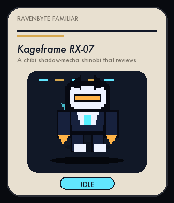</a><br>
  <strong>Kageframe RX-07</strong><br>
  <sub>A chibi shadow-mecha shinobi that reviews code with a plasma scarf.</sub><br>
  <a href="pets/kageframe-rx07/README.md">README</a> · <a href="pets/kageframe-rx07/spritesheet.webp">spritesheet</a>
</td>
<td width="33%" align="center" valign="top">
  <a href="pets/shuriken-byte-zero/README.md">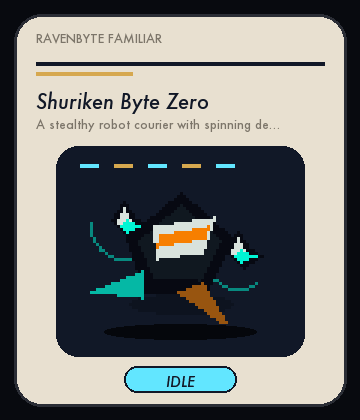</a><br>
  <strong>Shuriken Byte Zero</strong><br>
  <sub>A stealthy robot courier with spinning debug shuriken drones.</sub><br>
  <a href="pets/shuriken-byte-zero/README.md">README</a> · <a href="pets/shuriken-byte-zero/spritesheet.webp">spritesheet</a>
</td>
<td width="33%" align="center" valign="top">
  <a href="pets/ronin-build-fox/README.md">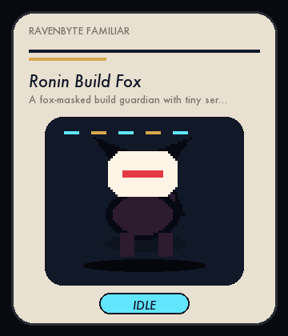</a><br>
  <strong>Ronin Build Fox</strong><br>
  <sub>A fox-masked build guardian with tiny servo tails and CI charms.</sub><br>
  <a href="pets/ronin-build-fox/README.md">README</a> · <a href="pets/ronin-build-fox/spritesheet.webp">spritesheet</a>
</td>
</tr>
<tr>
<td width="33%" align="center" valign="top">
  <a href="pets/compiler-oni-mini/README.md">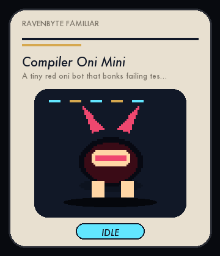</a><br>
  <strong>Compiler Oni Mini</strong><br>
  <sub>A tiny red oni bot that bonks failing tests with a foam kanabo.</sub><br>
  <a href="pets/compiler-oni-mini/README.md">README</a> · <a href="pets/compiler-oni-mini/spritesheet.webp">spritesheet</a>
</td>
<td width="33%" align="center" valign="top">
  <a href="pets/moonbase-tanuki-dev/README.md">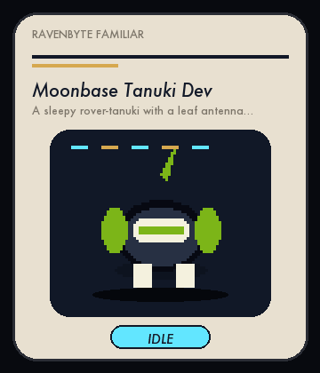</a><br>
  <strong>Moonbase Tanuki Dev</strong><br>
  <sub>A sleepy rover-tanuki with a leaf antenna and lunar debug pouches.</sub><br>
  <a href="pets/moonbase-tanuki-dev/README.md">README</a> · <a href="pets/moonbase-tanuki-dev/spritesheet.webp">spritesheet</a>
</td>
<td width="33%" align="center" valign="top">
  <a href="pets/karakuri-patch-cat/README.md">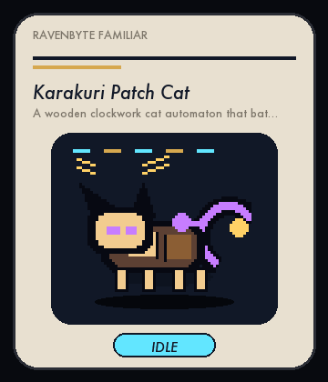</a><br>
  <strong>Karakuri Patch Cat</strong><br>
  <sub>A wooden clockwork cat automaton that bats TODOs into shape.</sub><br>
  <a href="pets/karakuri-patch-cat/README.md">README</a> · <a href="pets/karakuri-patch-cat/spritesheet.webp">spritesheet</a>
</td>
</tr>
<tr>
<td width="33%" align="center" valign="top">
  <a href="pets/lotus-firewall-monk/README.md">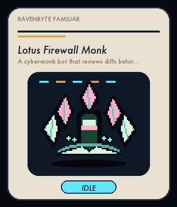</a><br>
  <strong>Lotus Firewall Monk</strong><br>
  <sub>A cyber-monk bot that reviews diffs behind shield-petal armor.</sub><br>
  <a href="pets/lotus-firewall-monk/README.md">README</a> · <a href="pets/lotus-firewall-monk/spritesheet.webp">spritesheet</a>
</td>
<td width="33%" align="center" valign="top">
  <a href="pets/nebula-courier-mech/README.md">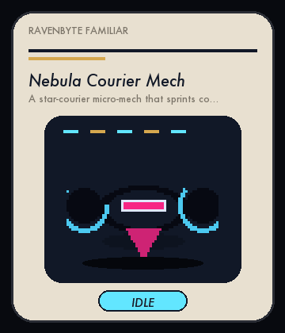</a><br>
  <strong>Nebula Courier Mech</strong><br>
  <sub>A star-courier micro-mech that sprints commits through hyperspace.</sub><br>
  <a href="pets/nebula-courier-mech/README.md">README</a> · <a href="pets/nebula-courier-mech/spritesheet.webp">spritesheet</a>
</td>
<td width="33%" align="center" valign="top">
  <a href="pets/origami-test-heron/README.md">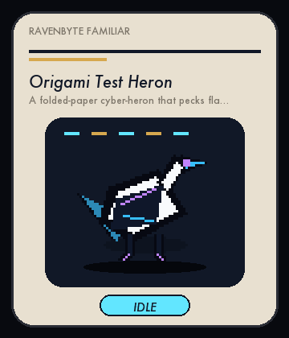</a><br>
  <strong>Origami Test Heron</strong><br>
  <sub>A folded-paper cyber-heron that pecks flaky tests until they settle.</sub><br>
  <a href="pets/origami-test-heron/README.md">README</a> · <a href="pets/origami-test-heron/spritesheet.webp">spritesheet</a>
</td>
</tr>
<tr>
<td width="33%" align="center" valign="top">
  <a href="pets/ramen-debug-drone/README.md">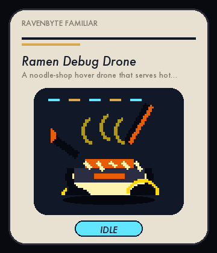</a><br>
  <strong>Ramen Debug Drone</strong><br>
  <sub>A noodle-shop hover drone that serves hot fixes in a tiny bowl.</sub><br>
  <a href="pets/ramen-debug-drone/README.md">README</a> · <a href="pets/ramen-debug-drone/spritesheet.webp">spritesheet</a>
</td>
<td width="33%" align="center" valign="top">
  <a href="pets/ravenbyte-001-ash-delta-beetle/README.md">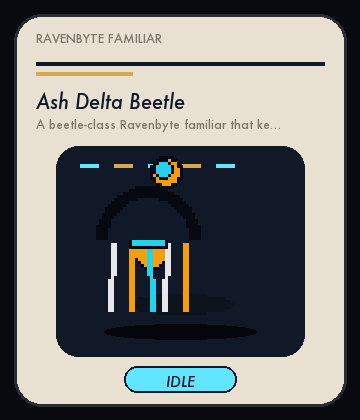</a><br>
  <strong>Ash Delta Beetle</strong><br>
  <sub>A beetle-class Ravenbyte familiar that keeps delta work moving during long coding runs.</sub><br>
  <a href="pets/ravenbyte-001-ash-delta-beetle/README.md">README</a> · <a href="pets/ravenbyte-001-ash-delta-beetle/spritesheet.webp">spritesheet</a>
</td>
<td width="33%" align="center" valign="top">
  <a href="pets/ravenbyte-002-basilisk-graph-lantern/README.md">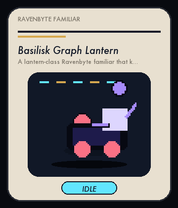</a><br>
  <strong>Basilisk Graph Lantern</strong><br>
  <sub>A lantern-class Ravenbyte familiar that keeps graph work moving during long coding runs.</sub><br>
  <a href="pets/ravenbyte-002-basilisk-graph-lantern/README.md">README</a> · <a href="pets/ravenbyte-002-basilisk-graph-lantern/spritesheet.webp">spritesheet</a>
</td>
</tr>
<tr>
<td width="33%" align="center" valign="top">
  <a href="pets/ravenbyte-003-cipher-junction-crawler/README.md">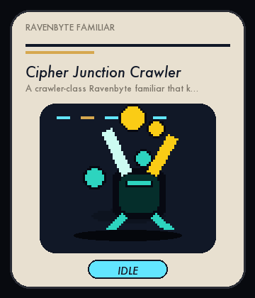</a><br>
  <strong>Cipher Junction Crawler</strong><br>
  <sub>A crawler-class Ravenbyte familiar that keeps junction work moving during long coding runs.</sub><br>
  <a href="pets/ravenbyte-003-cipher-junction-crawler/README.md">README</a> · <a href="pets/ravenbyte-003-cipher-junction-crawler/spritesheet.webp">spritesheet</a>
</td>
<td width="33%" align="center" valign="top">
  <a href="pets/ravenbyte-004-dawn-monitor-kite/README.md">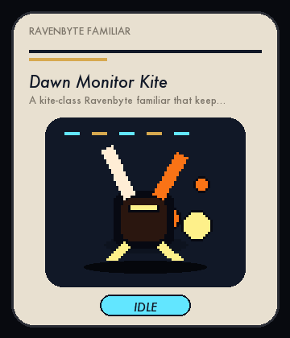</a><br>
  <strong>Dawn Monitor Kite</strong><br>
  <sub>A kite-class Ravenbyte familiar that keeps monitor work moving during long coding runs.</sub><br>
  <a href="pets/ravenbyte-004-dawn-monitor-kite/README.md">README</a> · <a href="pets/ravenbyte-004-dawn-monitor-kite/spritesheet.webp">spritesheet</a>
</td>
<td width="33%" align="center" valign="top">
  <a href="pets/ravenbyte-005-ember-patch-totem/README.md">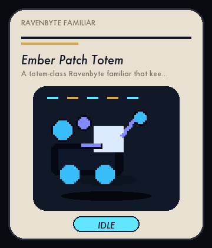</a><br>
  <strong>Ember Patch Totem</strong><br>
  <sub>A totem-class Ravenbyte familiar that keeps patch work moving during long coding runs.</sub><br>
  <a href="pets/ravenbyte-005-ember-patch-totem/README.md">README</a> · <a href="pets/ravenbyte-005-ember-patch-totem/spritesheet.webp">spritesheet</a>
</td>
</tr>
<tr>
<td width="33%" align="center" valign="top">
  <a href="pets/ravenbyte-006-frost-sentinel-serpent/README.md">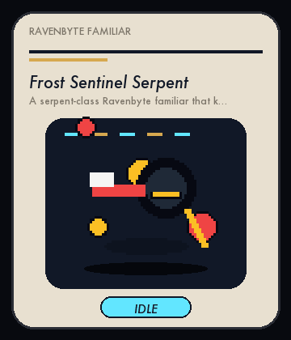</a><br>
  <strong>Frost Sentinel Serpent</strong><br>
  <sub>A serpent-class Ravenbyte familiar that keeps sentinel work moving during long coding runs.</sub><br>
  <a href="pets/ravenbyte-006-frost-sentinel-serpent/README.md">README</a> · <a href="pets/ravenbyte-006-frost-sentinel-serpent/spritesheet.webp">spritesheet</a>
</td>
<td width="33%" align="center" valign="top">
  <a href="pets/ravenbyte-007-glyph-vector-crystal/README.md">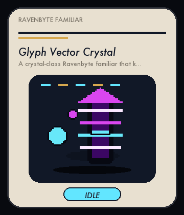</a><br>
  <strong>Glyph Vector Crystal</strong><br>
  <sub>A crystal-class Ravenbyte familiar that keeps vector work moving during long coding runs.</sub><br>
  <a href="pets/ravenbyte-007-glyph-vector-crystal/README.md">README</a> · <a href="pets/ravenbyte-007-glyph-vector-crystal/spritesheet.webp">spritesheet</a>
</td>
<td width="33%" align="center" valign="top">
  <a href="pets/ravenbyte-008-harbor-yield-wheel/README.md">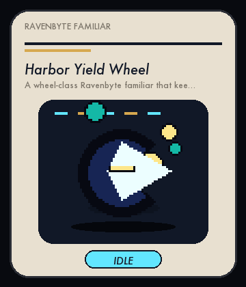</a><br>
  <strong>Harbor Yield Wheel</strong><br>
  <sub>A wheel-class Ravenbyte familiar that keeps yield work moving during long coding runs.</sub><br>
  <a href="pets/ravenbyte-008-harbor-yield-wheel/README.md">README</a> · <a href="pets/ravenbyte-008-harbor-yield-wheel/spritesheet.webp">spritesheet</a>
</td>
</tr>
<tr>
<td width="33%" align="center" valign="top">
  <a href="pets/ravenbyte-009-ion-circuit-mushroom/README.md">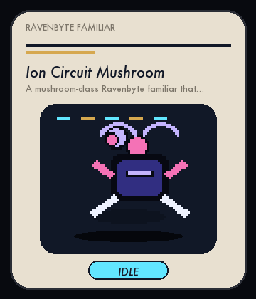</a><br>
  <strong>Ion Circuit Mushroom</strong><br>
  <sub>A mushroom-class Ravenbyte familiar that keeps circuit work moving during long coding runs.</sub><br>
  <a href="pets/ravenbyte-009-ion-circuit-mushroom/README.md">README</a> · <a href="pets/ravenbyte-009-ion-circuit-mushroom/spritesheet.webp">spritesheet</a>
</td>
<td width="33%" align="center" valign="top">
  <a href="pets/ravenbyte-010-jade-flux-mask/README.md">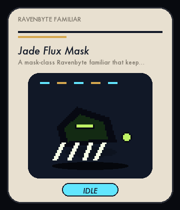</a><br>
  <strong>Jade Flux Mask</strong><br>
  <sub>A mask-class Ravenbyte familiar that keeps flux work moving during long coding runs.</sub><br>
  <a href="pets/ravenbyte-010-jade-flux-mask/README.md">README</a> · <a href="pets/ravenbyte-010-jade-flux-mask/spritesheet.webp">spritesheet</a>
</td>
<td width="33%" align="center" valign="top">
  <a href="pets/ravenbyte-011-keystone-beacon-train/README.md">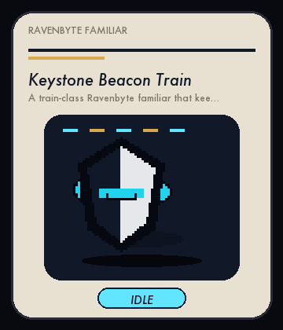</a><br>
  <strong>Keystone Beacon Train</strong><br>
  <sub>A train-class Ravenbyte familiar that keeps beacon work moving during long coding runs.</sub><br>
  <a href="pets/ravenbyte-011-keystone-beacon-train/README.md">README</a> · <a href="pets/ravenbyte-011-keystone-beacon-train/spritesheet.webp">spritesheet</a>
</td>
</tr>
<tr>
<td width="33%" align="center" valign="top">
  <a href="pets/ravenbyte-012-lumen-engine-manta/README.md">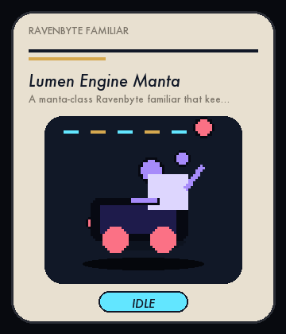</a><br>
  <strong>Lumen Engine Manta</strong><br>
  <sub>A manta-class Ravenbyte familiar that keeps engine work moving during long coding runs.</sub><br>
  <a href="pets/ravenbyte-012-lumen-engine-manta/README.md">README</a> · <a href="pets/ravenbyte-012-lumen-engine-manta/spritesheet.webp">spritesheet</a>
</td>
<td width="33%" align="center" valign="top">
  <a href="pets/ravenbyte-013-morrow-harvester-book/README.md">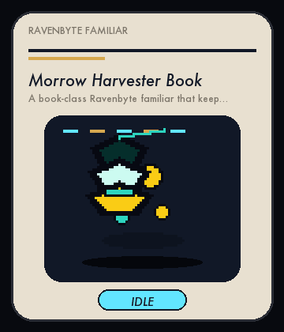</a><br>
  <strong>Morrow Harvester Book</strong><br>
  <sub>A book-class Ravenbyte familiar that keeps harvester work moving during long coding runs.</sub><br>
  <a href="pets/ravenbyte-013-morrow-harvester-book/README.md">README</a> · <a href="pets/ravenbyte-013-morrow-harvester-book/spritesheet.webp">spritesheet</a>
</td>
<td width="33%" align="center" valign="top">
  <a href="pets/ravenbyte-014-nimbus-kernel-key/README.md">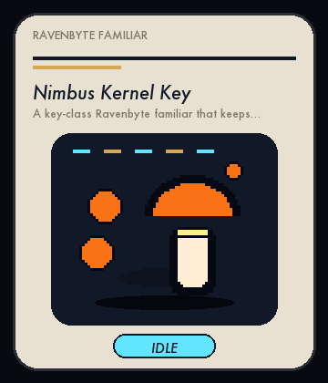</a><br>
  <strong>Nimbus Kernel Key</strong><br>
  <sub>A key-class Ravenbyte familiar that keeps kernel work moving during long coding runs.</sub><br>
  <a href="pets/ravenbyte-014-nimbus-kernel-key/README.md">README</a> · <a href="pets/ravenbyte-014-nimbus-kernel-key/spritesheet.webp">spritesheet</a>
</td>
</tr>
<tr>
<td width="33%" align="center" valign="top">
  <a href="pets/ravenbyte-015-obsidian-nexus-jelly/README.md">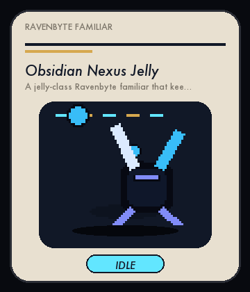</a><br>
  <strong>Obsidian Nexus Jelly</strong><br>
  <sub>A jelly-class Ravenbyte familiar that keeps nexus work moving during long coding runs.</sub><br>
  <a href="pets/ravenbyte-015-obsidian-nexus-jelly/README.md">README</a> · <a href="pets/ravenbyte-015-obsidian-nexus-jelly/spritesheet.webp">spritesheet</a>
</td>
<td width="33%" align="center" valign="top">
  <a href="pets/ravenbyte-016-prairie-query-rabbit/README.md">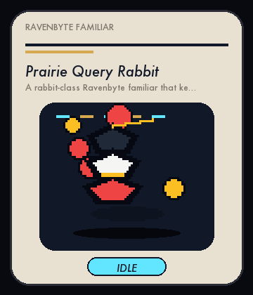</a><br>
  <strong>Prairie Query Rabbit</strong><br>
  <sub>A rabbit-class Ravenbyte familiar that keeps query work moving during long coding runs.</sub><br>
  <a href="pets/ravenbyte-016-prairie-query-rabbit/README.md">README</a> · <a href="pets/ravenbyte-016-prairie-query-rabbit/spritesheet.webp">spritesheet</a>
</td>
<td width="33%" align="center" valign="top">
  <a href="pets/ravenbyte-017-quartz-triage-beetle/README.md">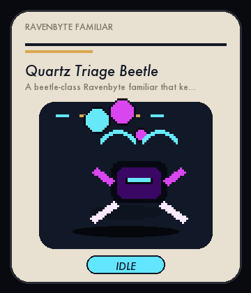</a><br>
  <strong>Quartz Triage Beetle</strong><br>
  <sub>A beetle-class Ravenbyte familiar that keeps triage work moving during long coding runs.</sub><br>
  <a href="pets/ravenbyte-017-quartz-triage-beetle/README.md">README</a> · <a href="pets/ravenbyte-017-quartz-triage-beetle/spritesheet.webp">spritesheet</a>
</td>
</tr>
<tr>
<td width="33%" align="center" valign="top">
  <a href="pets/ravenbyte-018-rune-widget-lantern/README.md">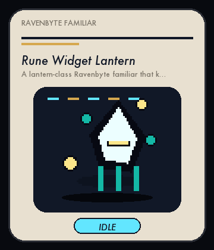</a><br>
  <strong>Rune Widget Lantern</strong><br>
  <sub>A lantern-class Ravenbyte familiar that keeps widget work moving during long coding runs.</sub><br>
  <a href="pets/ravenbyte-018-rune-widget-lantern/README.md">README</a> · <a href="pets/ravenbyte-018-rune-widget-lantern/spritesheet.webp">spritesheet</a>
</td>
<td width="33%" align="center" valign="top">
  <a href="pets/ravenbyte-019-signal-zenith-crawler/README.md">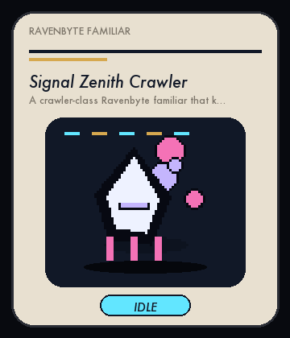</a><br>
  <strong>Signal Zenith Crawler</strong><br>
  <sub>A crawler-class Ravenbyte familiar that keeps zenith work moving during long coding runs.</sub><br>
  <a href="pets/ravenbyte-019-signal-zenith-crawler/README.md">README</a> · <a href="pets/ravenbyte-019-signal-zenith-crawler/spritesheet.webp">spritesheet</a>
</td>
<td width="33%" align="center" valign="top">
  <a href="pets/ravenbyte-020-tundra-diff-kite/README.md">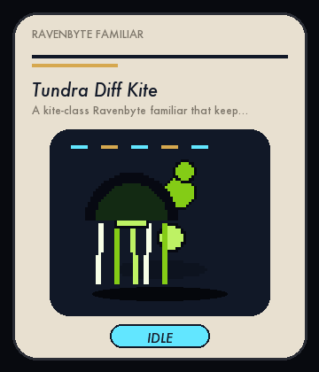</a><br>
  <strong>Tundra Diff Kite</strong><br>
  <sub>A kite-class Ravenbyte familiar that keeps diff work moving during long coding runs.</sub><br>
  <a href="pets/ravenbyte-020-tundra-diff-kite/README.md">README</a> · <a href="pets/ravenbyte-020-tundra-diff-kite/spritesheet.webp">spritesheet</a>
</td>
</tr>
<tr>
<td width="33%" align="center" valign="top">
  <a href="pets/ravenbyte-021-umber-gate-totem/README.md">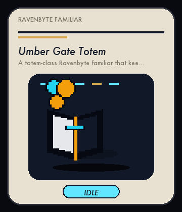</a><br>
  <strong>Umber Gate Totem</strong><br>
  <sub>A totem-class Ravenbyte familiar that keeps gate work moving during long coding runs.</sub><br>
  <a href="pets/ravenbyte-021-umber-gate-totem/README.md">README</a> · <a href="pets/ravenbyte-021-umber-gate-totem/spritesheet.webp">spritesheet</a>
</td>
<td width="33%" align="center" valign="top">
  <a href="pets/ravenbyte-022-violet-cache-serpent/README.md">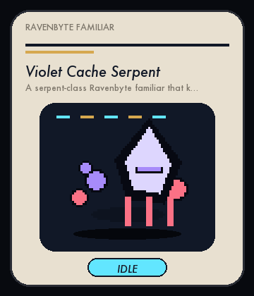</a><br>
  <strong>Violet Cache Serpent</strong><br>
  <sub>A serpent-class Ravenbyte familiar that keeps cache work moving during long coding runs.</sub><br>
  <a href="pets/ravenbyte-022-violet-cache-serpent/README.md">README</a> · <a href="pets/ravenbyte-022-violet-cache-serpent/spritesheet.webp">spritesheet</a>
</td>
<td width="33%" align="center" valign="top">
  <a href="pets/ravenbyte-023-warden-forge-crystal/README.md">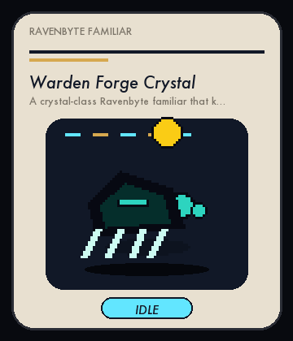</a><br>
  <strong>Warden Forge Crystal</strong><br>
  <sub>A crystal-class Ravenbyte familiar that keeps forge work moving during long coding runs.</sub><br>
  <a href="pets/ravenbyte-023-warden-forge-crystal/README.md">README</a> · <a href="pets/ravenbyte-023-warden-forge-crystal/spritesheet.webp">spritesheet</a>
</td>
</tr>
<tr>
<td width="33%" align="center" valign="top">
  <a href="pets/ravenbyte-024-xenon-index-wheel/README.md">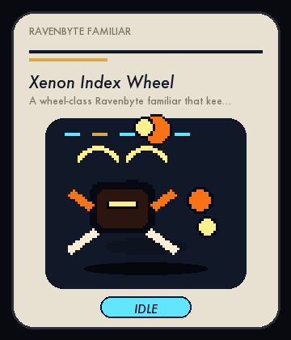</a><br>
  <strong>Xenon Index Wheel</strong><br>
  <sub>A wheel-class Ravenbyte familiar that keeps index work moving during long coding runs.</sub><br>
  <a href="pets/ravenbyte-024-xenon-index-wheel/README.md">README</a> · <a href="pets/ravenbyte-024-xenon-index-wheel/spritesheet.webp">spritesheet</a>
</td>
<td width="33%" align="center" valign="top">
  <a href="pets/ravenbyte-025-yonder-latch-mushroom/README.md">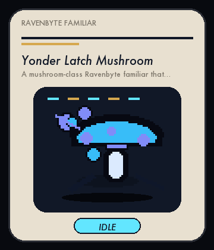</a><br>
  <strong>Yonder Latch Mushroom</strong><br>
  <sub>A mushroom-class Ravenbyte familiar that keeps latch work moving during long coding runs.</sub><br>
  <a href="pets/ravenbyte-025-yonder-latch-mushroom/README.md">README</a> · <a href="pets/ravenbyte-025-yonder-latch-mushroom/spritesheet.webp">spritesheet</a>
</td>
<td width="33%" align="center" valign="top">
  <a href="pets/ravenbyte-026-zephyr-oracle-mask/README.md">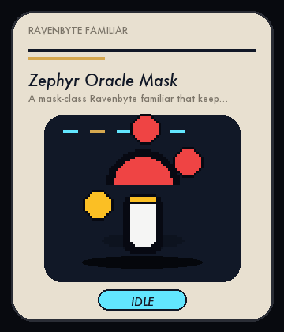</a><br>
  <strong>Zephyr Oracle Mask</strong><br>
  <sub>A mask-class Ravenbyte familiar that keeps oracle work moving during long coding runs.</sub><br>
  <a href="pets/ravenbyte-026-zephyr-oracle-mask/README.md">README</a> · <a href="pets/ravenbyte-026-zephyr-oracle-mask/spritesheet.webp">spritesheet</a>
</td>
</tr>
<tr>
<td width="33%" align="center" valign="top">
  <a href="pets/ravenbyte-027-brass-relay-train/README.md">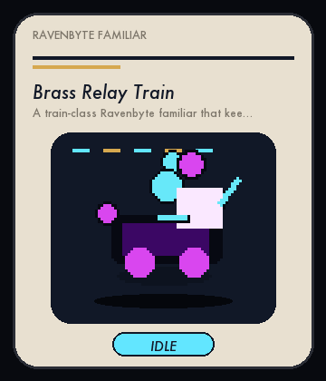</a><br>
  <strong>Brass Relay Train</strong><br>
  <sub>A train-class Ravenbyte familiar that keeps relay work moving during long coding runs.</sub><br>
  <a href="pets/ravenbyte-027-brass-relay-train/README.md">README</a> · <a href="pets/ravenbyte-027-brass-relay-train/spritesheet.webp">spritesheet</a>
</td>
<td width="33%" align="center" valign="top">
  <a href="pets/ravenbyte-028-cobalt-uplink-manta/README.md">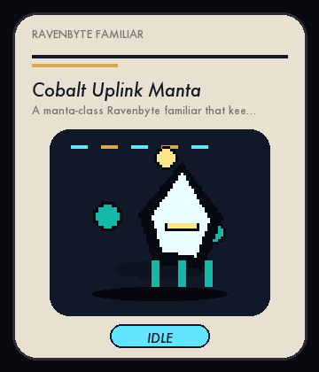</a><br>
  <strong>Cobalt Uplink Manta</strong><br>
  <sub>A manta-class Ravenbyte familiar that keeps uplink work moving during long coding runs.</sub><br>
  <a href="pets/ravenbyte-028-cobalt-uplink-manta/README.md">README</a> · <a href="pets/ravenbyte-028-cobalt-uplink-manta/spritesheet.webp">spritesheet</a>
</td>
<td width="33%" align="center" valign="top">
  <a href="pets/ravenbyte-029-drift-xray-book/README.md">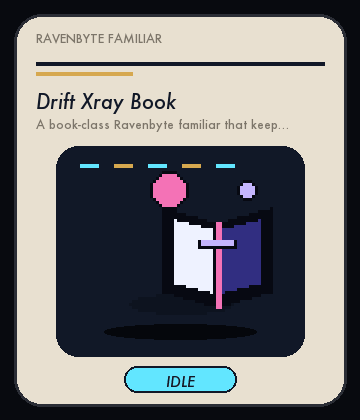</a><br>
  <strong>Drift Xray Book</strong><br>
  <sub>A book-class Ravenbyte familiar that keeps xray work moving during long coding runs.</sub><br>
  <a href="pets/ravenbyte-029-drift-xray-book/README.md">README</a> · <a href="pets/ravenbyte-029-drift-xray-book/spritesheet.webp">spritesheet</a>
</td>
</tr>
<tr>
<td width="33%" align="center" valign="top">
  <a href="pets/ravenbyte-030-echo-bundle-key/README.md">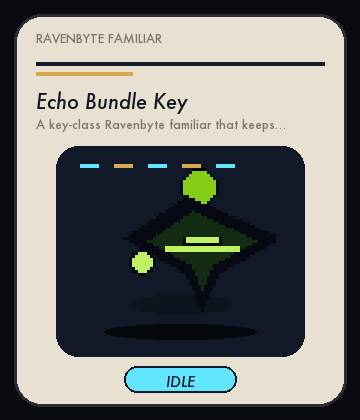</a><br>
  <strong>Echo Bundle Key</strong><br>
  <sub>A key-class Ravenbyte familiar that keeps bundle work moving during long coding runs.</sub><br>
  <a href="pets/ravenbyte-030-echo-bundle-key/README.md">README</a> · <a href="pets/ravenbyte-030-echo-bundle-key/spritesheet.webp">spritesheet</a>
</td>
<td width="33%" align="center" valign="top">
  <a href="pets/ravenbyte-031-fable-event-jelly/README.md">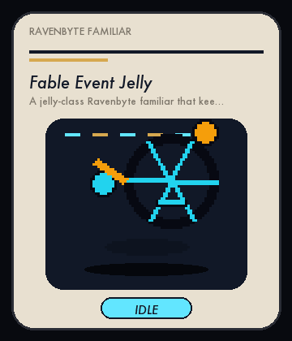</a><br>
  <strong>Fable Event Jelly</strong><br>
  <sub>A jelly-class Ravenbyte familiar that keeps event work moving during long coding runs.</sub><br>
  <a href="pets/ravenbyte-031-fable-event-jelly/README.md">README</a> · <a href="pets/ravenbyte-031-fable-event-jelly/spritesheet.webp">spritesheet</a>
</td>
<td width="33%" align="center" valign="top">
  <a href="pets/ravenbyte-032-grove-audit-rabbit/README.md">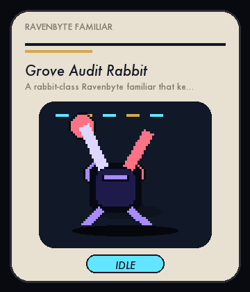</a><br>
  <strong>Grove Audit Rabbit</strong><br>
  <sub>A rabbit-class Ravenbyte familiar that keeps audit work moving during long coding runs.</sub><br>
  <a href="pets/ravenbyte-032-grove-audit-rabbit/README.md">README</a> · <a href="pets/ravenbyte-032-grove-audit-rabbit/spritesheet.webp">spritesheet</a>
</td>
</tr>
<tr>
<td width="33%" align="center" valign="top">
  <a href="pets/ravenbyte-033-ash-engine-beetle/README.md">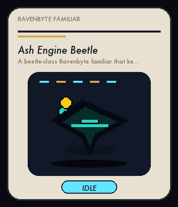</a><br>
  <strong>Ash Engine Beetle</strong><br>
  <sub>A beetle-class Ravenbyte familiar that keeps engine work moving during long coding runs.</sub><br>
  <a href="pets/ravenbyte-033-ash-engine-beetle/README.md">README</a> · <a href="pets/ravenbyte-033-ash-engine-beetle/spritesheet.webp">spritesheet</a>
</td>
<td width="33%" align="center" valign="top">
  <a href="pets/ravenbyte-034-basilisk-harvester-lantern/README.md">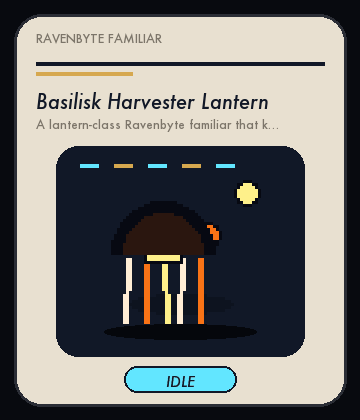</a><br>
  <strong>Basilisk Harvester Lantern</strong><br>
  <sub>A lantern-class Ravenbyte familiar that keeps harvester work moving during long coding runs.</sub><br>
  <a href="pets/ravenbyte-034-basilisk-harvester-lantern/README.md">README</a> · <a href="pets/ravenbyte-034-basilisk-harvester-lantern/spritesheet.webp">spritesheet</a>
</td>
<td width="33%" align="center" valign="top">
  <a href="pets/ravenbyte-035-cipher-kernel-crawler/README.md">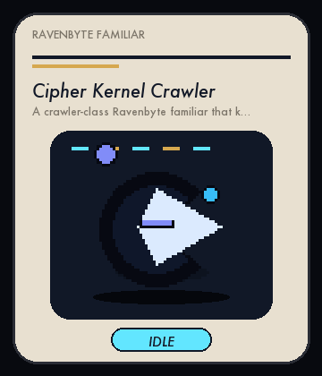</a><br>
  <strong>Cipher Kernel Crawler</strong><br>
  <sub>A crawler-class Ravenbyte familiar that keeps kernel work moving during long coding runs.</sub><br>
  <a href="pets/ravenbyte-035-cipher-kernel-crawler/README.md">README</a> · <a href="pets/ravenbyte-035-cipher-kernel-crawler/spritesheet.webp">spritesheet</a>
</td>
</tr>
<tr>
<td width="33%" align="center" valign="top">
  <a href="pets/ravenbyte-036-dawn-nexus-kite/README.md">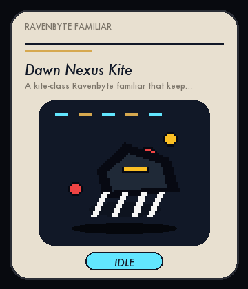</a><br>
  <strong>Dawn Nexus Kite</strong><br>
  <sub>A kite-class Ravenbyte familiar that keeps nexus work moving during long coding runs.</sub><br>
  <a href="pets/ravenbyte-036-dawn-nexus-kite/README.md">README</a> · <a href="pets/ravenbyte-036-dawn-nexus-kite/spritesheet.webp">spritesheet</a>
</td>
<td width="33%" align="center" valign="top">
  <a href="pets/ravenbyte-037-ember-query-totem/README.md">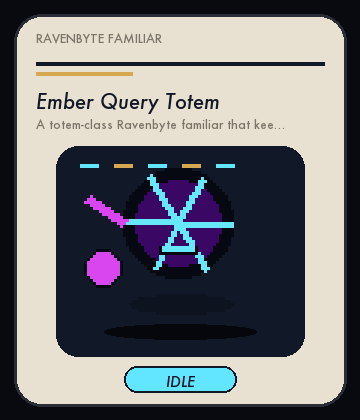</a><br>
  <strong>Ember Query Totem</strong><br>
  <sub>A totem-class Ravenbyte familiar that keeps query work moving during long coding runs.</sub><br>
  <a href="pets/ravenbyte-037-ember-query-totem/README.md">README</a> · <a href="pets/ravenbyte-037-ember-query-totem/spritesheet.webp">spritesheet</a>
</td>
<td width="33%" align="center" valign="top">
  <a href="pets/ravenbyte-038-frost-triage-serpent/README.md">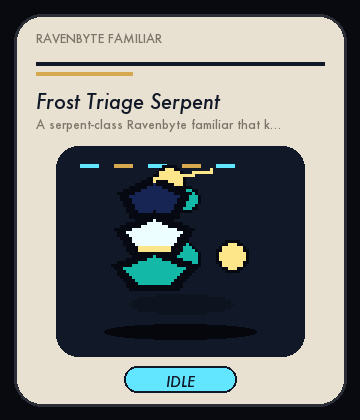</a><br>
  <strong>Frost Triage Serpent</strong><br>
  <sub>A serpent-class Ravenbyte familiar that keeps triage work moving during long coding runs.</sub><br>
  <a href="pets/ravenbyte-038-frost-triage-serpent/README.md">README</a> · <a href="pets/ravenbyte-038-frost-triage-serpent/spritesheet.webp">spritesheet</a>
</td>
</tr>
<tr>
<td width="33%" align="center" valign="top">
  <a href="pets/ravenbyte-039-glyph-widget-crystal/README.md">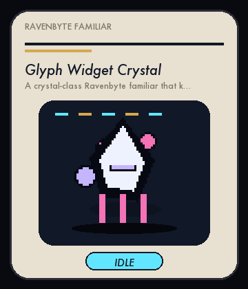</a><br>
  <strong>Glyph Widget Crystal</strong><br>
  <sub>A crystal-class Ravenbyte familiar that keeps widget work moving during long coding runs.</sub><br>
  <a href="pets/ravenbyte-039-glyph-widget-crystal/README.md">README</a> · <a href="pets/ravenbyte-039-glyph-widget-crystal/spritesheet.webp">spritesheet</a>
</td>
<td width="33%" align="center" valign="top">
  <a href="pets/ravenbyte-040-harbor-zenith-wheel/README.md"></a><br>
  <strong>Harbor Zenith Wheel</strong><br>
  <sub>A wheel-class Ravenbyte familiar that keeps zenith work moving during long coding runs.</sub><br>
  <a href="pets/ravenbyte-040-harbor-zenith-wheel/README.md">README</a> · <a href="pets/ravenbyte-040-harbor-zenith-wheel/spritesheet.webp">spritesheet</a>
</td>
<td width="33%" align="center" valign="top">
  <a href="pets/ravenbyte-041-ion-diff-mushroom/README.md"></a><br>
  <strong>Ion Diff Mushroom</strong><br>
  <sub>A mushroom-class Ravenbyte familiar that keeps diff work moving during long coding runs.</sub><br>
  <a href="pets/ravenbyte-041-ion-diff-mushroom/README.md">README</a> · <a href="pets/ravenbyte-041-ion-diff-mushroom/spritesheet.webp">spritesheet</a>
</td>
</tr>
<tr>
<td width="33%" align="center" valign="top">
  <a href="pets/ravenbyte-042-jade-gate-mask/README.md"></a><br>
  <strong>Jade Gate Mask</strong><br>
  <sub>A mask-class Ravenbyte familiar that keeps gate work moving during long coding runs.</sub><br>
  <a href="pets/ravenbyte-042-jade-gate-mask/README.md">README</a> · <a href="pets/ravenbyte-042-jade-gate-mask/spritesheet.webp">spritesheet</a>
</td>
<td width="33%" align="center" valign="top">
  <a href="pets/ravenbyte-043-keystone-cache-train/README.md"></a><br>
  <strong>Keystone Cache Train</strong><br>
  <sub>A train-class Ravenbyte familiar that keeps cache work moving during long coding runs.</sub><br>
  <a href="pets/ravenbyte-043-keystone-cache-train/README.md">README</a> · <a href="pets/ravenbyte-043-keystone-cache-train/spritesheet.webp">spritesheet</a>
</td>
<td width="33%" align="center" valign="top">
  <a href="pets/ravenbyte-044-lumen-forge-manta/README.md"></a><br>
  <strong>Lumen Forge Manta</strong><br>
  <sub>A manta-class Ravenbyte familiar that keeps forge work moving during long coding runs.</sub><br>
  <a href="pets/ravenbyte-044-lumen-forge-manta/README.md">README</a> · <a href="pets/ravenbyte-044-lumen-forge-manta/spritesheet.webp">spritesheet</a>
</td>
</tr>
<tr>
<td width="33%" align="center" valign="top">
  <a href="pets/ravenbyte-045-morrow-index-book/README.md"></a><br>
  <strong>Morrow Index Book</strong><br>
  <sub>A book-class Ravenbyte familiar that keeps index work moving during long coding runs.</sub><br>
  <a href="pets/ravenbyte-045-morrow-index-book/README.md">README</a> · <a href="pets/ravenbyte-045-morrow-index-book/spritesheet.webp">spritesheet</a>
</td>
<td width="33%" align="center" valign="top">
  <a href="pets/ravenbyte-046-nimbus-latch-key/README.md"></a><br>
  <strong>Nimbus Latch Key</strong><br>
  <sub>A key-class Ravenbyte familiar that keeps latch work moving during long coding runs.</sub><br>
  <a href="pets/ravenbyte-046-nimbus-latch-key/README.md">README</a> · <a href="pets/ravenbyte-046-nimbus-latch-key/spritesheet.webp">spritesheet</a>
</td>
<td width="33%" align="center" valign="top">
  <a href="pets/ravenbyte-047-obsidian-oracle-jelly/README.md"></a><br>
  <strong>Obsidian Oracle Jelly</strong><br>
  <sub>A jelly-class Ravenbyte familiar that keeps oracle work moving during long coding runs.</sub><br>
  <a href="pets/ravenbyte-047-obsidian-oracle-jelly/README.md">README</a> · <a href="pets/ravenbyte-047-obsidian-oracle-jelly/spritesheet.webp">spritesheet</a>
</td>
</tr>
<tr>
<td width="33%" align="center" valign="top">
  <a href="pets/ravenbyte-048-prairie-relay-rabbit/README.md"></a><br>
  <strong>Prairie Relay Rabbit</strong><br>
  <sub>A rabbit-class Ravenbyte familiar that keeps relay work moving during long coding runs.</sub><br>
  <a href="pets/ravenbyte-048-prairie-relay-rabbit/README.md">README</a> · <a href="pets/ravenbyte-048-prairie-relay-rabbit/spritesheet.webp">spritesheet</a>
</td>
<td width="33%" align="center" valign="top">
  <a href="pets/ravenbyte-049-quartz-uplink-beetle/README.md"></a><br>
  <strong>Quartz Uplink Beetle</strong><br>
  <sub>A beetle-class Ravenbyte familiar that keeps uplink work moving during long coding runs.</sub><br>
  <a href="pets/ravenbyte-049-quartz-uplink-beetle/README.md">README</a> · <a href="pets/ravenbyte-049-quartz-uplink-beetle/spritesheet.webp">spritesheet</a>
</td>
<td width="33%" align="center" valign="top">
  <a href="pets/ravenbyte-050-rune-xray-lantern/README.md"></a><br>
  <strong>Rune Xray Lantern</strong><br>
  <sub>A lantern-class Ravenbyte familiar that keeps xray work moving during long coding runs.</sub><br>
  <a href="pets/ravenbyte-050-rune-xray-lantern/README.md">README</a> · <a href="pets/ravenbyte-050-rune-xray-lantern/spritesheet.webp">spritesheet</a>
</td>
</tr>
<tr>
<td width="33%" align="center" valign="top">
  <a href="pets/ravenbyte-051-signal-bundle-crawler/README.md"></a><br>
  <strong>Signal Bundle Crawler</strong><br>
  <sub>A crawler-class Ravenbyte familiar that keeps bundle work moving during long coding runs.</sub><br>
  <a href="pets/ravenbyte-051-signal-bundle-crawler/README.md">README</a> · <a href="pets/ravenbyte-051-signal-bundle-crawler/spritesheet.webp">spritesheet</a>
</td>
<td width="33%" align="center" valign="top">
  <a href="pets/ravenbyte-052-tundra-event-kite/README.md"></a><br>
  <strong>Tundra Event Kite</strong><br>
  <sub>A kite-class Ravenbyte familiar that keeps event work moving during long coding runs.</sub><br>
  <a href="pets/ravenbyte-052-tundra-event-kite/README.md">README</a> · <a href="pets/ravenbyte-052-tundra-event-kite/spritesheet.webp">spritesheet</a>
</td>
<td width="33%" align="center" valign="top">
  <a href="pets/ravenbyte-053-umber-audit-totem/README.md"></a><br>
  <strong>Umber Audit Totem</strong><br>
  <sub>A totem-class Ravenbyte familiar that keeps audit work moving during long coding runs.</sub><br>
  <a href="pets/ravenbyte-053-umber-audit-totem/README.md">README</a> · <a href="pets/ravenbyte-053-umber-audit-totem/spritesheet.webp">spritesheet</a>
</td>
</tr>
<tr>
<td width="33%" align="center" valign="top">
  <a href="pets/ravenbyte-054-violet-delta-serpent/README.md"></a><br>
  <strong>Violet Delta Serpent</strong><br>
  <sub>A serpent-class Ravenbyte familiar that keeps delta work moving during long coding runs.</sub><br>
  <a href="pets/ravenbyte-054-violet-delta-serpent/README.md">README</a> · <a href="pets/ravenbyte-054-violet-delta-serpent/spritesheet.webp">spritesheet</a>
</td>
<td width="33%" align="center" valign="top">
  <a href="pets/ravenbyte-055-warden-graph-crystal/README.md"></a><br>
  <strong>Warden Graph Crystal</strong><br>
  <sub>A crystal-class Ravenbyte familiar that keeps graph work moving during long coding runs.</sub><br>
  <a href="pets/ravenbyte-055-warden-graph-crystal/README.md">README</a> · <a href="pets/ravenbyte-055-warden-graph-crystal/spritesheet.webp">spritesheet</a>
</td>
<td width="33%" align="center" valign="top">
  <a href="pets/ravenbyte-056-xenon-junction-wheel/README.md"></a><br>
  <strong>Xenon Junction Wheel</strong><br>
  <sub>A wheel-class Ravenbyte familiar that keeps junction work moving during long coding runs.</sub><br>
  <a href="pets/ravenbyte-056-xenon-junction-wheel/README.md">README</a> · <a href="pets/ravenbyte-056-xenon-junction-wheel/spritesheet.webp">spritesheet</a>
</td>
</tr>
<tr>
<td width="33%" align="center" valign="top">
  <a href="pets/ravenbyte-057-yonder-monitor-mushroom/README.md"></a><br>
  <strong>Yonder Monitor Mushroom</strong><br>
  <sub>A mushroom-class Ravenbyte familiar that keeps monitor work moving during long coding runs.</sub><br>
  <a href="pets/ravenbyte-057-yonder-monitor-mushroom/README.md">README</a> · <a href="pets/ravenbyte-057-yonder-monitor-mushroom/spritesheet.webp">spritesheet</a>
</td>
<td width="33%" align="center" valign="top">
  <a href="pets/ravenbyte-058-zephyr-patch-mask/README.md"></a><br>
  <strong>Zephyr Patch Mask</strong><br>
  <sub>A mask-class Ravenbyte familiar that keeps patch work moving during long coding runs.</sub><br>
  <a href="pets/ravenbyte-058-zephyr-patch-mask/README.md">README</a> · <a href="pets/ravenbyte-058-zephyr-patch-mask/spritesheet.webp">spritesheet</a>
</td>
<td width="33%" align="center" valign="top">
  <a href="pets/ravenbyte-059-brass-sentinel-train/README.md"></a><br>
  <strong>Brass Sentinel Train</strong><br>
  <sub>A train-class Ravenbyte familiar that keeps sentinel work moving during long coding runs.</sub><br>
  <a href="pets/ravenbyte-059-brass-sentinel-train/README.md">README</a> · <a href="pets/ravenbyte-059-brass-sentinel-train/spritesheet.webp">spritesheet</a>
</td>
</tr>
<tr>
<td width="33%" align="center" valign="top">
  <a href="pets/ravenbyte-060-cobalt-vector-manta/README.md"></a><br>
  <strong>Cobalt Vector Manta</strong><br>
  <sub>A manta-class Ravenbyte familiar that keeps vector work moving during long coding runs.</sub><br>
  <a href="pets/ravenbyte-060-cobalt-vector-manta/README.md">README</a> · <a href="pets/ravenbyte-060-cobalt-vector-manta/spritesheet.webp">spritesheet</a>
</td>
<td width="33%" align="center" valign="top">
  <a href="pets/ravenbyte-061-drift-yield-book/README.md"></a><br>
  <strong>Drift Yield Book</strong><br>
  <sub>A book-class Ravenbyte familiar that keeps yield work moving during long coding runs.</sub><br>
  <a href="pets/ravenbyte-061-drift-yield-book/README.md">README</a> · <a href="pets/ravenbyte-061-drift-yield-book/spritesheet.webp">spritesheet</a>
</td>
<td width="33%" align="center" valign="top">
  <a href="pets/ravenbyte-062-echo-circuit-key/README.md"></a><br>
  <strong>Echo Circuit Key</strong><br>
  <sub>A key-class Ravenbyte familiar that keeps circuit work moving during long coding runs.</sub><br>
  <a href="pets/ravenbyte-062-echo-circuit-key/README.md">README</a> · <a href="pets/ravenbyte-062-echo-circuit-key/spritesheet.webp">spritesheet</a>
</td>
</tr>
<tr>
<td width="33%" align="center" valign="top">
  <a href="pets/ravenbyte-063-fable-flux-jelly/README.md"></a><br>
  <strong>Fable Flux Jelly</strong><br>
  <sub>A jelly-class Ravenbyte familiar that keeps flux work moving during long coding runs.</sub><br>
  <a href="pets/ravenbyte-063-fable-flux-jelly/README.md">README</a> · <a href="pets/ravenbyte-063-fable-flux-jelly/spritesheet.webp">spritesheet</a>
</td>
<td width="33%" align="center" valign="top">
  <a href="pets/ravenbyte-064-grove-beacon-rabbit/README.md"></a><br>
  <strong>Grove Beacon Rabbit</strong><br>
  <sub>A rabbit-class Ravenbyte familiar that keeps beacon work moving during long coding runs.</sub><br>
  <a href="pets/ravenbyte-064-grove-beacon-rabbit/README.md">README</a> · <a href="pets/ravenbyte-064-grove-beacon-rabbit/spritesheet.webp">spritesheet</a>
</td>
<td width="33%" align="center" valign="top">
  <a href="pets/ravenbyte-065-ash-forge-beetle/README.md"></a><br>
  <strong>Ash Forge Beetle</strong><br>
  <sub>A beetle-class Ravenbyte familiar that keeps forge work moving during long coding runs.</sub><br>
  <a href="pets/ravenbyte-065-ash-forge-beetle/README.md">README</a> · <a href="pets/ravenbyte-065-ash-forge-beetle/spritesheet.webp">spritesheet</a>
</td>
</tr>
<tr>
<td width="33%" align="center" valign="top">
  <a href="pets/ravenbyte-066-basilisk-index-lantern/README.md"></a><br>
  <strong>Basilisk Index Lantern</strong><br>
  <sub>A lantern-class Ravenbyte familiar that keeps index work moving during long coding runs.</sub><br>
  <a href="pets/ravenbyte-066-basilisk-index-lantern/README.md">README</a> · <a href="pets/ravenbyte-066-basilisk-index-lantern/spritesheet.webp">spritesheet</a>
</td>
<td width="33%" align="center" valign="top">
  <a href="pets/ravenbyte-067-cipher-latch-crawler/README.md"></a><br>
  <strong>Cipher Latch Crawler</strong><br>
  <sub>A crawler-class Ravenbyte familiar that keeps latch work moving during long coding runs.</sub><br>
  <a href="pets/ravenbyte-067-cipher-latch-crawler/README.md">README</a> · <a href="pets/ravenbyte-067-cipher-latch-crawler/spritesheet.webp">spritesheet</a>
</td>
<td width="33%" align="center" valign="top">
  <a href="pets/ravenbyte-068-dawn-oracle-kite/README.md"></a><br>
  <strong>Dawn Oracle Kite</strong><br>
  <sub>A kite-class Ravenbyte familiar that keeps oracle work moving during long coding runs.</sub><br>
  <a href="pets/ravenbyte-068-dawn-oracle-kite/README.md">README</a> · <a href="pets/ravenbyte-068-dawn-oracle-kite/spritesheet.webp">spritesheet</a>
</td>
</tr>
<tr>
<td width="33%" align="center" valign="top">
  <a href="pets/ravenbyte-069-ember-relay-totem/README.md"></a><br>
  <strong>Ember Relay Totem</strong><br>
  <sub>A totem-class Ravenbyte familiar that keeps relay work moving during long coding runs.</sub><br>
  <a href="pets/ravenbyte-069-ember-relay-totem/README.md">README</a> · <a href="pets/ravenbyte-069-ember-relay-totem/spritesheet.webp">spritesheet</a>
</td>
<td width="33%" align="center" valign="top">
  <a href="pets/ravenbyte-070-frost-uplink-serpent/README.md"></a><br>
  <strong>Frost Uplink Serpent</strong><br>
  <sub>A serpent-class Ravenbyte familiar that keeps uplink work moving during long coding runs.</sub><br>
  <a href="pets/ravenbyte-070-frost-uplink-serpent/README.md">README</a> · <a href="pets/ravenbyte-070-frost-uplink-serpent/spritesheet.webp">spritesheet</a>
</td>
<td width="33%" align="center" valign="top">
  <a href="pets/ravenbyte-071-glyph-xray-crystal/README.md"></a><br>
  <strong>Glyph Xray Crystal</strong><br>
  <sub>A crystal-class Ravenbyte familiar that keeps xray work moving during long coding runs.</sub><br>
  <a href="pets/ravenbyte-071-glyph-xray-crystal/README.md">README</a> · <a href="pets/ravenbyte-071-glyph-xray-crystal/spritesheet.webp">spritesheet</a>
</td>
</tr>
<tr>
<td width="33%" align="center" valign="top">
  <a href="pets/ravenbyte-072-harbor-bundle-wheel/README.md"></a><br>
  <strong>Harbor Bundle Wheel</strong><br>
  <sub>A wheel-class Ravenbyte familiar that keeps bundle work moving during long coding runs.</sub><br>
  <a href="pets/ravenbyte-072-harbor-bundle-wheel/README.md">README</a> · <a href="pets/ravenbyte-072-harbor-bundle-wheel/spritesheet.webp">spritesheet</a>
</td>
<td width="33%" align="center" valign="top">
  <a href="pets/ravenbyte-073-ion-event-mushroom/README.md"></a><br>
  <strong>Ion Event Mushroom</strong><br>
  <sub>A mushroom-class Ravenbyte familiar that keeps event work moving during long coding runs.</sub><br>
  <a href="pets/ravenbyte-073-ion-event-mushroom/README.md">README</a> · <a href="pets/ravenbyte-073-ion-event-mushroom/spritesheet.webp">spritesheet</a>
</td>
<td width="33%" align="center" valign="top">
  <a href="pets/ravenbyte-074-jade-audit-mask/README.md"></a><br>
  <strong>Jade Audit Mask</strong><br>
  <sub>A mask-class Ravenbyte familiar that keeps audit work moving during long coding runs.</sub><br>
  <a href="pets/ravenbyte-074-jade-audit-mask/README.md">README</a> · <a href="pets/ravenbyte-074-jade-audit-mask/spritesheet.webp">spritesheet</a>
</td>
</tr>
<tr>
<td width="33%" align="center" valign="top">
  <a href="pets/ravenbyte-075-keystone-delta-train/README.md"></a><br>
  <strong>Keystone Delta Train</strong><br>
  <sub>A train-class Ravenbyte familiar that keeps delta work moving during long coding runs.</sub><br>
  <a href="pets/ravenbyte-075-keystone-delta-train/README.md">README</a> · <a href="pets/ravenbyte-075-keystone-delta-train/spritesheet.webp">spritesheet</a>
</td>
<td width="33%" align="center" valign="top">
  <a href="pets/ravenbyte-076-lumen-graph-manta/README.md"></a><br>
  <strong>Lumen Graph Manta</strong><br>
  <sub>A manta-class Ravenbyte familiar that keeps graph work moving during long coding runs.</sub><br>
  <a href="pets/ravenbyte-076-lumen-graph-manta/README.md">README</a> · <a href="pets/ravenbyte-076-lumen-graph-manta/spritesheet.webp">spritesheet</a>
</td>
<td width="33%" align="center" valign="top">
  <a href="pets/ravenbyte-077-morrow-junction-book/README.md"></a><br>
  <strong>Morrow Junction Book</strong><br>
  <sub>A book-class Ravenbyte familiar that keeps junction work moving during long coding runs.</sub><br>
  <a href="pets/ravenbyte-077-morrow-junction-book/README.md">README</a> · <a href="pets/ravenbyte-077-morrow-junction-book/spritesheet.webp">spritesheet</a>
</td>
</tr>
<tr>
<td width="33%" align="center" valign="top">
  <a href="pets/ravenbyte-078-nimbus-monitor-key/README.md"></a><br>
  <strong>Nimbus Monitor Key</strong><br>
  <sub>A key-class Ravenbyte familiar that keeps monitor work moving during long coding runs.</sub><br>
  <a href="pets/ravenbyte-078-nimbus-monitor-key/README.md">README</a> · <a href="pets/ravenbyte-078-nimbus-monitor-key/spritesheet.webp">spritesheet</a>
</td>
<td width="33%" align="center" valign="top">
  <a href="pets/ravenbyte-079-obsidian-patch-jelly/README.md"></a><br>
  <strong>Obsidian Patch Jelly</strong><br>
  <sub>A jelly-class Ravenbyte familiar that keeps patch work moving during long coding runs.</sub><br>
  <a href="pets/ravenbyte-079-obsidian-patch-jelly/README.md">README</a> · <a href="pets/ravenbyte-079-obsidian-patch-jelly/spritesheet.webp">spritesheet</a>
</td>
<td width="33%" align="center" valign="top">
  <a href="pets/ravenbyte-080-prairie-sentinel-rabbit/README.md"></a><br>
  <strong>Prairie Sentinel Rabbit</strong><br>
  <sub>A rabbit-class Ravenbyte familiar that keeps sentinel work moving during long coding runs.</sub><br>
  <a href="pets/ravenbyte-080-prairie-sentinel-rabbit/README.md">README</a> · <a href="pets/ravenbyte-080-prairie-sentinel-rabbit/spritesheet.webp">spritesheet</a>
</td>
</tr>
<tr>
<td width="33%" align="center" valign="top">
  <a href="pets/ravenbyte-081-quartz-vector-beetle/README.md"></a><br>
  <strong>Quartz Vector Beetle</strong><br>
  <sub>A beetle-class Ravenbyte familiar that keeps vector work moving during long coding runs.</sub><br>
  <a href="pets/ravenbyte-081-quartz-vector-beetle/README.md">README</a> · <a href="pets/ravenbyte-081-quartz-vector-beetle/spritesheet.webp">spritesheet</a>
</td>
<td width="33%" align="center" valign="top">
  <a href="pets/ravenbyte-082-rune-yield-lantern/README.md"></a><br>
  <strong>Rune Yield Lantern</strong><br>
  <sub>A lantern-class Ravenbyte familiar that keeps yield work moving during long coding runs.</sub><br>
  <a href="pets/ravenbyte-082-rune-yield-lantern/README.md">README</a> · <a href="pets/ravenbyte-082-rune-yield-lantern/spritesheet.webp">spritesheet</a>
</td>
<td width="33%" align="center" valign="top">
  <a href="pets/ravenbyte-083-signal-circuit-crawler/README.md"></a><br>
  <strong>Signal Circuit Crawler</strong><br>
  <sub>A crawler-class Ravenbyte familiar that keeps circuit work moving during long coding runs.</sub><br>
  <a href="pets/ravenbyte-083-signal-circuit-crawler/README.md">README</a> · <a href="pets/ravenbyte-083-signal-circuit-crawler/spritesheet.webp">spritesheet</a>
</td>
</tr>
<tr>
<td width="33%" align="center" valign="top">
  <a href="pets/ravenbyte-084-tundra-flux-kite/README.md"></a><br>
  <strong>Tundra Flux Kite</strong><br>
  <sub>A kite-class Ravenbyte familiar that keeps flux work moving during long coding runs.</sub><br>
  <a href="pets/ravenbyte-084-tundra-flux-kite/README.md">README</a> · <a href="pets/ravenbyte-084-tundra-flux-kite/spritesheet.webp">spritesheet</a>
</td>
<td width="33%" align="center" valign="top">
  <a href="pets/ravenbyte-085-umber-beacon-totem/README.md"></a><br>
  <strong>Umber Beacon Totem</strong><br>
  <sub>A totem-class Ravenbyte familiar that keeps beacon work moving during long coding runs.</sub><br>
  <a href="pets/ravenbyte-085-umber-beacon-totem/README.md">README</a> · <a href="pets/ravenbyte-085-umber-beacon-totem/spritesheet.webp">spritesheet</a>
</td>
<td width="33%" align="center" valign="top">
  <a href="pets/ravenbyte-086-violet-engine-serpent/README.md"></a><br>
  <strong>Violet Engine Serpent</strong><br>
  <sub>A serpent-class Ravenbyte familiar that keeps engine work moving during long coding runs.</sub><br>
  <a href="pets/ravenbyte-086-violet-engine-serpent/README.md">README</a> · <a href="pets/ravenbyte-086-violet-engine-serpent/spritesheet.webp">spritesheet</a>
</td>
</tr>
<tr>
<td width="33%" align="center" valign="top">
  <a href="pets/ravenbyte-087-warden-harvester-crystal/README.md"></a><br>
  <strong>Warden Harvester Crystal</strong><br>
  <sub>A crystal-class Ravenbyte familiar that keeps harvester work moving during long coding runs.</sub><br>
  <a href="pets/ravenbyte-087-warden-harvester-crystal/README.md">README</a> · <a href="pets/ravenbyte-087-warden-harvester-crystal/spritesheet.webp">spritesheet</a>
</td>
<td width="33%" align="center" valign="top">
  <a href="pets/ravenbyte-088-xenon-kernel-wheel/README.md"></a><br>
  <strong>Xenon Kernel Wheel</strong><br>
  <sub>A wheel-class Ravenbyte familiar that keeps kernel work moving during long coding runs.</sub><br>
  <a href="pets/ravenbyte-088-xenon-kernel-wheel/README.md">README</a> · <a href="pets/ravenbyte-088-xenon-kernel-wheel/spritesheet.webp">spritesheet</a>
</td>
<td width="33%" align="center" valign="top">
  <a href="pets/ravenbyte-089-yonder-nexus-mushroom/README.md"></a><br>
  <strong>Yonder Nexus Mushroom</strong><br>
  <sub>A mushroom-class Ravenbyte familiar that keeps nexus work moving during long coding runs.</sub><br>
  <a href="pets/ravenbyte-089-yonder-nexus-mushroom/README.md">README</a> · <a href="pets/ravenbyte-089-yonder-nexus-mushroom/spritesheet.webp">spritesheet</a>
</td>
</tr>
<tr>
<td width="33%" align="center" valign="top">
  <a href="pets/ravenbyte-090-zephyr-query-mask/README.md"></a><br>
  <strong>Zephyr Query Mask</strong><br>
  <sub>A mask-class Ravenbyte familiar that keeps query work moving during long coding runs.</sub><br>
  <a href="pets/ravenbyte-090-zephyr-query-mask/README.md">README</a> · <a href="pets/ravenbyte-090-zephyr-query-mask/spritesheet.webp">spritesheet</a>
</td>
<td width="33%" align="center" valign="top">
  <a href="pets/ravenbyte-091-brass-triage-train/README.md"></a><br>
  <strong>Brass Triage Train</strong><br>
  <sub>A train-class Ravenbyte familiar that keeps triage work moving during long coding runs.</sub><br>
  <a href="pets/ravenbyte-091-brass-triage-train/README.md">README</a> · <a href="pets/ravenbyte-091-brass-triage-train/spritesheet.webp">spritesheet</a>
</td>
<td width="33%" align="center" valign="top">
  <a href="pets/ravenbyte-092-cobalt-widget-manta/README.md"></a><br>
  <strong>Cobalt Widget Manta</strong><br>
  <sub>A manta-class Ravenbyte familiar that keeps widget work moving during long coding runs.</sub><br>
  <a href="pets/ravenbyte-092-cobalt-widget-manta/README.md">README</a> · <a href="pets/ravenbyte-092-cobalt-widget-manta/spritesheet.webp">spritesheet</a>
</td>
</tr>
<tr>
<td width="33%" align="center" valign="top">
  <a href="pets/ravenbyte-093-drift-zenith-book/README.md"></a><br>
  <strong>Drift Zenith Book</strong><br>
  <sub>A book-class Ravenbyte familiar that keeps zenith work moving during long coding runs.</sub><br>
  <a href="pets/ravenbyte-093-drift-zenith-book/README.md">README</a> · <a href="pets/ravenbyte-093-drift-zenith-book/spritesheet.webp">spritesheet</a>
</td>
<td width="33%" align="center" valign="top">
  <a href="pets/ravenbyte-094-echo-diff-key/README.md"></a><br>
  <strong>Echo Diff Key</strong><br>
  <sub>A key-class Ravenbyte familiar that keeps diff work moving during long coding runs.</sub><br>
  <a href="pets/ravenbyte-094-echo-diff-key/README.md">README</a> · <a href="pets/ravenbyte-094-echo-diff-key/spritesheet.webp">spritesheet</a>
</td>
<td width="33%" align="center" valign="top">
  <a href="pets/ravenbyte-095-fable-gate-jelly/README.md"></a><br>
  <strong>Fable Gate Jelly</strong><br>
  <sub>A jelly-class Ravenbyte familiar that keeps gate work moving during long coding runs.</sub><br>
  <a href="pets/ravenbyte-095-fable-gate-jelly/README.md">README</a> · <a href="pets/ravenbyte-095-fable-gate-jelly/spritesheet.webp">spritesheet</a>
</td>
</tr>
<tr>
<td width="33%" align="center" valign="top">
  <a href="pets/ravenbyte-096-grove-cache-rabbit/README.md"></a><br>
  <strong>Grove Cache Rabbit</strong><br>
  <sub>A rabbit-class Ravenbyte familiar that keeps cache work moving during long coding runs.</sub><br>
  <a href="pets/ravenbyte-096-grove-cache-rabbit/README.md">README</a> · <a href="pets/ravenbyte-096-grove-cache-rabbit/spritesheet.webp">spritesheet</a>
</td>
<td width="33%" align="center" valign="top">
  <a href="pets/ravenbyte-097-ash-graph-beetle/README.md"></a><br>
  <strong>Ash Graph Beetle</strong><br>
  <sub>A beetle-class Ravenbyte familiar that keeps graph work moving during long coding runs.</sub><br>
  <a href="pets/ravenbyte-097-ash-graph-beetle/README.md">README</a> · <a href="pets/ravenbyte-097-ash-graph-beetle/spritesheet.webp">spritesheet</a>
</td>
<td width="33%" align="center" valign="top">
  <a href="pets/ravenbyte-098-basilisk-junction-lantern/README.md"></a><br>
  <strong>Basilisk Junction Lantern</strong><br>
  <sub>A lantern-class Ravenbyte familiar that keeps junction work moving during long coding runs.</sub><br>
  <a href="pets/ravenbyte-098-basilisk-junction-lantern/README.md">README</a> · <a href="pets/ravenbyte-098-basilisk-junction-lantern/spritesheet.webp">spritesheet</a>
</td>
</tr>
<tr>
<td width="33%" align="center" valign="top">
  <a href="pets/ravenbyte-099-cipher-monitor-crawler/README.md"></a><br>
  <strong>Cipher Monitor Crawler</strong><br>
  <sub>A crawler-class Ravenbyte familiar that keeps monitor work moving during long coding runs.</sub><br>
  <a href="pets/ravenbyte-099-cipher-monitor-crawler/README.md">README</a> · <a href="pets/ravenbyte-099-cipher-monitor-crawler/spritesheet.webp">spritesheet</a>
</td>
<td width="33%" align="center" valign="top">
  <a href="pets/ravenbyte-100-dawn-patch-kite/README.md"></a><br>
  <strong>Dawn Patch Kite</strong><br>
  <sub>A kite-class Ravenbyte familiar that keeps patch work moving during long coding runs.</sub><br>
  <a href="pets/ravenbyte-100-dawn-patch-kite/README.md">README</a> · <a href="pets/ravenbyte-100-dawn-patch-kite/spritesheet.webp">spritesheet</a>
</td>
<td width="33%" align="center" valign="top">
  <a href="pets/ravenbyte-101-ember-sentinel-totem/README.md"></a><br>
  <strong>Ember Sentinel Totem</strong><br>
  <sub>A totem-class Ravenbyte familiar that keeps sentinel work moving during long coding runs.</sub><br>
  <a href="pets/ravenbyte-101-ember-sentinel-totem/README.md">README</a> · <a href="pets/ravenbyte-101-ember-sentinel-totem/spritesheet.webp">spritesheet</a>
</td>
</tr>
<tr>
<td width="33%" align="center" valign="top">
  <a href="pets/ravenbyte-102-frost-vector-serpent/README.md"></a><br>
  <strong>Frost Vector Serpent</strong><br>
  <sub>A serpent-class Ravenbyte familiar that keeps vector work moving during long coding runs.</sub><br>
  <a href="pets/ravenbyte-102-frost-vector-serpent/README.md">README</a> · <a href="pets/ravenbyte-102-frost-vector-serpent/spritesheet.webp">spritesheet</a>
</td>
<td width="33%" align="center" valign="top">
  <a href="pets/ravenbyte-103-glyph-yield-crystal/README.md"></a><br>
  <strong>Glyph Yield Crystal</strong><br>
  <sub>A crystal-class Ravenbyte familiar that keeps yield work moving during long coding runs.</sub><br>
  <a href="pets/ravenbyte-103-glyph-yield-crystal/README.md">README</a> · <a href="pets/ravenbyte-103-glyph-yield-crystal/spritesheet.webp">spritesheet</a>
</td>
<td width="33%" align="center" valign="top">
  <a href="pets/ravenbyte-104-harbor-circuit-wheel/README.md"></a><br>
  <strong>Harbor Circuit Wheel</strong><br>
  <sub>A wheel-class Ravenbyte familiar that keeps circuit work moving during long coding runs.</sub><br>
  <a href="pets/ravenbyte-104-harbor-circuit-wheel/README.md">README</a> · <a href="pets/ravenbyte-104-harbor-circuit-wheel/spritesheet.webp">spritesheet</a>
</td>
</tr>
<tr>
<td width="33%" align="center" valign="top">
  <a href="pets/ravenbyte-105-ion-flux-mushroom/README.md"></a><br>
  <strong>Ion Flux Mushroom</strong><br>
  <sub>A mushroom-class Ravenbyte familiar that keeps flux work moving during long coding runs.</sub><br>
  <a href="pets/ravenbyte-105-ion-flux-mushroom/README.md">README</a> · <a href="pets/ravenbyte-105-ion-flux-mushroom/spritesheet.webp">spritesheet</a>
</td>
<td width="33%" align="center" valign="top">
  <a href="pets/ravenbyte-106-jade-beacon-mask/README.md"></a><br>
  <strong>Jade Beacon Mask</strong><br>
  <sub>A mask-class Ravenbyte familiar that keeps beacon work moving during long coding runs.</sub><br>
  <a href="pets/ravenbyte-106-jade-beacon-mask/README.md">README</a> · <a href="pets/ravenbyte-106-jade-beacon-mask/spritesheet.webp">spritesheet</a>
</td>
<td width="33%" align="center" valign="top">
  <a href="pets/ravenbyte-107-keystone-engine-train/README.md"></a><br>
  <strong>Keystone Engine Train</strong><br>
  <sub>A train-class Ravenbyte familiar that keeps engine work moving during long coding runs.</sub><br>
  <a href="pets/ravenbyte-107-keystone-engine-train/README.md">README</a> · <a href="pets/ravenbyte-107-keystone-engine-train/spritesheet.webp">spritesheet</a>
</td>
</tr>
<tr>
<td width="33%" align="center" valign="top">
  <a href="pets/ravenbyte-108-lumen-harvester-manta/README.md"></a><br>
  <strong>Lumen Harvester Manta</strong><br>
  <sub>A manta-class Ravenbyte familiar that keeps harvester work moving during long coding runs.</sub><br>
  <a href="pets/ravenbyte-108-lumen-harvester-manta/README.md">README</a> · <a href="pets/ravenbyte-108-lumen-harvester-manta/spritesheet.webp">spritesheet</a>
</td>
<td width="33%" align="center" valign="top">
  <a href="pets/ravenbyte-109-morrow-kernel-book/README.md"></a><br>
  <strong>Morrow Kernel Book</strong><br>
  <sub>A book-class Ravenbyte familiar that keeps kernel work moving during long coding runs.</sub><br>
  <a href="pets/ravenbyte-109-morrow-kernel-book/README.md">README</a> · <a href="pets/ravenbyte-109-morrow-kernel-book/spritesheet.webp">spritesheet</a>
</td>
<td width="33%" align="center" valign="top">
  <a href="pets/ravenbyte-110-nimbus-nexus-key/README.md"></a><br>
  <strong>Nimbus Nexus Key</strong><br>
  <sub>A key-class Ravenbyte familiar that keeps nexus work moving during long coding runs.</sub><br>
  <a href="pets/ravenbyte-110-nimbus-nexus-key/README.md">README</a> · <a href="pets/ravenbyte-110-nimbus-nexus-key/spritesheet.webp">spritesheet</a>
</td>
</tr>
<tr>
<td width="33%" align="center" valign="top">
  <a href="pets/ravenbyte-111-obsidian-query-jelly/README.md"></a><br>
  <strong>Obsidian Query Jelly</strong><br>
  <sub>A jelly-class Ravenbyte familiar that keeps query work moving during long coding runs.</sub><br>
  <a href="pets/ravenbyte-111-obsidian-query-jelly/README.md">README</a> · <a href="pets/ravenbyte-111-obsidian-query-jelly/spritesheet.webp">spritesheet</a>
</td>
<td width="33%" align="center" valign="top">
  <a href="pets/ravenbyte-112-prairie-triage-rabbit/README.md"></a><br>
  <strong>Prairie Triage Rabbit</strong><br>
  <sub>A rabbit-class Ravenbyte familiar that keeps triage work moving during long coding runs.</sub><br>
  <a href="pets/ravenbyte-112-prairie-triage-rabbit/README.md">README</a> · <a href="pets/ravenbyte-112-prairie-triage-rabbit/spritesheet.webp">spritesheet</a>
</td>
<td width="33%" align="center" valign="top">
  <a href="pets/ravenbyte-113-quartz-widget-beetle/README.md"></a><br>
  <strong>Quartz Widget Beetle</strong><br>
  <sub>A beetle-class Ravenbyte familiar that keeps widget work moving during long coding runs.</sub><br>
  <a href="pets/ravenbyte-113-quartz-widget-beetle/README.md">README</a> · <a href="pets/ravenbyte-113-quartz-widget-beetle/spritesheet.webp">spritesheet</a>
</td>
</tr>
<tr>
<td width="33%" align="center" valign="top">
  <a href="pets/ravenbyte-114-rune-zenith-lantern/README.md"></a><br>
  <strong>Rune Zenith Lantern</strong><br>
  <sub>A lantern-class Ravenbyte familiar that keeps zenith work moving during long coding runs.</sub><br>
  <a href="pets/ravenbyte-114-rune-zenith-lantern/README.md">README</a> · <a href="pets/ravenbyte-114-rune-zenith-lantern/spritesheet.webp">spritesheet</a>
</td>
<td width="33%" align="center" valign="top">
  <a href="pets/ravenbyte-115-signal-diff-crawler/README.md"></a><br>
  <strong>Signal Diff Crawler</strong><br>
  <sub>A crawler-class Ravenbyte familiar that keeps diff work moving during long coding runs.</sub><br>
  <a href="pets/ravenbyte-115-signal-diff-crawler/README.md">README</a> · <a href="pets/ravenbyte-115-signal-diff-crawler/spritesheet.webp">spritesheet</a>
</td>
<td width="33%" align="center" valign="top">
  <a href="pets/ravenbyte-116-tundra-gate-kite/README.md"></a><br>
  <strong>Tundra Gate Kite</strong><br>
  <sub>A kite-class Ravenbyte familiar that keeps gate work moving during long coding runs.</sub><br>
  <a href="pets/ravenbyte-116-tundra-gate-kite/README.md">README</a> · <a href="pets/ravenbyte-116-tundra-gate-kite/spritesheet.webp">spritesheet</a>
</td>
</tr>
<tr>
<td width="33%" align="center" valign="top">
  <a href="pets/ravenbyte-117-umber-cache-totem/README.md"></a><br>
  <strong>Umber Cache Totem</strong><br>
  <sub>A totem-class Ravenbyte familiar that keeps cache work moving during long coding runs.</sub><br>
  <a href="pets/ravenbyte-117-umber-cache-totem/README.md">README</a> · <a href="pets/ravenbyte-117-umber-cache-totem/spritesheet.webp">spritesheet</a>
</td>
<td width="33%" align="center" valign="top">
  <a href="pets/ravenbyte-118-violet-forge-serpent/README.md"></a><br>
  <strong>Violet Forge Serpent</strong><br>
  <sub>A serpent-class Ravenbyte familiar that keeps forge work moving during long coding runs.</sub><br>
  <a href="pets/ravenbyte-118-violet-forge-serpent/README.md">README</a> · <a href="pets/ravenbyte-118-violet-forge-serpent/spritesheet.webp">spritesheet</a>
</td>
<td width="33%" align="center" valign="top">
  <a href="pets/ravenbyte-119-warden-index-crystal/README.md"></a><br>
  <strong>Warden Index Crystal</strong><br>
  <sub>A crystal-class Ravenbyte familiar that keeps index work moving during long coding runs.</sub><br>
  <a href="pets/ravenbyte-119-warden-index-crystal/README.md">README</a> · <a href="pets/ravenbyte-119-warden-index-crystal/spritesheet.webp">spritesheet</a>
</td>
</tr>
<tr>
<td width="33%" align="center" valign="top">
  <a href="pets/ravenbyte-120-xenon-latch-wheel/README.md"></a><br>
  <strong>Xenon Latch Wheel</strong><br>
  <sub>A wheel-class Ravenbyte familiar that keeps latch work moving during long coding runs.</sub><br>
  <a href="pets/ravenbyte-120-xenon-latch-wheel/README.md">README</a> · <a href="pets/ravenbyte-120-xenon-latch-wheel/spritesheet.webp">spritesheet</a>
</td>
<td width="33%" align="center" valign="top">
  <a href="pets/ravenbyte-121-yonder-oracle-mushroom/README.md"></a><br>
  <strong>Yonder Oracle Mushroom</strong><br>
  <sub>A mushroom-class Ravenbyte familiar that keeps oracle work moving during long coding runs.</sub><br>
  <a href="pets/ravenbyte-121-yonder-oracle-mushroom/README.md">README</a> · <a href="pets/ravenbyte-121-yonder-oracle-mushroom/spritesheet.webp">spritesheet</a>
</td>
<td width="33%" align="center" valign="top">
  <a href="pets/ravenbyte-122-zephyr-relay-mask/README.md"></a><br>
  <strong>Zephyr Relay Mask</strong><br>
  <sub>A mask-class Ravenbyte familiar that keeps relay work moving during long coding runs.</sub><br>
  <a href="pets/ravenbyte-122-zephyr-relay-mask/README.md">README</a> · <a href="pets/ravenbyte-122-zephyr-relay-mask/spritesheet.webp">spritesheet</a>
</td>
</tr>
<tr>
<td width="33%" align="center" valign="top">
  <a href="pets/ravenbyte-123-brass-uplink-train/README.md"></a><br>
  <strong>Brass Uplink Train</strong><br>
  <sub>A train-class Ravenbyte familiar that keeps uplink work moving during long coding runs.</sub><br>
  <a href="pets/ravenbyte-123-brass-uplink-train/README.md">README</a> · <a href="pets/ravenbyte-123-brass-uplink-train/spritesheet.webp">spritesheet</a>
</td>
<td width="33%" align="center" valign="top">
  <a href="pets/ravenbyte-124-cobalt-xray-manta/README.md"></a><br>
  <strong>Cobalt Xray Manta</strong><br>
  <sub>A manta-class Ravenbyte familiar that keeps xray work moving during long coding runs.</sub><br>
  <a href="pets/ravenbyte-124-cobalt-xray-manta/README.md">README</a> · <a href="pets/ravenbyte-124-cobalt-xray-manta/spritesheet.webp">spritesheet</a>
</td>
<td width="33%" align="center" valign="top">
  <a href="pets/ravenbyte-125-drift-bundle-book/README.md"></a><br>
  <strong>Drift Bundle Book</strong><br>
  <sub>A book-class Ravenbyte familiar that keeps bundle work moving during long coding runs.</sub><br>
  <a href="pets/ravenbyte-125-drift-bundle-book/README.md">README</a> · <a href="pets/ravenbyte-125-drift-bundle-book/spritesheet.webp">spritesheet</a>
</td>
</tr>
<tr>
<td width="33%" align="center" valign="top">
  <a href="pets/ravenbyte-126-echo-event-key/README.md"></a><br>
  <strong>Echo Event Key</strong><br>
  <sub>A key-class Ravenbyte familiar that keeps event work moving during long coding runs.</sub><br>
  <a href="pets/ravenbyte-126-echo-event-key/README.md">README</a> · <a href="pets/ravenbyte-126-echo-event-key/spritesheet.webp">spritesheet</a>
</td>
<td width="33%" align="center" valign="top">
  <a href="pets/ravenbyte-127-fable-audit-jelly/README.md"></a><br>
  <strong>Fable Audit Jelly</strong><br>
  <sub>A jelly-class Ravenbyte familiar that keeps audit work moving during long coding runs.</sub><br>
  <a href="pets/ravenbyte-127-fable-audit-jelly/README.md">README</a> · <a href="pets/ravenbyte-127-fable-audit-jelly/spritesheet.webp">spritesheet</a>
</td>
<td width="33%" align="center" valign="top">
  <a href="pets/ravenbyte-128-grove-delta-rabbit/README.md"></a><br>
  <strong>Grove Delta Rabbit</strong><br>
  <sub>A rabbit-class Ravenbyte familiar that keeps delta work moving during long coding runs.</sub><br>
  <a href="pets/ravenbyte-128-grove-delta-rabbit/README.md">README</a> · <a href="pets/ravenbyte-128-grove-delta-rabbit/spritesheet.webp">spritesheet</a>
</td>
</tr>
<tr>
<td width="33%" align="center" valign="top">
  <a href="pets/ravenbyte-129-ash-harvester-beetle/README.md"></a><br>
  <strong>Ash Harvester Beetle</strong><br>
  <sub>A beetle-class Ravenbyte familiar that keeps harvester work moving during long coding runs.</sub><br>
  <a href="pets/ravenbyte-129-ash-harvester-beetle/README.md">README</a> · <a href="pets/ravenbyte-129-ash-harvester-beetle/spritesheet.webp">spritesheet</a>
</td>
<td width="33%" align="center" valign="top">
  <a href="pets/ravenbyte-130-basilisk-kernel-lantern/README.md"></a><br>
  <strong>Basilisk Kernel Lantern</strong><br>
  <sub>A lantern-class Ravenbyte familiar that keeps kernel work moving during long coding runs.</sub><br>
  <a href="pets/ravenbyte-130-basilisk-kernel-lantern/README.md">README</a> · <a href="pets/ravenbyte-130-basilisk-kernel-lantern/spritesheet.webp">spritesheet</a>
</td>
<td width="33%" align="center" valign="top">
  <a href="pets/ravenbyte-131-cipher-nexus-crawler/README.md"></a><br>
  <strong>Cipher Nexus Crawler</strong><br>
  <sub>A crawler-class Ravenbyte familiar that keeps nexus work moving during long coding runs.</sub><br>
  <a href="pets/ravenbyte-131-cipher-nexus-crawler/README.md">README</a> · <a href="pets/ravenbyte-131-cipher-nexus-crawler/spritesheet.webp">spritesheet</a>
</td>
</tr>
<tr>
<td width="33%" align="center" valign="top">
  <a href="pets/ravenbyte-132-dawn-query-kite/README.md"></a><br>
  <strong>Dawn Query Kite</strong><br>
  <sub>A kite-class Ravenbyte familiar that keeps query work moving during long coding runs.</sub><br>
  <a href="pets/ravenbyte-132-dawn-query-kite/README.md">README</a> · <a href="pets/ravenbyte-132-dawn-query-kite/spritesheet.webp">spritesheet</a>
</td>
<td width="33%" align="center" valign="top">
  <a href="pets/ravenbyte-133-ember-triage-totem/README.md"></a><br>
  <strong>Ember Triage Totem</strong><br>
  <sub>A totem-class Ravenbyte familiar that keeps triage work moving during long coding runs.</sub><br>
  <a href="pets/ravenbyte-133-ember-triage-totem/README.md">README</a> · <a href="pets/ravenbyte-133-ember-triage-totem/spritesheet.webp">spritesheet</a>
</td>
<td width="33%" align="center" valign="top">
  <a href="pets/ravenbyte-134-frost-widget-serpent/README.md"></a><br>
  <strong>Frost Widget Serpent</strong><br>
  <sub>A serpent-class Ravenbyte familiar that keeps widget work moving during long coding runs.</sub><br>
  <a href="pets/ravenbyte-134-frost-widget-serpent/README.md">README</a> · <a href="pets/ravenbyte-134-frost-widget-serpent/spritesheet.webp">spritesheet</a>
</td>
</tr>
<tr>
<td width="33%" align="center" valign="top">
  <a href="pets/ravenbyte-135-glyph-zenith-crystal/README.md"></a><br>
  <strong>Glyph Zenith Crystal</strong><br>
  <sub>A crystal-class Ravenbyte familiar that keeps zenith work moving during long coding runs.</sub><br>
  <a href="pets/ravenbyte-135-glyph-zenith-crystal/README.md">README</a> · <a href="pets/ravenbyte-135-glyph-zenith-crystal/spritesheet.webp">spritesheet</a>
</td>
<td width="33%" align="center" valign="top">
  <a href="pets/ravenbyte-136-harbor-diff-wheel/README.md"></a><br>
  <strong>Harbor Diff Wheel</strong><br>
  <sub>A wheel-class Ravenbyte familiar that keeps diff work moving during long coding runs.</sub><br>
  <a href="pets/ravenbyte-136-harbor-diff-wheel/README.md">README</a> · <a href="pets/ravenbyte-136-harbor-diff-wheel/spritesheet.webp">spritesheet</a>
</td>
<td width="33%" align="center" valign="top">
  <a href="pets/ravenbyte-137-ion-gate-mushroom/README.md"></a><br>
  <strong>Ion Gate Mushroom</strong><br>
  <sub>A mushroom-class Ravenbyte familiar that keeps gate work moving during long coding runs.</sub><br>
  <a href="pets/ravenbyte-137-ion-gate-mushroom/README.md">README</a> · <a href="pets/ravenbyte-137-ion-gate-mushroom/spritesheet.webp">spritesheet</a>
</td>
</tr>
<tr>
<td width="33%" align="center" valign="top">
  <a href="pets/ravenbyte-138-jade-cache-mask/README.md"></a><br>
  <strong>Jade Cache Mask</strong><br>
  <sub>A mask-class Ravenbyte familiar that keeps cache work moving during long coding runs.</sub><br>
  <a href="pets/ravenbyte-138-jade-cache-mask/README.md">README</a> · <a href="pets/ravenbyte-138-jade-cache-mask/spritesheet.webp">spritesheet</a>
</td>
<td width="33%" align="center" valign="top">
  <a href="pets/ravenbyte-139-keystone-forge-train/README.md"></a><br>
  <strong>Keystone Forge Train</strong><br>
  <sub>A train-class Ravenbyte familiar that keeps forge work moving during long coding runs.</sub><br>
  <a href="pets/ravenbyte-139-keystone-forge-train/README.md">README</a> · <a href="pets/ravenbyte-139-keystone-forge-train/spritesheet.webp">spritesheet</a>
</td>
<td width="33%" align="center" valign="top">
  <a href="pets/ravenbyte-140-lumen-index-manta/README.md"></a><br>
  <strong>Lumen Index Manta</strong><br>
  <sub>A manta-class Ravenbyte familiar that keeps index work moving during long coding runs.</sub><br>
  <a href="pets/ravenbyte-140-lumen-index-manta/README.md">README</a> · <a href="pets/ravenbyte-140-lumen-index-manta/spritesheet.webp">spritesheet</a>
</td>
</tr>
<tr>
<td width="33%" align="center" valign="top">
  <a href="pets/ravenbyte-141-morrow-latch-book/README.md"></a><br>
  <strong>Morrow Latch Book</strong><br>
  <sub>A book-class Ravenbyte familiar that keeps latch work moving during long coding runs.</sub><br>
  <a href="pets/ravenbyte-141-morrow-latch-book/README.md">README</a> · <a href="pets/ravenbyte-141-morrow-latch-book/spritesheet.webp">spritesheet</a>
</td>
<td width="33%" align="center" valign="top">
  <a href="pets/ravenbyte-142-nimbus-oracle-key/README.md"></a><br>
  <strong>Nimbus Oracle Key</strong><br>
  <sub>A key-class Ravenbyte familiar that keeps oracle work moving during long coding runs.</sub><br>
  <a href="pets/ravenbyte-142-nimbus-oracle-key/README.md">README</a> · <a href="pets/ravenbyte-142-nimbus-oracle-key/spritesheet.webp">spritesheet</a>
</td>
<td width="33%" align="center" valign="top">
  <a href="pets/ravenbyte-143-obsidian-relay-jelly/README.md"></a><br>
  <strong>Obsidian Relay Jelly</strong><br>
  <sub>A jelly-class Ravenbyte familiar that keeps relay work moving during long coding runs.</sub><br>
  <a href="pets/ravenbyte-143-obsidian-relay-jelly/README.md">README</a> · <a href="pets/ravenbyte-143-obsidian-relay-jelly/spritesheet.webp">spritesheet</a>
</td>
</tr>
<tr>
<td width="33%" align="center" valign="top">
  <a href="pets/ravenbyte-144-prairie-uplink-rabbit/README.md"></a><br>
  <strong>Prairie Uplink Rabbit</strong><br>
  <sub>A rabbit-class Ravenbyte familiar that keeps uplink work moving during long coding runs.</sub><br>
  <a href="pets/ravenbyte-144-prairie-uplink-rabbit/README.md">README</a> · <a href="pets/ravenbyte-144-prairie-uplink-rabbit/spritesheet.webp">spritesheet</a>
</td>
<td width="33%" align="center" valign="top">
  <a href="pets/ravenbyte-145-quartz-xray-beetle/README.md"></a><br>
  <strong>Quartz Xray Beetle</strong><br>
  <sub>A beetle-class Ravenbyte familiar that keeps xray work moving during long coding runs.</sub><br>
  <a href="pets/ravenbyte-145-quartz-xray-beetle/README.md">README</a> · <a href="pets/ravenbyte-145-quartz-xray-beetle/spritesheet.webp">spritesheet</a>
</td>
<td width="33%" align="center" valign="top">
  <a href="pets/ravenbyte-146-rune-bundle-lantern/README.md"></a><br>
  <strong>Rune Bundle Lantern</strong><br>
  <sub>A lantern-class Ravenbyte familiar that keeps bundle work moving during long coding runs.</sub><br>
  <a href="pets/ravenbyte-146-rune-bundle-lantern/README.md">README</a> · <a href="pets/ravenbyte-146-rune-bundle-lantern/spritesheet.webp">spritesheet</a>
</td>
</tr>
<tr>
<td width="33%" align="center" valign="top">
  <a href="pets/ravenbyte-147-signal-event-crawler/README.md"></a><br>
  <strong>Signal Event Crawler</strong><br>
  <sub>A crawler-class Ravenbyte familiar that keeps event work moving during long coding runs.</sub><br>
  <a href="pets/ravenbyte-147-signal-event-crawler/README.md">README</a> · <a href="pets/ravenbyte-147-signal-event-crawler/spritesheet.webp">spritesheet</a>
</td>
<td width="33%" align="center" valign="top">
  <a href="pets/ravenbyte-148-tundra-audit-kite/README.md"></a><br>
  <strong>Tundra Audit Kite</strong><br>
  <sub>A kite-class Ravenbyte familiar that keeps audit work moving during long coding runs.</sub><br>
  <a href="pets/ravenbyte-148-tundra-audit-kite/README.md">README</a> · <a href="pets/ravenbyte-148-tundra-audit-kite/spritesheet.webp">spritesheet</a>
</td>
<td width="33%" align="center" valign="top">
  <a href="pets/ravenbyte-149-umber-delta-totem/README.md"></a><br>
  <strong>Umber Delta Totem</strong><br>
  <sub>A totem-class Ravenbyte familiar that keeps delta work moving during long coding runs.</sub><br>
  <a href="pets/ravenbyte-149-umber-delta-totem/README.md">README</a> · <a href="pets/ravenbyte-149-umber-delta-totem/spritesheet.webp">spritesheet</a>
</td>
</tr>
<tr>
<td width="33%" align="center" valign="top">
  <a href="pets/ravenbyte-150-violet-graph-serpent/README.md"></a><br>
  <strong>Violet Graph Serpent</strong><br>
  <sub>A serpent-class Ravenbyte familiar that keeps graph work moving during long coding runs.</sub><br>
  <a href="pets/ravenbyte-150-violet-graph-serpent/README.md">README</a> · <a href="pets/ravenbyte-150-violet-graph-serpent/spritesheet.webp">spritesheet</a>
</td>
<td width="33%" align="center" valign="top">
  <a href="pets/ravenbyte-151-warden-junction-crystal/README.md"></a><br>
  <strong>Warden Junction Crystal</strong><br>
  <sub>A crystal-class Ravenbyte familiar that keeps junction work moving during long coding runs.</sub><br>
  <a href="pets/ravenbyte-151-warden-junction-crystal/README.md">README</a> · <a href="pets/ravenbyte-151-warden-junction-crystal/spritesheet.webp">spritesheet</a>
</td>
<td width="33%" align="center" valign="top">
  <a href="pets/ravenbyte-152-xenon-monitor-wheel/README.md"></a><br>
  <strong>Xenon Monitor Wheel</strong><br>
  <sub>A wheel-class Ravenbyte familiar that keeps monitor work moving during long coding runs.</sub><br>
  <a href="pets/ravenbyte-152-xenon-monitor-wheel/README.md">README</a> · <a href="pets/ravenbyte-152-xenon-monitor-wheel/spritesheet.webp">spritesheet</a>
</td>
</tr>
<tr>
<td width="33%" align="center" valign="top">
  <a href="pets/ravenbyte-153-yonder-patch-mushroom/README.md"></a><br>
  <strong>Yonder Patch Mushroom</strong><br>
  <sub>A mushroom-class Ravenbyte familiar that keeps patch work moving during long coding runs.</sub><br>
  <a href="pets/ravenbyte-153-yonder-patch-mushroom/README.md">README</a> · <a href="pets/ravenbyte-153-yonder-patch-mushroom/spritesheet.webp">spritesheet</a>
</td>
<td width="33%" align="center" valign="top">
  <a href="pets/ravenbyte-154-zephyr-sentinel-mask/README.md"></a><br>
  <strong>Zephyr Sentinel Mask</strong><br>
  <sub>A mask-class Ravenbyte familiar that keeps sentinel work moving during long coding runs.</sub><br>
  <a href="pets/ravenbyte-154-zephyr-sentinel-mask/README.md">README</a> · <a href="pets/ravenbyte-154-zephyr-sentinel-mask/spritesheet.webp">spritesheet</a>
</td>
<td width="33%" align="center" valign="top">
  <a href="pets/ravenbyte-155-brass-vector-train/README.md"></a><br>
  <strong>Brass Vector Train</strong><br>
  <sub>A train-class Ravenbyte familiar that keeps vector work moving during long coding runs.</sub><br>
  <a href="pets/ravenbyte-155-brass-vector-train/README.md">README</a> · <a href="pets/ravenbyte-155-brass-vector-train/spritesheet.webp">spritesheet</a>
</td>
</tr>
<tr>
<td width="33%" align="center" valign="top">
  <a href="pets/ravenbyte-156-cobalt-yield-manta/README.md"></a><br>
  <strong>Cobalt Yield Manta</strong><br>
  <sub>A manta-class Ravenbyte familiar that keeps yield work moving during long coding runs.</sub><br>
  <a href="pets/ravenbyte-156-cobalt-yield-manta/README.md">README</a> · <a href="pets/ravenbyte-156-cobalt-yield-manta/spritesheet.webp">spritesheet</a>
</td>
<td width="33%" align="center" valign="top">
  <a href="pets/ravenbyte-157-drift-circuit-book/README.md"></a><br>
  <strong>Drift Circuit Book</strong><br>
  <sub>A book-class Ravenbyte familiar that keeps circuit work moving during long coding runs.</sub><br>
  <a href="pets/ravenbyte-157-drift-circuit-book/README.md">README</a> · <a href="pets/ravenbyte-157-drift-circuit-book/spritesheet.webp">spritesheet</a>
</td>
<td width="33%" align="center" valign="top">
  <a href="pets/ravenbyte-158-echo-flux-key/README.md"></a><br>
  <strong>Echo Flux Key</strong><br>
  <sub>A key-class Ravenbyte familiar that keeps flux work moving during long coding runs.</sub><br>
  <a href="pets/ravenbyte-158-echo-flux-key/README.md">README</a> · <a href="pets/ravenbyte-158-echo-flux-key/spritesheet.webp">spritesheet</a>
</td>
</tr>
<tr>
<td width="33%" align="center" valign="top">
  <a href="pets/ravenbyte-159-fable-beacon-jelly/README.md"></a><br>
  <strong>Fable Beacon Jelly</strong><br>
  <sub>A jelly-class Ravenbyte familiar that keeps beacon work moving during long coding runs.</sub><br>
  <a href="pets/ravenbyte-159-fable-beacon-jelly/README.md">README</a> · <a href="pets/ravenbyte-159-fable-beacon-jelly/spritesheet.webp">spritesheet</a>
</td>
<td width="33%" align="center" valign="top">
  <a href="pets/ravenbyte-160-grove-engine-rabbit/README.md"></a><br>
  <strong>Grove Engine Rabbit</strong><br>
  <sub>A rabbit-class Ravenbyte familiar that keeps engine work moving during long coding runs.</sub><br>
  <a href="pets/ravenbyte-160-grove-engine-rabbit/README.md">README</a> · <a href="pets/ravenbyte-160-grove-engine-rabbit/spritesheet.webp">spritesheet</a>
</td>
<td width="33%" align="center" valign="top">
  <a href="pets/ravenbyte-161-ash-index-beetle/README.md"></a><br>
  <strong>Ash Index Beetle</strong><br>
  <sub>A beetle-class Ravenbyte familiar that keeps index work moving during long coding runs.</sub><br>
  <a href="pets/ravenbyte-161-ash-index-beetle/README.md">README</a> · <a href="pets/ravenbyte-161-ash-index-beetle/spritesheet.webp">spritesheet</a>
</td>
</tr>
<tr>
<td width="33%" align="center" valign="top">
  <a href="pets/ravenbyte-162-basilisk-latch-lantern/README.md"></a><br>
  <strong>Basilisk Latch Lantern</strong><br>
  <sub>A lantern-class Ravenbyte familiar that keeps latch work moving during long coding runs.</sub><br>
  <a href="pets/ravenbyte-162-basilisk-latch-lantern/README.md">README</a> · <a href="pets/ravenbyte-162-basilisk-latch-lantern/spritesheet.webp">spritesheet</a>
</td>
<td width="33%" align="center" valign="top">
  <a href="pets/ravenbyte-163-cipher-oracle-crawler/README.md"></a><br>
  <strong>Cipher Oracle Crawler</strong><br>
  <sub>A crawler-class Ravenbyte familiar that keeps oracle work moving during long coding runs.</sub><br>
  <a href="pets/ravenbyte-163-cipher-oracle-crawler/README.md">README</a> · <a href="pets/ravenbyte-163-cipher-oracle-crawler/spritesheet.webp">spritesheet</a>
</td>
<td width="33%" align="center" valign="top">
  <a href="pets/ravenbyte-164-dawn-relay-kite/README.md"></a><br>
  <strong>Dawn Relay Kite</strong><br>
  <sub>A kite-class Ravenbyte familiar that keeps relay work moving during long coding runs.</sub><br>
  <a href="pets/ravenbyte-164-dawn-relay-kite/README.md">README</a> · <a href="pets/ravenbyte-164-dawn-relay-kite/spritesheet.webp">spritesheet</a>
</td>
</tr>
<tr>
<td width="33%" align="center" valign="top">
  <a href="pets/ravenbyte-165-ember-uplink-totem/README.md"></a><br>
  <strong>Ember Uplink Totem</strong><br>
  <sub>A totem-class Ravenbyte familiar that keeps uplink work moving during long coding runs.</sub><br>
  <a href="pets/ravenbyte-165-ember-uplink-totem/README.md">README</a> · <a href="pets/ravenbyte-165-ember-uplink-totem/spritesheet.webp">spritesheet</a>
</td>
<td width="33%" align="center" valign="top">
  <a href="pets/ravenbyte-166-frost-xray-serpent/README.md"></a><br>
  <strong>Frost Xray Serpent</strong><br>
  <sub>A serpent-class Ravenbyte familiar that keeps xray work moving during long coding runs.</sub><br>
  <a href="pets/ravenbyte-166-frost-xray-serpent/README.md">README</a> · <a href="pets/ravenbyte-166-frost-xray-serpent/spritesheet.webp">spritesheet</a>
</td>
<td width="33%" align="center" valign="top">
  <a href="pets/ravenbyte-167-glyph-bundle-crystal/README.md"></a><br>
  <strong>Glyph Bundle Crystal</strong><br>
  <sub>A crystal-class Ravenbyte familiar that keeps bundle work moving during long coding runs.</sub><br>
  <a href="pets/ravenbyte-167-glyph-bundle-crystal/README.md">README</a> · <a href="pets/ravenbyte-167-glyph-bundle-crystal/spritesheet.webp">spritesheet</a>
</td>
</tr>
<tr>
<td width="33%" align="center" valign="top">
  <a href="pets/ravenbyte-168-harbor-event-wheel/README.md"></a><br>
  <strong>Harbor Event Wheel</strong><br>
  <sub>A wheel-class Ravenbyte familiar that keeps event work moving during long coding runs.</sub><br>
  <a href="pets/ravenbyte-168-harbor-event-wheel/README.md">README</a> · <a href="pets/ravenbyte-168-harbor-event-wheel/spritesheet.webp">spritesheet</a>
</td>
<td width="33%" align="center" valign="top">
  <a href="pets/ravenbyte-169-ion-audit-mushroom/README.md"></a><br>
  <strong>Ion Audit Mushroom</strong><br>
  <sub>A mushroom-class Ravenbyte familiar that keeps audit work moving during long coding runs.</sub><br>
  <a href="pets/ravenbyte-169-ion-audit-mushroom/README.md">README</a> · <a href="pets/ravenbyte-169-ion-audit-mushroom/spritesheet.webp">spritesheet</a>
</td>
<td width="33%" align="center" valign="top">
  <a href="pets/ravenbyte-170-jade-delta-mask/README.md"></a><br>
  <strong>Jade Delta Mask</strong><br>
  <sub>A mask-class Ravenbyte familiar that keeps delta work moving during long coding runs.</sub><br>
  <a href="pets/ravenbyte-170-jade-delta-mask/README.md">README</a> · <a href="pets/ravenbyte-170-jade-delta-mask/spritesheet.webp">spritesheet</a>
</td>
</tr>
<tr>
<td width="33%" align="center" valign="top">
  <a href="pets/ravenbyte-171-keystone-graph-train/README.md"></a><br>
  <strong>Keystone Graph Train</strong><br>
  <sub>A train-class Ravenbyte familiar that keeps graph work moving during long coding runs.</sub><br>
  <a href="pets/ravenbyte-171-keystone-graph-train/README.md">README</a> · <a href="pets/ravenbyte-171-keystone-graph-train/spritesheet.webp">spritesheet</a>
</td>
<td width="33%" align="center" valign="top">
  <a href="pets/ravenbyte-172-lumen-junction-manta/README.md"></a><br>
  <strong>Lumen Junction Manta</strong><br>
  <sub>A manta-class Ravenbyte familiar that keeps junction work moving during long coding runs.</sub><br>
  <a href="pets/ravenbyte-172-lumen-junction-manta/README.md">README</a> · <a href="pets/ravenbyte-172-lumen-junction-manta/spritesheet.webp">spritesheet</a>
</td>
<td width="33%" align="center" valign="top">
  <a href="pets/ravenbyte-173-morrow-monitor-book/README.md"></a><br>
  <strong>Morrow Monitor Book</strong><br>
  <sub>A book-class Ravenbyte familiar that keeps monitor work moving during long coding runs.</sub><br>
  <a href="pets/ravenbyte-173-morrow-monitor-book/README.md">README</a> · <a href="pets/ravenbyte-173-morrow-monitor-book/spritesheet.webp">spritesheet</a>
</td>
</tr>
<tr>
<td width="33%" align="center" valign="top">
  <a href="pets/ravenbyte-174-nimbus-patch-key/README.md"></a><br>
  <strong>Nimbus Patch Key</strong><br>
  <sub>A key-class Ravenbyte familiar that keeps patch work moving during long coding runs.</sub><br>
  <a href="pets/ravenbyte-174-nimbus-patch-key/README.md">README</a> · <a href="pets/ravenbyte-174-nimbus-patch-key/spritesheet.webp">spritesheet</a>
</td>
<td width="33%" align="center" valign="top">
  <a href="pets/ravenbyte-175-obsidian-sentinel-jelly/README.md"></a><br>
  <strong>Obsidian Sentinel Jelly</strong><br>
  <sub>A jelly-class Ravenbyte familiar that keeps sentinel work moving during long coding runs.</sub><br>
  <a href="pets/ravenbyte-175-obsidian-sentinel-jelly/README.md">README</a> · <a href="pets/ravenbyte-175-obsidian-sentinel-jelly/spritesheet.webp">spritesheet</a>
</td>
<td width="33%" align="center" valign="top">
  <a href="pets/ravenbyte-176-prairie-vector-rabbit/README.md"></a><br>
  <strong>Prairie Vector Rabbit</strong><br>
  <sub>A rabbit-class Ravenbyte familiar that keeps vector work moving during long coding runs.</sub><br>
  <a href="pets/ravenbyte-176-prairie-vector-rabbit/README.md">README</a> · <a href="pets/ravenbyte-176-prairie-vector-rabbit/spritesheet.webp">spritesheet</a>
</td>
</tr>
<tr>
<td width="33%" align="center" valign="top">
  <a href="pets/ravenbyte-177-quartz-yield-beetle/README.md"></a><br>
  <strong>Quartz Yield Beetle</strong><br>
  <sub>A beetle-class Ravenbyte familiar that keeps yield work moving during long coding runs.</sub><br>
  <a href="pets/ravenbyte-177-quartz-yield-beetle/README.md">README</a> · <a href="pets/ravenbyte-177-quartz-yield-beetle/spritesheet.webp">spritesheet</a>
</td>
<td width="33%" align="center" valign="top">
  <a href="pets/ravenbyte-178-rune-circuit-lantern/README.md"></a><br>
  <strong>Rune Circuit Lantern</strong><br>
  <sub>A lantern-class Ravenbyte familiar that keeps circuit work moving during long coding runs.</sub><br>
  <a href="pets/ravenbyte-178-rune-circuit-lantern/README.md">README</a> · <a href="pets/ravenbyte-178-rune-circuit-lantern/spritesheet.webp">spritesheet</a>
</td>
<td width="33%" align="center" valign="top">
  <a href="pets/ravenbyte-179-signal-flux-crawler/README.md"></a><br>
  <strong>Signal Flux Crawler</strong><br>
  <sub>A crawler-class Ravenbyte familiar that keeps flux work moving during long coding runs.</sub><br>
  <a href="pets/ravenbyte-179-signal-flux-crawler/README.md">README</a> · <a href="pets/ravenbyte-179-signal-flux-crawler/spritesheet.webp">spritesheet</a>
</td>
</tr>
<tr>
<td width="33%" align="center" valign="top">
  <a href="pets/ravenbyte-180-tundra-beacon-kite/README.md"></a><br>
  <strong>Tundra Beacon Kite</strong><br>
  <sub>A kite-class Ravenbyte familiar that keeps beacon work moving during long coding runs.</sub><br>
  <a href="pets/ravenbyte-180-tundra-beacon-kite/README.md">README</a> · <a href="pets/ravenbyte-180-tundra-beacon-kite/spritesheet.webp">spritesheet</a>
</td>
<td width="33%" align="center" valign="top">
  <a href="pets/ravenbyte-181-umber-engine-totem/README.md"></a><br>
  <strong>Umber Engine Totem</strong><br>
  <sub>A totem-class Ravenbyte familiar that keeps engine work moving during long coding runs.</sub><br>
  <a href="pets/ravenbyte-181-umber-engine-totem/README.md">README</a> · <a href="pets/ravenbyte-181-umber-engine-totem/spritesheet.webp">spritesheet</a>
</td>
<td width="33%" align="center" valign="top">
  <a href="pets/ravenbyte-182-violet-harvester-serpent/README.md"></a><br>
  <strong>Violet Harvester Serpent</strong><br>
  <sub>A serpent-class Ravenbyte familiar that keeps harvester work moving during long coding runs.</sub><br>
  <a href="pets/ravenbyte-182-violet-harvester-serpent/README.md">README</a> · <a href="pets/ravenbyte-182-violet-harvester-serpent/spritesheet.webp">spritesheet</a>
</td>
</tr>
<tr>
<td width="33%" align="center" valign="top">
  <a href="pets/ravenbyte-183-warden-kernel-crystal/README.md"></a><br>
  <strong>Warden Kernel Crystal</strong><br>
  <sub>A crystal-class Ravenbyte familiar that keeps kernel work moving during long coding runs.</sub><br>
  <a href="pets/ravenbyte-183-warden-kernel-crystal/README.md">README</a> · <a href="pets/ravenbyte-183-warden-kernel-crystal/spritesheet.webp">spritesheet</a>
</td>
<td width="33%" align="center" valign="top">
  <a href="pets/ravenbyte-184-xenon-nexus-wheel/README.md"></a><br>
  <strong>Xenon Nexus Wheel</strong><br>
  <sub>A wheel-class Ravenbyte familiar that keeps nexus work moving during long coding runs.</sub><br>
  <a href="pets/ravenbyte-184-xenon-nexus-wheel/README.md">README</a> · <a href="pets/ravenbyte-184-xenon-nexus-wheel/spritesheet.webp">spritesheet</a>
</td>
<td width="33%" align="center" valign="top">
  <a href="pets/ravenbyte-185-yonder-query-mushroom/README.md"></a><br>
  <strong>Yonder Query Mushroom</strong><br>
  <sub>A mushroom-class Ravenbyte familiar that keeps query work moving during long coding runs.</sub><br>
  <a href="pets/ravenbyte-185-yonder-query-mushroom/README.md">README</a> · <a href="pets/ravenbyte-185-yonder-query-mushroom/spritesheet.webp">spritesheet</a>
</td>
</tr>
<tr>
<td width="33%" align="center" valign="top">
  <a href="pets/ravenbyte-186-zephyr-triage-mask/README.md"></a><br>
  <strong>Zephyr Triage Mask</strong><br>
  <sub>A mask-class Ravenbyte familiar that keeps triage work moving during long coding runs.</sub><br>
  <a href="pets/ravenbyte-186-zephyr-triage-mask/README.md">README</a> · <a href="pets/ravenbyte-186-zephyr-triage-mask/spritesheet.webp">spritesheet</a>
</td>
<td width="33%" align="center" valign="top">
  <a href="pets/ravenbyte-187-brass-widget-train/README.md"></a><br>
  <strong>Brass Widget Train</strong><br>
  <sub>A train-class Ravenbyte familiar that keeps widget work moving during long coding runs.</sub><br>
  <a href="pets/ravenbyte-187-brass-widget-train/README.md">README</a> · <a href="pets/ravenbyte-187-brass-widget-train/spritesheet.webp">spritesheet</a>
</td>
<td width="33%" align="center" valign="top">
  <a href="pets/ravenbyte-188-cobalt-zenith-manta/README.md"></a><br>
  <strong>Cobalt Zenith Manta</strong><br>
  <sub>A manta-class Ravenbyte familiar that keeps zenith work moving during long coding runs.</sub><br>
  <a href="pets/ravenbyte-188-cobalt-zenith-manta/README.md">README</a> · <a href="pets/ravenbyte-188-cobalt-zenith-manta/spritesheet.webp">spritesheet</a>
</td>
</tr>
<tr>
<td width="33%" align="center" valign="top">
  <a href="pets/ravenbyte-189-drift-diff-book/README.md"></a><br>
  <strong>Drift Diff Book</strong><br>
  <sub>A book-class Ravenbyte familiar that keeps diff work moving during long coding runs.</sub><br>
  <a href="pets/ravenbyte-189-drift-diff-book/README.md">README</a> · <a href="pets/ravenbyte-189-drift-diff-book/spritesheet.webp">spritesheet</a>
</td>
<td width="33%" align="center" valign="top">
  <a href="pets/ravenbyte-190-echo-gate-key/README.md"></a><br>
  <strong>Echo Gate Key</strong><br>
  <sub>A key-class Ravenbyte familiar that keeps gate work moving during long coding runs.</sub><br>
  <a href="pets/ravenbyte-190-echo-gate-key/README.md">README</a> · <a href="pets/ravenbyte-190-echo-gate-key/spritesheet.webp">spritesheet</a>
</td>
<td width="33%" align="center" valign="top">
  <a href="pets/ravenbyte-191-fable-cache-jelly/README.md"></a><br>
  <strong>Fable Cache Jelly</strong><br>
  <sub>A jelly-class Ravenbyte familiar that keeps cache work moving during long coding runs.</sub><br>
  <a href="pets/ravenbyte-191-fable-cache-jelly/README.md">README</a> · <a href="pets/ravenbyte-191-fable-cache-jelly/spritesheet.webp">spritesheet</a>
</td>
</tr>
<tr>
<td width="33%" align="center" valign="top">
  <a href="pets/ravenbyte-192-grove-forge-rabbit/README.md"></a><br>
  <strong>Grove Forge Rabbit</strong><br>
  <sub>A rabbit-class Ravenbyte familiar that keeps forge work moving during long coding runs.</sub><br>
  <a href="pets/ravenbyte-192-grove-forge-rabbit/README.md">README</a> · <a href="pets/ravenbyte-192-grove-forge-rabbit/spritesheet.webp">spritesheet</a>
</td>
<td width="33%" align="center" valign="top">
  <a href="pets/ravenbyte-193-ash-junction-beetle/README.md"></a><br>
  <strong>Ash Junction Beetle</strong><br>
  <sub>A beetle-class Ravenbyte familiar that keeps junction work moving during long coding runs.</sub><br>
  <a href="pets/ravenbyte-193-ash-junction-beetle/README.md">README</a> · <a href="pets/ravenbyte-193-ash-junction-beetle/spritesheet.webp">spritesheet</a>
</td>
<td width="33%" align="center" valign="top">
  <a href="pets/ravenbyte-194-basilisk-monitor-lantern/README.md"></a><br>
  <strong>Basilisk Monitor Lantern</strong><br>
  <sub>A lantern-class Ravenbyte familiar that keeps monitor work moving during long coding runs.</sub><br>
  <a href="pets/ravenbyte-194-basilisk-monitor-lantern/README.md">README</a> · <a href="pets/ravenbyte-194-basilisk-monitor-lantern/spritesheet.webp">spritesheet</a>
</td>
</tr>
<tr>
<td width="33%" align="center" valign="top">
  <a href="pets/ravenbyte-195-cipher-patch-crawler/README.md"></a><br>
  <strong>Cipher Patch Crawler</strong><br>
  <sub>A crawler-class Ravenbyte familiar that keeps patch work moving during long coding runs.</sub><br>
  <a href="pets/ravenbyte-195-cipher-patch-crawler/README.md">README</a> · <a href="pets/ravenbyte-195-cipher-patch-crawler/spritesheet.webp">spritesheet</a>
</td>
<td width="33%" align="center" valign="top">
  <a href="pets/ravenbyte-196-dawn-sentinel-kite/README.md"></a><br>
  <strong>Dawn Sentinel Kite</strong><br>
  <sub>A kite-class Ravenbyte familiar that keeps sentinel work moving during long coding runs.</sub><br>
  <a href="pets/ravenbyte-196-dawn-sentinel-kite/README.md">README</a> · <a href="pets/ravenbyte-196-dawn-sentinel-kite/spritesheet.webp">spritesheet</a>
</td>
<td width="33%" align="center" valign="top">
  <a href="pets/ravenbyte-197-ember-vector-totem/README.md"></a><br>
  <strong>Ember Vector Totem</strong><br>
  <sub>A totem-class Ravenbyte familiar that keeps vector work moving during long coding runs.</sub><br>
  <a href="pets/ravenbyte-197-ember-vector-totem/README.md">README</a> · <a href="pets/ravenbyte-197-ember-vector-totem/spritesheet.webp">spritesheet</a>
</td>
</tr>
<tr>
<td width="33%" align="center" valign="top">
  <a href="pets/ravenbyte-198-frost-yield-serpent/README.md"></a><br>
  <strong>Frost Yield Serpent</strong><br>
  <sub>A serpent-class Ravenbyte familiar that keeps yield work moving during long coding runs.</sub><br>
  <a href="pets/ravenbyte-198-frost-yield-serpent/README.md">README</a> · <a href="pets/ravenbyte-198-frost-yield-serpent/spritesheet.webp">spritesheet</a>
</td>
<td width="33%" align="center" valign="top">
  <a href="pets/ravenbyte-199-glyph-circuit-crystal/README.md"></a><br>
  <strong>Glyph Circuit Crystal</strong><br>
  <sub>A crystal-class Ravenbyte familiar that keeps circuit work moving during long coding runs.</sub><br>
  <a href="pets/ravenbyte-199-glyph-circuit-crystal/README.md">README</a> · <a href="pets/ravenbyte-199-glyph-circuit-crystal/spritesheet.webp">spritesheet</a>
</td>
<td width="33%" align="center" valign="top">
  <a href="pets/ravenbyte-200-harbor-flux-wheel/README.md"></a><br>
  <strong>Harbor Flux Wheel</strong><br>
  <sub>A wheel-class Ravenbyte familiar that keeps flux work moving during long coding runs.</sub><br>
  <a href="pets/ravenbyte-200-harbor-flux-wheel/README.md">README</a> · <a href="pets/ravenbyte-200-harbor-flux-wheel/spritesheet.webp">spritesheet</a>
</td>
</tr>
<tr>
<td width="33%" align="center" valign="top">
  <a href="pets/ravenbyte-201-ion-beacon-mushroom/README.md"></a><br>
  <strong>Ion Beacon Mushroom</strong><br>
  <sub>A mushroom-class Ravenbyte familiar that keeps beacon work moving during long coding runs.</sub><br>
  <a href="pets/ravenbyte-201-ion-beacon-mushroom/README.md">README</a> · <a href="pets/ravenbyte-201-ion-beacon-mushroom/spritesheet.webp">spritesheet</a>
</td>
<td width="33%" align="center" valign="top">
  <a href="pets/ravenbyte-202-jade-engine-mask/README.md"></a><br>
  <strong>Jade Engine Mask</strong><br>
  <sub>A mask-class Ravenbyte familiar that keeps engine work moving during long coding runs.</sub><br>
  <a href="pets/ravenbyte-202-jade-engine-mask/README.md">README</a> · <a href="pets/ravenbyte-202-jade-engine-mask/spritesheet.webp">spritesheet</a>
</td>
<td width="33%" align="center" valign="top">
  <a href="pets/ravenbyte-203-keystone-harvester-train/README.md"></a><br>
  <strong>Keystone Harvester Train</strong><br>
  <sub>A train-class Ravenbyte familiar that keeps harvester work moving during long coding runs.</sub><br>
  <a href="pets/ravenbyte-203-keystone-harvester-train/README.md">README</a> · <a href="pets/ravenbyte-203-keystone-harvester-train/spritesheet.webp">spritesheet</a>
</td>
</tr>
<tr>
<td width="33%" align="center" valign="top">
  <a href="pets/ravenbyte-204-lumen-kernel-manta/README.md"></a><br>
  <strong>Lumen Kernel Manta</strong><br>
  <sub>A manta-class Ravenbyte familiar that keeps kernel work moving during long coding runs.</sub><br>
  <a href="pets/ravenbyte-204-lumen-kernel-manta/README.md">README</a> · <a href="pets/ravenbyte-204-lumen-kernel-manta/spritesheet.webp">spritesheet</a>
</td>
<td width="33%" align="center" valign="top">
  <a href="pets/ravenbyte-205-morrow-nexus-book/README.md"></a><br>
  <strong>Morrow Nexus Book</strong><br>
  <sub>A book-class Ravenbyte familiar that keeps nexus work moving during long coding runs.</sub><br>
  <a href="pets/ravenbyte-205-morrow-nexus-book/README.md">README</a> · <a href="pets/ravenbyte-205-morrow-nexus-book/spritesheet.webp">spritesheet</a>
</td>
<td width="33%" align="center" valign="top">
  <a href="pets/ravenbyte-206-nimbus-query-key/README.md"></a><br>
  <strong>Nimbus Query Key</strong><br>
  <sub>A key-class Ravenbyte familiar that keeps query work moving during long coding runs.</sub><br>
  <a href="pets/ravenbyte-206-nimbus-query-key/README.md">README</a> · <a href="pets/ravenbyte-206-nimbus-query-key/spritesheet.webp">spritesheet</a>
</td>
</tr>
<tr>
<td width="33%" align="center" valign="top">
  <a href="pets/ravenbyte-207-obsidian-triage-jelly/README.md"></a><br>
  <strong>Obsidian Triage Jelly</strong><br>
  <sub>A jelly-class Ravenbyte familiar that keeps triage work moving during long coding runs.</sub><br>
  <a href="pets/ravenbyte-207-obsidian-triage-jelly/README.md">README</a> · <a href="pets/ravenbyte-207-obsidian-triage-jelly/spritesheet.webp">spritesheet</a>
</td>
<td width="33%" align="center" valign="top">
  <a href="pets/ravenbyte-208-prairie-widget-rabbit/README.md"></a><br>
  <strong>Prairie Widget Rabbit</strong><br>
  <sub>A rabbit-class Ravenbyte familiar that keeps widget work moving during long coding runs.</sub><br>
  <a href="pets/ravenbyte-208-prairie-widget-rabbit/README.md">README</a> · <a href="pets/ravenbyte-208-prairie-widget-rabbit/spritesheet.webp">spritesheet</a>
</td>
<td width="33%" align="center" valign="top">
  <a href="pets/ravenbyte-209-quartz-zenith-beetle/README.md"></a><br>
  <strong>Quartz Zenith Beetle</strong><br>
  <sub>A beetle-class Ravenbyte familiar that keeps zenith work moving during long coding runs.</sub><br>
  <a href="pets/ravenbyte-209-quartz-zenith-beetle/README.md">README</a> · <a href="pets/ravenbyte-209-quartz-zenith-beetle/spritesheet.webp">spritesheet</a>
</td>
</tr>
<tr>
<td width="33%" align="center" valign="top">
  <a href="pets/ravenbyte-210-rune-diff-lantern/README.md"></a><br>
  <strong>Rune Diff Lantern</strong><br>
  <sub>A lantern-class Ravenbyte familiar that keeps diff work moving during long coding runs.</sub><br>
  <a href="pets/ravenbyte-210-rune-diff-lantern/README.md">README</a> · <a href="pets/ravenbyte-210-rune-diff-lantern/spritesheet.webp">spritesheet</a>
</td>
<td width="33%" align="center" valign="top">
  <a href="pets/ravenbyte-211-signal-gate-crawler/README.md"></a><br>
  <strong>Signal Gate Crawler</strong><br>
  <sub>A crawler-class Ravenbyte familiar that keeps gate work moving during long coding runs.</sub><br>
  <a href="pets/ravenbyte-211-signal-gate-crawler/README.md">README</a> · <a href="pets/ravenbyte-211-signal-gate-crawler/spritesheet.webp">spritesheet</a>
</td>
<td width="33%" align="center" valign="top">
  <a href="pets/ravenbyte-212-tundra-cache-kite/README.md"></a><br>
  <strong>Tundra Cache Kite</strong><br>
  <sub>A kite-class Ravenbyte familiar that keeps cache work moving during long coding runs.</sub><br>
  <a href="pets/ravenbyte-212-tundra-cache-kite/README.md">README</a> · <a href="pets/ravenbyte-212-tundra-cache-kite/spritesheet.webp">spritesheet</a>
</td>
</tr>
<tr>
<td width="33%" align="center" valign="top">
  <a href="pets/ravenbyte-213-umber-forge-totem/README.md"></a><br>
  <strong>Umber Forge Totem</strong><br>
  <sub>A totem-class Ravenbyte familiar that keeps forge work moving during long coding runs.</sub><br>
  <a href="pets/ravenbyte-213-umber-forge-totem/README.md">README</a> · <a href="pets/ravenbyte-213-umber-forge-totem/spritesheet.webp">spritesheet</a>
</td>
<td width="33%" align="center" valign="top">
  <a href="pets/ravenbyte-214-violet-index-serpent/README.md"></a><br>
  <strong>Violet Index Serpent</strong><br>
  <sub>A serpent-class Ravenbyte familiar that keeps index work moving during long coding runs.</sub><br>
  <a href="pets/ravenbyte-214-violet-index-serpent/README.md">README</a> · <a href="pets/ravenbyte-214-violet-index-serpent/spritesheet.webp">spritesheet</a>
</td>
<td width="33%" align="center" valign="top">
  <a href="pets/ravenbyte-215-warden-latch-crystal/README.md"></a><br>
  <strong>Warden Latch Crystal</strong><br>
  <sub>A crystal-class Ravenbyte familiar that keeps latch work moving during long coding runs.</sub><br>
  <a href="pets/ravenbyte-215-warden-latch-crystal/README.md">README</a> · <a href="pets/ravenbyte-215-warden-latch-crystal/spritesheet.webp">spritesheet</a>
</td>
</tr>
<tr>
<td width="33%" align="center" valign="top">
  <a href="pets/ravenbyte-216-xenon-oracle-wheel/README.md"></a><br>
  <strong>Xenon Oracle Wheel</strong><br>
  <sub>A wheel-class Ravenbyte familiar that keeps oracle work moving during long coding runs.</sub><br>
  <a href="pets/ravenbyte-216-xenon-oracle-wheel/README.md">README</a> · <a href="pets/ravenbyte-216-xenon-oracle-wheel/spritesheet.webp">spritesheet</a>
</td>
<td width="33%" align="center" valign="top">
  <a href="pets/ravenbyte-217-yonder-relay-mushroom/README.md"></a><br>
  <strong>Yonder Relay Mushroom</strong><br>
  <sub>A mushroom-class Ravenbyte familiar that keeps relay work moving during long coding runs.</sub><br>
  <a href="pets/ravenbyte-217-yonder-relay-mushroom/README.md">README</a> · <a href="pets/ravenbyte-217-yonder-relay-mushroom/spritesheet.webp">spritesheet</a>
</td>
<td width="33%" align="center" valign="top">
  <a href="pets/ravenbyte-218-zephyr-uplink-mask/README.md"></a><br>
  <strong>Zephyr Uplink Mask</strong><br>
  <sub>A mask-class Ravenbyte familiar that keeps uplink work moving during long coding runs.</sub><br>
  <a href="pets/ravenbyte-218-zephyr-uplink-mask/README.md">README</a> · <a href="pets/ravenbyte-218-zephyr-uplink-mask/spritesheet.webp">spritesheet</a>
</td>
</tr>
<tr>
<td width="33%" align="center" valign="top">
  <a href="pets/ravenbyte-219-brass-xray-train/README.md"></a><br>
  <strong>Brass Xray Train</strong><br>
  <sub>A train-class Ravenbyte familiar that keeps xray work moving during long coding runs.</sub><br>
  <a href="pets/ravenbyte-219-brass-xray-train/README.md">README</a> · <a href="pets/ravenbyte-219-brass-xray-train/spritesheet.webp">spritesheet</a>
</td>
<td width="33%" align="center" valign="top">
  <a href="pets/ravenbyte-220-cobalt-bundle-manta/README.md"></a><br>
  <strong>Cobalt Bundle Manta</strong><br>
  <sub>A manta-class Ravenbyte familiar that keeps bundle work moving during long coding runs.</sub><br>
  <a href="pets/ravenbyte-220-cobalt-bundle-manta/README.md">README</a> · <a href="pets/ravenbyte-220-cobalt-bundle-manta/spritesheet.webp">spritesheet</a>
</td>
<td width="33%" align="center" valign="top">
  <a href="pets/ravenbyte-221-drift-event-book/README.md"></a><br>
  <strong>Drift Event Book</strong><br>
  <sub>A book-class Ravenbyte familiar that keeps event work moving during long coding runs.</sub><br>
  <a href="pets/ravenbyte-221-drift-event-book/README.md">README</a> · <a href="pets/ravenbyte-221-drift-event-book/spritesheet.webp">spritesheet</a>
</td>
</tr>
<tr>
<td width="33%" align="center" valign="top">
  <a href="pets/ravenbyte-222-echo-audit-key/README.md"></a><br>
  <strong>Echo Audit Key</strong><br>
  <sub>A key-class Ravenbyte familiar that keeps audit work moving during long coding runs.</sub><br>
  <a href="pets/ravenbyte-222-echo-audit-key/README.md">README</a> · <a href="pets/ravenbyte-222-echo-audit-key/spritesheet.webp">spritesheet</a>
</td>
<td width="33%" align="center" valign="top">
  <a href="pets/ravenbyte-223-fable-delta-jelly/README.md"></a><br>
  <strong>Fable Delta Jelly</strong><br>
  <sub>A jelly-class Ravenbyte familiar that keeps delta work moving during long coding runs.</sub><br>
  <a href="pets/ravenbyte-223-fable-delta-jelly/README.md">README</a> · <a href="pets/ravenbyte-223-fable-delta-jelly/spritesheet.webp">spritesheet</a>
</td>
<td width="33%" align="center" valign="top">
  <a href="pets/ravenbyte-224-grove-graph-rabbit/README.md"></a><br>
  <strong>Grove Graph Rabbit</strong><br>
  <sub>A rabbit-class Ravenbyte familiar that keeps graph work moving during long coding runs.</sub><br>
  <a href="pets/ravenbyte-224-grove-graph-rabbit/README.md">README</a> · <a href="pets/ravenbyte-224-grove-graph-rabbit/spritesheet.webp">spritesheet</a>
</td>
</tr>
<tr>
<td width="33%" align="center" valign="top">
  <a href="pets/ravenbyte-225-ash-kernel-beetle/README.md"></a><br>
  <strong>Ash Kernel Beetle</strong><br>
  <sub>A beetle-class Ravenbyte familiar that keeps kernel work moving during long coding runs.</sub><br>
  <a href="pets/ravenbyte-225-ash-kernel-beetle/README.md">README</a> · <a href="pets/ravenbyte-225-ash-kernel-beetle/spritesheet.webp">spritesheet</a>
</td>
<td width="33%" align="center" valign="top">
  <a href="pets/ravenbyte-226-basilisk-nexus-lantern/README.md"></a><br>
  <strong>Basilisk Nexus Lantern</strong><br>
  <sub>A lantern-class Ravenbyte familiar that keeps nexus work moving during long coding runs.</sub><br>
  <a href="pets/ravenbyte-226-basilisk-nexus-lantern/README.md">README</a> · <a href="pets/ravenbyte-226-basilisk-nexus-lantern/spritesheet.webp">spritesheet</a>
</td>
<td width="33%" align="center" valign="top">
  <a href="pets/ravenbyte-227-cipher-query-crawler/README.md"></a><br>
  <strong>Cipher Query Crawler</strong><br>
  <sub>A crawler-class Ravenbyte familiar that keeps query work moving during long coding runs.</sub><br>
  <a href="pets/ravenbyte-227-cipher-query-crawler/README.md">README</a> · <a href="pets/ravenbyte-227-cipher-query-crawler/spritesheet.webp">spritesheet</a>
</td>
</tr>
<tr>
<td width="33%" align="center" valign="top">
  <a href="pets/ravenbyte-228-dawn-triage-kite/README.md"></a><br>
  <strong>Dawn Triage Kite</strong><br>
  <sub>A kite-class Ravenbyte familiar that keeps triage work moving during long coding runs.</sub><br>
  <a href="pets/ravenbyte-228-dawn-triage-kite/README.md">README</a> · <a href="pets/ravenbyte-228-dawn-triage-kite/spritesheet.webp">spritesheet</a>
</td>
<td width="33%" align="center" valign="top">
  <a href="pets/ravenbyte-229-ember-widget-totem/README.md"></a><br>
  <strong>Ember Widget Totem</strong><br>
  <sub>A totem-class Ravenbyte familiar that keeps widget work moving during long coding runs.</sub><br>
  <a href="pets/ravenbyte-229-ember-widget-totem/README.md">README</a> · <a href="pets/ravenbyte-229-ember-widget-totem/spritesheet.webp">spritesheet</a>
</td>
<td width="33%" align="center" valign="top">
  <a href="pets/ravenbyte-230-frost-zenith-serpent/README.md"></a><br>
  <strong>Frost Zenith Serpent</strong><br>
  <sub>A serpent-class Ravenbyte familiar that keeps zenith work moving during long coding runs.</sub><br>
  <a href="pets/ravenbyte-230-frost-zenith-serpent/README.md">README</a> · <a href="pets/ravenbyte-230-frost-zenith-serpent/spritesheet.webp">spritesheet</a>
</td>
</tr>
<tr>
<td width="33%" align="center" valign="top">
  <a href="pets/ravenbyte-231-glyph-diff-crystal/README.md"></a><br>
  <strong>Glyph Diff Crystal</strong><br>
  <sub>A crystal-class Ravenbyte familiar that keeps diff work moving during long coding runs.</sub><br>
  <a href="pets/ravenbyte-231-glyph-diff-crystal/README.md">README</a> · <a href="pets/ravenbyte-231-glyph-diff-crystal/spritesheet.webp">spritesheet</a>
</td>
<td width="33%" align="center" valign="top">
  <a href="pets/ravenbyte-232-harbor-gate-wheel/README.md"></a><br>
  <strong>Harbor Gate Wheel</strong><br>
  <sub>A wheel-class Ravenbyte familiar that keeps gate work moving during long coding runs.</sub><br>
  <a href="pets/ravenbyte-232-harbor-gate-wheel/README.md">README</a> · <a href="pets/ravenbyte-232-harbor-gate-wheel/spritesheet.webp">spritesheet</a>
</td>
<td width="33%" align="center" valign="top">
  <a href="pets/ravenbyte-233-ion-cache-mushroom/README.md"></a><br>
  <strong>Ion Cache Mushroom</strong><br>
  <sub>A mushroom-class Ravenbyte familiar that keeps cache work moving during long coding runs.</sub><br>
  <a href="pets/ravenbyte-233-ion-cache-mushroom/README.md">README</a> · <a href="pets/ravenbyte-233-ion-cache-mushroom/spritesheet.webp">spritesheet</a>
</td>
</tr>
<tr>
<td width="33%" align="center" valign="top">
  <a href="pets/ravenbyte-234-jade-forge-mask/README.md"></a><br>
  <strong>Jade Forge Mask</strong><br>
  <sub>A mask-class Ravenbyte familiar that keeps forge work moving during long coding runs.</sub><br>
  <a href="pets/ravenbyte-234-jade-forge-mask/README.md">README</a> · <a href="pets/ravenbyte-234-jade-forge-mask/spritesheet.webp">spritesheet</a>
</td>
<td width="33%" align="center" valign="top">
  <a href="pets/ravenbyte-235-keystone-index-train/README.md"></a><br>
  <strong>Keystone Index Train</strong><br>
  <sub>A train-class Ravenbyte familiar that keeps index work moving during long coding runs.</sub><br>
  <a href="pets/ravenbyte-235-keystone-index-train/README.md">README</a> · <a href="pets/ravenbyte-235-keystone-index-train/spritesheet.webp">spritesheet</a>
</td>
<td width="33%" align="center" valign="top">
  <a href="pets/ravenbyte-236-lumen-latch-manta/README.md"></a><br>
  <strong>Lumen Latch Manta</strong><br>
  <sub>A manta-class Ravenbyte familiar that keeps latch work moving during long coding runs.</sub><br>
  <a href="pets/ravenbyte-236-lumen-latch-manta/README.md">README</a> · <a href="pets/ravenbyte-236-lumen-latch-manta/spritesheet.webp">spritesheet</a>
</td>
</tr>
<tr>
<td width="33%" align="center" valign="top">
  <a href="pets/ravenbyte-237-morrow-oracle-book/README.md"></a><br>
  <strong>Morrow Oracle Book</strong><br>
  <sub>A book-class Ravenbyte familiar that keeps oracle work moving during long coding runs.</sub><br>
  <a href="pets/ravenbyte-237-morrow-oracle-book/README.md">README</a> · <a href="pets/ravenbyte-237-morrow-oracle-book/spritesheet.webp">spritesheet</a>
</td>
<td width="33%" align="center" valign="top">
  <a href="pets/ravenbyte-238-nimbus-relay-key/README.md"></a><br>
  <strong>Nimbus Relay Key</strong><br>
  <sub>A key-class Ravenbyte familiar that keeps relay work moving during long coding runs.</sub><br>
  <a href="pets/ravenbyte-238-nimbus-relay-key/README.md">README</a> · <a href="pets/ravenbyte-238-nimbus-relay-key/spritesheet.webp">spritesheet</a>
</td>
<td width="33%" align="center" valign="top">
  <a href="pets/ravenbyte-239-obsidian-uplink-jelly/README.md"></a><br>
  <strong>Obsidian Uplink Jelly</strong><br>
  <sub>A jelly-class Ravenbyte familiar that keeps uplink work moving during long coding runs.</sub><br>
  <a href="pets/ravenbyte-239-obsidian-uplink-jelly/README.md">README</a> · <a href="pets/ravenbyte-239-obsidian-uplink-jelly/spritesheet.webp">spritesheet</a>
</td>
</tr>
<tr>
<td width="33%" align="center" valign="top">
  <a href="pets/ravenbyte-240-prairie-xray-rabbit/README.md"></a><br>
  <strong>Prairie Xray Rabbit</strong><br>
  <sub>A rabbit-class Ravenbyte familiar that keeps xray work moving during long coding runs.</sub><br>
  <a href="pets/ravenbyte-240-prairie-xray-rabbit/README.md">README</a> · <a href="pets/ravenbyte-240-prairie-xray-rabbit/spritesheet.webp">spritesheet</a>
</td>
<td width="33%" align="center" valign="top">
  <a href="pets/ravenbyte-241-quartz-bundle-beetle/README.md"></a><br>
  <strong>Quartz Bundle Beetle</strong><br>
  <sub>A beetle-class Ravenbyte familiar that keeps bundle work moving during long coding runs.</sub><br>
  <a href="pets/ravenbyte-241-quartz-bundle-beetle/README.md">README</a> · <a href="pets/ravenbyte-241-quartz-bundle-beetle/spritesheet.webp">spritesheet</a>
</td>
<td width="33%" align="center" valign="top">
  <a href="pets/ravenbyte-242-rune-event-lantern/README.md"></a><br>
  <strong>Rune Event Lantern</strong><br>
  <sub>A lantern-class Ravenbyte familiar that keeps event work moving during long coding runs.</sub><br>
  <a href="pets/ravenbyte-242-rune-event-lantern/README.md">README</a> · <a href="pets/ravenbyte-242-rune-event-lantern/spritesheet.webp">spritesheet</a>
</td>
</tr>
<tr>
<td width="33%" align="center" valign="top">
  <a href="pets/ravenbyte-243-signal-audit-crawler/README.md"></a><br>
  <strong>Signal Audit Crawler</strong><br>
  <sub>A crawler-class Ravenbyte familiar that keeps audit work moving during long coding runs.</sub><br>
  <a href="pets/ravenbyte-243-signal-audit-crawler/README.md">README</a> · <a href="pets/ravenbyte-243-signal-audit-crawler/spritesheet.webp">spritesheet</a>
</td>
<td width="33%" align="center" valign="top">
  <a href="pets/ravenbyte-244-tundra-delta-kite/README.md"></a><br>
  <strong>Tundra Delta Kite</strong><br>
  <sub>A kite-class Ravenbyte familiar that keeps delta work moving during long coding runs.</sub><br>
  <a href="pets/ravenbyte-244-tundra-delta-kite/README.md">README</a> · <a href="pets/ravenbyte-244-tundra-delta-kite/spritesheet.webp">spritesheet</a>
</td>
<td width="33%" align="center" valign="top">
  <a href="pets/ravenbyte-245-umber-graph-totem/README.md"></a><br>
  <strong>Umber Graph Totem</strong><br>
  <sub>A totem-class Ravenbyte familiar that keeps graph work moving during long coding runs.</sub><br>
  <a href="pets/ravenbyte-245-umber-graph-totem/README.md">README</a> · <a href="pets/ravenbyte-245-umber-graph-totem/spritesheet.webp">spritesheet</a>
</td>
</tr>
<tr>
<td width="33%" align="center" valign="top">
  <a href="pets/ravenbyte-246-violet-junction-serpent/README.md"></a><br>
  <strong>Violet Junction Serpent</strong><br>
  <sub>A serpent-class Ravenbyte familiar that keeps junction work moving during long coding runs.</sub><br>
  <a href="pets/ravenbyte-246-violet-junction-serpent/README.md">README</a> · <a href="pets/ravenbyte-246-violet-junction-serpent/spritesheet.webp">spritesheet</a>
</td>
<td width="33%" align="center" valign="top">
  <a href="pets/ravenbyte-247-warden-monitor-crystal/README.md"></a><br>
  <strong>Warden Monitor Crystal</strong><br>
  <sub>A crystal-class Ravenbyte familiar that keeps monitor work moving during long coding runs.</sub><br>
  <a href="pets/ravenbyte-247-warden-monitor-crystal/README.md">README</a> · <a href="pets/ravenbyte-247-warden-monitor-crystal/spritesheet.webp">spritesheet</a>
</td>
<td width="33%" align="center" valign="top">
  <a href="pets/ravenbyte-248-xenon-patch-wheel/README.md"></a><br>
  <strong>Xenon Patch Wheel</strong><br>
  <sub>A wheel-class Ravenbyte familiar that keeps patch work moving during long coding runs.</sub><br>
  <a href="pets/ravenbyte-248-xenon-patch-wheel/README.md">README</a> · <a href="pets/ravenbyte-248-xenon-patch-wheel/spritesheet.webp">spritesheet</a>
</td>
</tr>
<tr>
<td width="33%" align="center" valign="top">
  <a href="pets/ravenbyte-249-yonder-sentinel-mushroom/README.md"></a><br>
  <strong>Yonder Sentinel Mushroom</strong><br>
  <sub>A mushroom-class Ravenbyte familiar that keeps sentinel work moving during long coding runs.</sub><br>
  <a href="pets/ravenbyte-249-yonder-sentinel-mushroom/README.md">README</a> · <a href="pets/ravenbyte-249-yonder-sentinel-mushroom/spritesheet.webp">spritesheet</a>
</td>
<td width="33%" align="center" valign="top">
  <a href="pets/ravenbyte-250-zephyr-vector-mask/README.md"></a><br>
  <strong>Zephyr Vector Mask</strong><br>
  <sub>A mask-class Ravenbyte familiar that keeps vector work moving during long coding runs.</sub><br>
  <a href="pets/ravenbyte-250-zephyr-vector-mask/README.md">README</a> · <a href="pets/ravenbyte-250-zephyr-vector-mask/spritesheet.webp">spritesheet</a>
</td>
<td width="33%" align="center" valign="top">
  <a href="pets/ravenbyte-251-brass-yield-train/README.md"></a><br>
  <strong>Brass Yield Train</strong><br>
  <sub>A train-class Ravenbyte familiar that keeps yield work moving during long coding runs.</sub><br>
  <a href="pets/ravenbyte-251-brass-yield-train/README.md">README</a> · <a href="pets/ravenbyte-251-brass-yield-train/spritesheet.webp">spritesheet</a>
</td>
</tr>
<tr>
<td width="33%" align="center" valign="top">
  <a href="pets/ravenbyte-252-cobalt-circuit-manta/README.md"></a><br>
  <strong>Cobalt Circuit Manta</strong><br>
  <sub>A manta-class Ravenbyte familiar that keeps circuit work moving during long coding runs.</sub><br>
  <a href="pets/ravenbyte-252-cobalt-circuit-manta/README.md">README</a> · <a href="pets/ravenbyte-252-cobalt-circuit-manta/spritesheet.webp">spritesheet</a>
</td>
<td width="33%" align="center" valign="top">
  <a href="pets/ravenbyte-253-drift-flux-book/README.md"></a><br>
  <strong>Drift Flux Book</strong><br>
  <sub>A book-class Ravenbyte familiar that keeps flux work moving during long coding runs.</sub><br>
  <a href="pets/ravenbyte-253-drift-flux-book/README.md">README</a> · <a href="pets/ravenbyte-253-drift-flux-book/spritesheet.webp">spritesheet</a>
</td>
<td width="33%" align="center" valign="top">
  <a href="pets/ravenbyte-254-echo-beacon-key/README.md"></a><br>
  <strong>Echo Beacon Key</strong><br>
  <sub>A key-class Ravenbyte familiar that keeps beacon work moving during long coding runs.</sub><br>
  <a href="pets/ravenbyte-254-echo-beacon-key/README.md">README</a> · <a href="pets/ravenbyte-254-echo-beacon-key/spritesheet.webp">spritesheet</a>
</td>
</tr>
<tr>
<td width="33%" align="center" valign="top">
  <a href="pets/ravenbyte-255-fable-engine-jelly/README.md"></a><br>
  <strong>Fable Engine Jelly</strong><br>
  <sub>A jelly-class Ravenbyte familiar that keeps engine work moving during long coding runs.</sub><br>
  <a href="pets/ravenbyte-255-fable-engine-jelly/README.md">README</a> · <a href="pets/ravenbyte-255-fable-engine-jelly/spritesheet.webp">spritesheet</a>
</td>
<td width="33%" align="center" valign="top">
  <a href="pets/ravenbyte-256-grove-harvester-rabbit/README.md"></a><br>
  <strong>Grove Harvester Rabbit</strong><br>
  <sub>A rabbit-class Ravenbyte familiar that keeps harvester work moving during long coding runs.</sub><br>
  <a href="pets/ravenbyte-256-grove-harvester-rabbit/README.md">README</a> · <a href="pets/ravenbyte-256-grove-harvester-rabbit/spritesheet.webp">spritesheet</a>
</td>
<td width="33%" align="center" valign="top">
  <a href="pets/ravenbyte-257-ash-latch-beetle/README.md"></a><br>
  <strong>Ash Latch Beetle</strong><br>
  <sub>A beetle-class Ravenbyte familiar that keeps latch work moving during long coding runs.</sub><br>
  <a href="pets/ravenbyte-257-ash-latch-beetle/README.md">README</a> · <a href="pets/ravenbyte-257-ash-latch-beetle/spritesheet.webp">spritesheet</a>
</td>
</tr>
<tr>
<td width="33%" align="center" valign="top">
  <a href="pets/ravenbyte-258-basilisk-oracle-lantern/README.md"></a><br>
  <strong>Basilisk Oracle Lantern</strong><br>
  <sub>A lantern-class Ravenbyte familiar that keeps oracle work moving during long coding runs.</sub><br>
  <a href="pets/ravenbyte-258-basilisk-oracle-lantern/README.md">README</a> · <a href="pets/ravenbyte-258-basilisk-oracle-lantern/spritesheet.webp">spritesheet</a>
</td>
<td width="33%" align="center" valign="top">
  <a href="pets/samurai-cache-crab/README.md"></a><br>
  <strong>Samurai Cache Crab</strong><br>
  <sub>A side-stepping armor crab that guards build artifacts and cache hits.</sub><br>
  <a href="pets/samurai-cache-crab/README.md">README</a> · <a href="pets/samurai-cache-crab/spritesheet.webp">spritesheet</a>
</td>
</tr>
</table>

Each familiar includes the same import-critical animation states:

<table>
<tr>
<td><code>idle</code></td><td><code>running-right</code></td><td><code>running-left</code></td>
<td><code>waving</code></td><td><code>jumping</code></td><td><code>failed</code></td>
<td><code>waiting</code></td><td><code>running</code></td><td><code>review</code></td>
</tr>
</table>

`running-left` is mirrored from `running-right` only for genuinely symmetric familiars.

## One-command install

From any machine with Python 3 and Git:

```bash
PET=kageframe-rx07; REPO=https://github.com/ObliviousOdin/ravenbyte-familiars.git; TMP=$(mktemp -d); git clone --depth 1 "$REPO" "$TMP" && python3 "$TMP/scripts/install_pet.py" "$PET" && echo "Installed to ${CODEX_HOME:-$HOME/.codex}/pets/$PET"
```

Then import the generated sprite package in Open Design:

```text
Settings → Pets → Import Codex sprite
```

Choose:

```text
${CODEX_HOME:-$HOME/.codex}/pets/kageframe-rx07/spritesheet.webp
```

The metadata file is next to it:

```text
${CODEX_HOME:-$HOME/.codex}/pets/kageframe-rx07/pet.json
```

## Hatch a familiar manually

```bash
python3 -m venv .venv
. .venv/bin/activate
python -m pip install -r requirements.txt
python scripts/hatch_pet.py --pet ronin-build-fox --root .
python scripts/validate_all.py
git diff --check
```

To grow the collection in a controlled batch while keeping the validation bar:

```bash
. .venv/bin/activate
python scripts/hatch_surge.py --target 205
python scripts/validate_all.py
git diff --check
```

`hatch_surge.py` creates only missing deterministic Ravenbyte familiars, installs each package into `${CODEX_HOME:-$HOME/.codex}/pets/<pet-name>/`, syncs the README/hero, and leaves MP4 export disabled by default so large batches stay practical. Set `RAVENBYTE_RENDER_MP4=1` before hatching if a smaller run needs video attachments.

The hatch script performs the deterministic pipeline:

1. stores the intended image-generation prompt in `generated/imagegen-prompt.json`,
2. creates or extracts a base look into `generated/base.png`,
3. composes row strips under `generated/strips/`,
4. builds `spritesheet.webp`,
5. writes `pet.json`,
6. validates dimensions and animation rows,
7. exports contact sheets plus per-state GIF/MP4 previews,
8. renders a stitched multi-motion `previews/<pet>-showcase.gif`,
9. packages the familiar into `${CODEX_HOME:-$HOME/.codex}/pets/<pet-name>/`.

To regenerate README media after adding familiars:

```bash
python scripts/render_showcase_gifs.py
python scripts/render_readme_hero.py
python scripts/sync_readme.py
```

## Package format

Each familiar directory is self-contained:

```text
pets/<pet-name>/
  README.md
  pet.json
  spritesheet.webp
  previews/
    <pet-name>-showcase.gif
    <pet-name>-contact-sheet.png
    <pet-name>-idle.gif
    ...
  generated/
    base.png
    imagegen-prompt.json
    strips/
      idle.png
      running-right.png
      running-left.png
      waving.png
      jumping.png
      failed.png
      waiting.png
      running.png
      review.png
```

The current spritesheet layout is `384×576`: six `64×64` frames per row and nine animation rows.

## Variation standard

A new familiar should not look like the previous familiar with different colors. Before publishing, check:

- silhouette overlap against existing familiars is not too high,
- head/body plan changes materially,
- motion language changes materially,
- at least one signature prop or creature feature is obvious at `64×64`,
- failed/waiting/review states are readable,
- README showcase cycles through multiple visibly different motions,
- no generated art claims to be a copyrighted character.

`python scripts/validate_all.py` includes a silhouette-overlap check and requires stitched showcase GIFs to catch clone-like or under-presented pets.

## Familiar ideas queued

Future hatches should rotate body plans instead of making the same mecha repeatedly:

- **Nebula Courier Mech** — courier robot with launch-thruster running animations.
- **Lotus Firewall Monk** — meditating cyber-monk bot with shield-petal review frames.
- **Samurai Cache Crab** — side-stepping armor crab with cache-crystal claws.
- **Ramen Debug Drone** — noodle-shop hover drone that serves hot fixes in a tiny bowl.
- **Origami Test Heron** — folded-paper cyber-heron that pecks flaky tests.

## Development and verification

```bash
python scripts/validate_all.py
python scripts/render_showcase_gifs.py
python scripts/render_readme_hero.py
python scripts/sync_readme.py
git diff --check
```

Before publishing a new familiar, check:

- `pet.json` exists and points to `spritesheet.webp`.
- All required animation rows exist.
- The root README links to the familiar README and shows aligned stitched showcase GIFs.
- GIF/MP4 previews are generated.
- The familiar installs into `${CODEX_HOME:-$HOME/.codex}/pets/<pet-name>/`.
- The new familiar is structurally distinct from earlier familiars.

## Project status

Early collection. The current familiars are usable now. New familiars are added as reviewable commits with validated packages.
