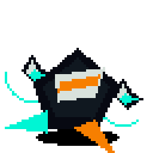
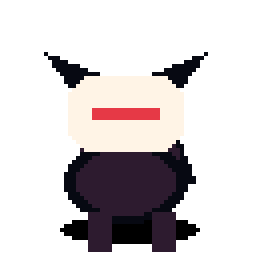

# Ravenbyte Familiars

**Tiny mythic coding companions for Codex-compatible and Open Design pet import workflows.**

Ravenbyte Familiars is an **ObliviousOdin** sprite collection: original animated familiars packaged with `pet.json` and `spritesheet.webp` so they can be imported into Open Design via **Settings → Pets → Import Codex sprite**.

The vibe is raven-dark, rune-lit, and wild-hearted: little build guardians, courier spirits, mecha shinobi, fox masks, oni bots, rover tanuki, and other desk-sized familiars for long coding nights. The adventure energy is intentional; the designs, names, palettes, silhouettes, and lore stay original.

## Brand tone

- **Voice:** artifact-like, playful, sharp, never corporate.
- **Mood:** dark workshop, tiny familiars, bright debug magic.
- **Promise:** small companions with distinct silhouettes and useful import packages.
- **Rule:** no palette-swap familiars. Each new pet needs a materially different body plan, motion language, or signature prop.

## Palette

| Token | Hex | Use |
| --- | --- | --- |
| Void Black | `#080A0F` | deep background |
| Raven Ink | `#111827` | panels and outlines |
| Bone White | `#E8E0D0` | readable text and masks |
| Rune Gold | `#D6A84F` | mythic accent |
| Plasma Cyan | `#62E6FF` | code energy and motion |
| Signal Ember | `#FF7A45` | warnings, failed states, sparks |

## Familiars

| Familiar | Theme | Animation | More |
| --- | --- | --- | --- |
| Kageframe RX-07 | chibi shadow-mecha shinobi with an energy scarf |  | [Familiar README](pets/kageframe-rx07/README.md) |
| Shuriken Byte Zero | hovering ninja-star courier with debug drones |  | [Familiar README](pets/shuriken-byte-zero/README.md) |
| Ronin Build Fox | fox-masked build guardian with servo tails and CI charms |  | [Familiar README](pets/ronin-build-fox/README.md) |

Each familiar includes rows for:

- `idle`
- `running-right`
- `running-left`
- `waving`
- `jumping`
- `failed`
- `waiting`
- `running`
- `review`

`running-left` is mirrored from `running-right` only for genuinely symmetric familiars.

## One-command install

From any machine with Python 3 and Git:

```bash
PET=kageframe-rx07; REPO=https://github.com/ObliviousOdin/ravenbyte-familiars.git; TMP=$(mktemp -d); git clone --depth 1 "$REPO" "$TMP" && python3 "$TMP/scripts/install_pet.py" "$PET" && echo "Installed to ${CODEX_HOME:-$HOME/.codex}/pets/$PET"
```

Then import the generated sprite package in Open Design:

```text
Settings → Pets → Import Codex sprite
```

Choose:

```text
${CODEX_HOME:-$HOME/.codex}/pets/kageframe-rx07/spritesheet.webp
```

The metadata file is next to it:

```text
${CODEX_HOME:-$HOME/.codex}/pets/kageframe-rx07/pet.json
```

## Hatch a familiar manually

```bash
python3 -m venv .venv
. .venv/bin/activate
python -m pip install -r requirements.txt
python scripts/hatch_pet.py --pet ronin-build-fox --root .
python scripts/validate_all.py
git diff --check
```

The hatch script performs the deterministic pipeline:

1. stores the intended `$imagegen` prompt in `generated/imagegen-prompt.json`,
2. creates/extracts a base look into `generated/base.png`,
3. composes row strips under `generated/strips/`,
4. builds `spritesheet.webp`,
5. writes `pet.json`,
6. validates dimensions and animation rows,
7. exports contact sheets plus GIF/MP4 previews,
8. packages the familiar into `${CODEX_HOME:-$HOME/.codex}/pets/<pet-name>/`.

## Package format

Each familiar directory is self-contained:

```text
pets/<pet-name>/
  README.md
  pet.json
  spritesheet.webp
  previews/
    <pet-name>-contact-sheet.png
    <pet-name>-idle.gif
    ...
  generated/
    base.png
    imagegen-prompt.json
    strips/
      idle.png
      running-right.png
      running-left.png
      waving.png
      jumping.png
      failed.png
      waiting.png
      running.png
      review.png
```

The current spritesheet layout is `384×576`: six `64×64` frames per row and nine animation rows.

## Variation standard

A new familiar should not look like the previous familiar with different colors. Before publishing, check:

- silhouette overlap against existing familiars is not too high,
- head/body plan changes materially,
- motion language changes materially,
- at least one signature prop or creature feature is obvious at `64×64`,
- failed/waiting/review states are readable,
- no generated art claims to be a copyrighted character.

`python scripts/validate_all.py` includes a silhouette-overlap check to catch clone-like pets.

## Familiar ideas queued

Future hatches should rotate body plans instead of making the same mecha repeatedly:

- **Compiler Oni Mini** — tiny red oni robot that bonks failing tests with a foam kanabo.
- **Moonbase Tanuki Dev** — round tanuki rover with a leaf-shaped antenna and sleepy review mode.
- **Patchwork Karakuri Cat** — wooden clockwork cat automaton with brass whiskers.
- **Nebula Courier Mech** — courier robot with launch-thruster running animations.
- **Lotus Firewall Monk** — meditating cyber-monk bot with shield-petal review frames.
- **Samurai Cache Crab** — side-stepping armor crab with cache-crystal claws.
- **Origami Test Heron** — folded-paper cyber-heron that pecks flaky tests.

## Development and verification

```bash
python scripts/hatch_pet.py --pet kageframe-rx07 --root .
python scripts/validate_all.py
git diff --check
```

Before publishing a new familiar, check:

- `pet.json` exists and points to `spritesheet.webp`.
- All required animation rows exist.
- The root README links to the familiar README and shows an animation.
- GIF/MP4 previews are generated.
- The familiar installs into `${CODEX_HOME:-$HOME/.codex}/pets/<pet-name>/`.
- The new familiar is structurally distinct from earlier familiars.

## Project status

Early collection. The first familiars are usable now. New familiars are added as reviewable commits with validated packages.
