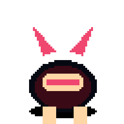
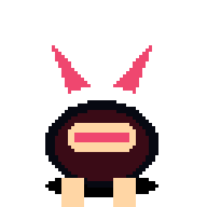
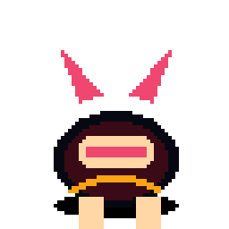
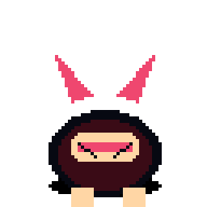
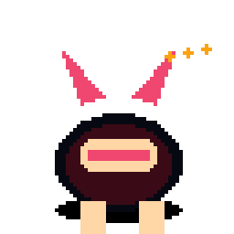
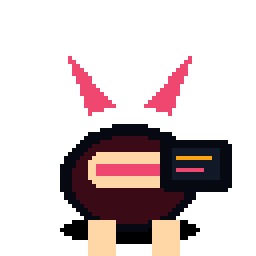
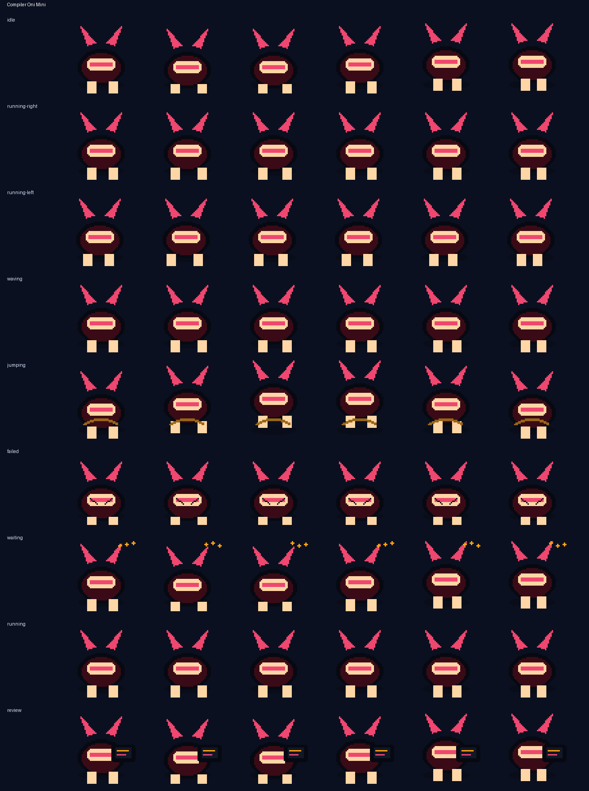

# Compiler Oni Mini



**A tiny red oni bot that bonks failing tests with a foam kanabo.**

Compiler Oni Mini is an original Codex-compatible coding familiar by **ObliviousOdin**. It brings festival-imp mischief, soft toy-club slapstick, and lint-spark energy without copying any named character, logo, costume, or insignia. Its squat horned body, oversized foam kanabo, and ember-bright expressions give it a compact silhouette designed to stay readable at `64×64`.

## Personality

Compiler Oni Mini is the cheerful test-suite bruiser under your desk lamp:

- bouncy and ready while idle,
- stompy when work starts moving,
- proud enough to wave after a clean compile,
- dramatically frazzled when checks fail,
- patient during waits with little spark beats,
- stern during review mode with a tiny diagnostic panel.

## Animation preview

| State | Preview |
| --- | --- |
| Idle |  |
| Running right |  |
| Running left |  |
| Waving |  |
| Jumping |  |
| Failed |  |
| Waiting |  |
| Running |  |
| Review |  |

Full contact sheet:



## Install

From the repository root:

```bash
python3 scripts/install_pet.py compiler-oni-mini
```

Or from anywhere with Git:

```bash
PET=compiler-oni-mini; REPO=https://github.com/ObliviousOdin/ravenbyte-familiars.git; TMP=$(mktemp -d); git clone --depth 1 "$REPO" "$TMP" && python3 "$TMP/scripts/install_pet.py" "$PET" && echo "Installed to ${CODEX_HOME:-$HOME/.codex}/pets/$PET"
```

Import this sprite in Open Design:

```text
Settings → Pets → Import Codex sprite
```

Use this spritesheet after install:

```text
${CODEX_HOME:-$HOME/.codex}/pets/compiler-oni-mini/spritesheet.webp
```

## Package contents

```text
pet.json
spritesheet.webp
previews/
  compiler-oni-mini-idle.gif
  compiler-oni-mini-running-right.gif
  compiler-oni-mini-running-left.gif
  compiler-oni-mini-waving.gif
  compiler-oni-mini-jumping.gif
  compiler-oni-mini-failed.gif
  compiler-oni-mini-waiting.gif
  compiler-oni-mini-running.gif
  compiler-oni-mini-review.gif
  compiler-oni-mini-contact-sheet.png
generated/
  base.png
  imagegen-prompt.json
  strips/*.png
```

## Sprite metadata

- Frame size: `64×64`
- Frames per row: `6`
- Rows: `9`
- Spritesheet: `384×576`
- Symmetric design: yes
- `running-left`: mirrored from `running-right` because the familiar has a symmetric body plan and centered toy club treatment
- Author: `ObliviousOdin`

## Design notes

The design is intentionally original. It uses broad visual language from tiny festival oni, toy workshop mascots, pixel companions, and coding robots, but does not copy any named character, logo, or exact costume design.
