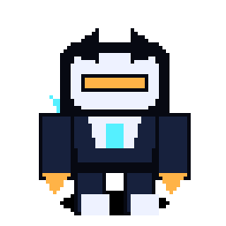
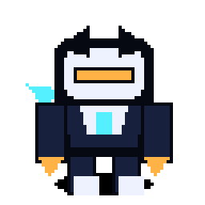
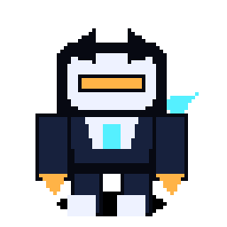
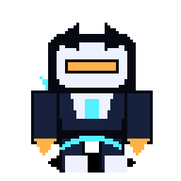
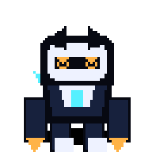
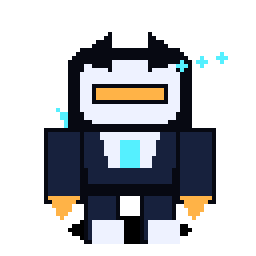
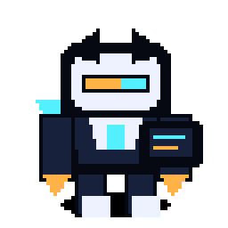
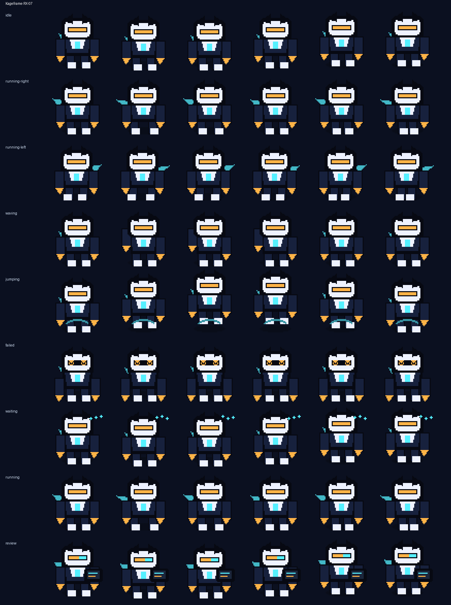

# Kageframe RX-07

<p align="center">
  
</p>

**A chibi shadow-mecha shinobi that reviews code with a plasma scarf.**

Kageframe RX-07 is an original Codex-compatible coding familiar by **ObliviousOdin**. It blends broad ninja-mecha inspiration with a tiny desk-companion silhouette: midnight armor, a bone-white mask plate, an amber visor, and a cyan energy scarf that trails during movement.

## Personality

Kageframe is the quiet reviewer in the corner of the terminal:

- calm during idle and waiting states,
- fast and focused while running tasks,
- dramatic but cute when a command fails,
- tablet-in-hand during review mode,
- heroic without being noisy.

## Showcase

The top card stitches several real animation rows together — idle, run, jump, review, failed, and wave — so the familiar is not represented by a single idle loop.

## Animation preview

| State | Preview |
| --- | --- |
| Idle |  |
| Running right |  |
| Running left |  |
| Waving |  |
| Jumping |  |
| Failed |  |
| Waiting |  |
| Running |  |
| Review |  |

Full contact sheet:



## Install

From the repository root:

```bash
python3 scripts/install_pet.py kageframe-rx07
```

Or from anywhere with Git:

```bash
PET=kageframe-rx07; REPO=https://github.com/ObliviousOdin/ravenbyte-familiars.git; TMP=$(mktemp -d); git clone --depth 1 "$REPO" "$TMP" && python3 "$TMP/scripts/install_pet.py" "$PET" && echo "Installed to ${CODEX_HOME:-$HOME/.codex}/pets/$PET"
```

Import this sprite in Open Design:

```text
Settings → Pets → Import Codex sprite
```

Use this spritesheet after install:

```text
${CODEX_HOME:-$HOME/.codex}/pets/kageframe-rx07/spritesheet.webp
```

## Package contents

```text
pet.json
spritesheet.webp
previews/
  kageframe-rx07-showcase.gif
  kageframe-rx07-idle.gif
  kageframe-rx07-running-right.gif
  kageframe-rx07-running-left.gif
  kageframe-rx07-waving.gif
  kageframe-rx07-jumping.gif
  kageframe-rx07-failed.gif
  kageframe-rx07-waiting.gif
  kageframe-rx07-running.gif
  kageframe-rx07-review.gif
  kageframe-rx07-contact-sheet.png
generated/
  base.png
  imagegen-prompt.json
  strips/*.png
```

## Sprite metadata

- Frame size: `64×64`
- Frames per row: `6`
- Rows: `9`
- Spritesheet: `384×576`
- Symmetric design: yes
- `running-left`: mirrored from `running-right`
- Author: `ObliviousOdin`

## Design notes

The design is intentionally original. It uses broad visual language from mecha, pixel companions, and shinobi robots, but does not copy any named character, logo, or exact costume design.
