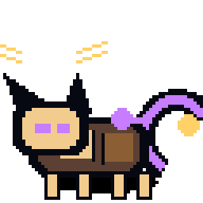
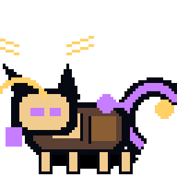
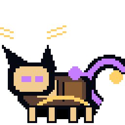
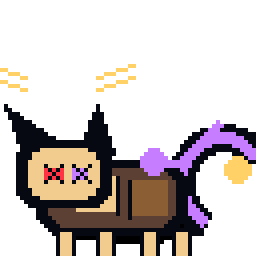
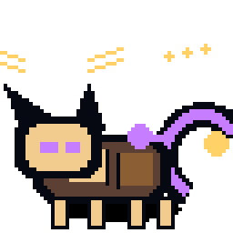
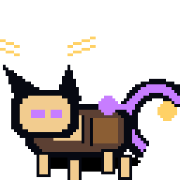
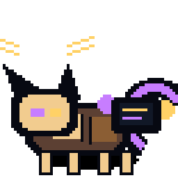
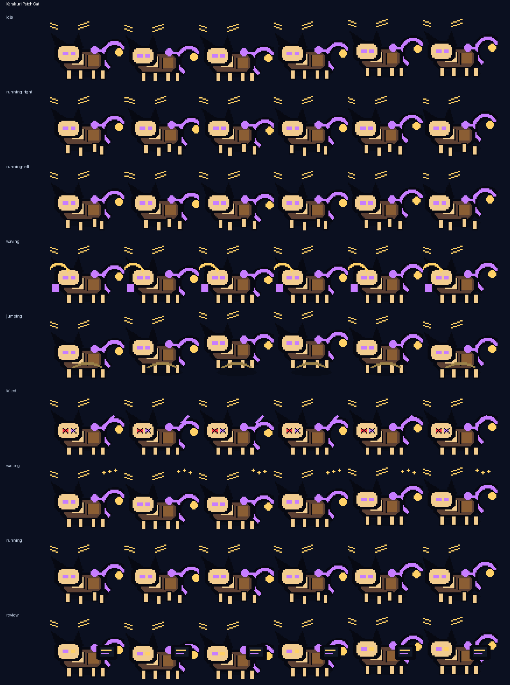

# Karakuri Patch Cat



**A wooden clockwork cat automaton that bats TODOs into shape.**

Karakuri Patch Cat is an original Codex-compatible coding familiar by **ObliviousOdin**. It folds wooden karakuri puppet craft, clockwork gears, brass whiskers, patchwork panels, and catlike debugging mischief into a compact silhouette designed to stay readable at `64×64`. The familiar is an original design and does not copy any named character, logo, costume, or insignia.

## Personality

Karakuri Patch Cat is the workshop mouser for stubborn TODOs and loose regressions:

- ticking in idle with a small wind-up bounce,
- skittering low to the ground on precise clockwork paws,
- waving with a paw-swipe that feels like batting a lint warning away,
- springing upward like a toy automaton released from its catch,
- drooping into loose screws and sparks when checks fail,
- waiting with patient gear-click blinks and small signal beats,
- reviewing code like a tiny bench artisan inspecting a polished mechanism.

## Animation preview

| State | Preview |
| --- | --- |
| Idle |  |
| Running right |  |
| Running left |  |
| Waving |  |
| Jumping |  |
| Failed |  |
| Waiting |  |
| Running |  |
| Review |  |

Full contact sheet:



## Install

From the repository root:

```bash
python3 scripts/install_pet.py karakuri-patch-cat
```

Or from anywhere with Git:

```bash
PET=karakuri-patch-cat; REPO=https://github.com/ObliviousOdin/ravenbyte-familiars.git; TMP=$(mktemp -d); git clone --depth 1 "$REPO" "$TMP" && python3 "$TMP/scripts/install_pet.py" "$PET" && echo "Installed to ${CODEX_HOME:-$HOME/.codex}/pets/$PET"
```

Import this sprite in Open Design:

```text
Settings → Pets → Import Codex sprite
```

Use this spritesheet after install:

```text
${CODEX_HOME:-$HOME/.codex}/pets/karakuri-patch-cat/spritesheet.webp
```

## Package contents

```text
pet.json
spritesheet.webp
previews/
  karakuri-patch-cat-idle.gif
  karakuri-patch-cat-running-right.gif
  karakuri-patch-cat-running-left.gif
  karakuri-patch-cat-waving.gif
  karakuri-patch-cat-jumping.gif
  karakuri-patch-cat-failed.gif
  karakuri-patch-cat-waiting.gif
  karakuri-patch-cat-running.gif
  karakuri-patch-cat-review.gif
  karakuri-patch-cat-contact-sheet.png
generated/
  base.png
  imagegen-prompt.json
  strips/*.png
```

## Sprite metadata

- Frame size: `64×64`
- Frames per row: `6`
- Rows: `9`
- Spritesheet: `384×576`
- Symmetric design: no
- `running-left`: separately drawn because the patchwork panels, brass whiskers, and clockwork tail create an asymmetric body plan
- Author: `ObliviousOdin`

## Design notes

The design is intentionally original. It uses broad visual language from karakuri automata, workshop cats, clockwork toys, pixel companions, and coding robots, but does not copy any named character, logo, or exact costume design.
