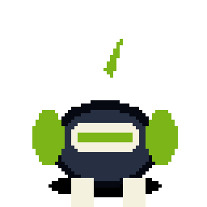
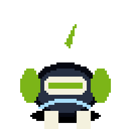
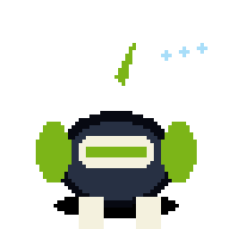
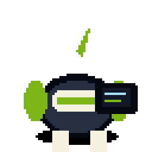
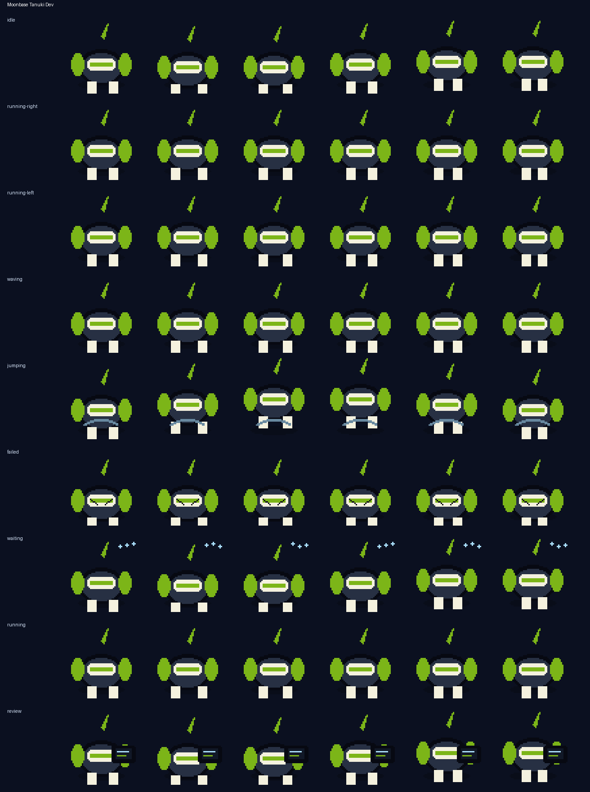

# Moonbase Tanuki Dev

<p align="center">
  
</p>

**A sleepy rover-tanuki with a leaf antenna and lunar debug pouches.**

Moonbase Tanuki Dev is an original Codex-compatible coding familiar by **ObliviousOdin**. It blends round moon-rover charm, tanuki curiosity, soft leaf-antenna signals, and tiny debug pouches into a compact silhouette designed to stay readable at `64×64`. The familiar is an original design and does not copy any named character, logo, costume, or insignia.

## Personality

Moonbase Tanuki Dev is the drowsy lunar field engineer who keeps watch over long builds:

- gently rocking in idle like a rover on low gravity,
- trundling side-to-side with pouch-and-tail weight during movement,
- waving with a sleepy little mission-check gesture,
- popping upward in a soft moon-hop,
- slumping into static and sparks when checks fail,
- blinking through patient wait cycles with small signal beats,
- reviewing code like a rover scanning core samples under pale telemetry light.

## Showcase

The top card stitches several real animation rows together — idle, run, jump, review, failed, and wave — so the familiar is not represented by a single idle loop.

## Animation preview

| State | Preview |
| --- | --- |
| Idle |  |
| Running right |  |
| Running left |  |
| Waving |  |
| Jumping |  |
| Failed |  |
| Waiting |  |
| Running |  |
| Review |  |

Full contact sheet:



## Install

From the repository root:

```bash
python3 scripts/install_pet.py moonbase-tanuki-dev
```

Or from anywhere with Git:

```bash
PET=moonbase-tanuki-dev; REPO=https://github.com/ObliviousOdin/ravenbyte-familiars.git; TMP=$(mktemp -d); git clone --depth 1 "$REPO" "$TMP" && python3 "$TMP/scripts/install_pet.py" "$PET" && echo "Installed to ${CODEX_HOME:-$HOME/.codex}/pets/$PET"
```

Import this sprite in Open Design:

```text
Settings → Pets → Import Codex sprite
```

Use this spritesheet after install:

```text
${CODEX_HOME:-$HOME/.codex}/pets/moonbase-tanuki-dev/spritesheet.webp
```

## Package contents

```text
pet.json
spritesheet.webp
previews/
  moonbase-tanuki-dev-showcase.gif
  moonbase-tanuki-dev-idle.gif
  moonbase-tanuki-dev-running-right.gif
  moonbase-tanuki-dev-running-left.gif
  moonbase-tanuki-dev-waving.gif
  moonbase-tanuki-dev-jumping.gif
  moonbase-tanuki-dev-failed.gif
  moonbase-tanuki-dev-waiting.gif
  moonbase-tanuki-dev-running.gif
  moonbase-tanuki-dev-review.gif
  moonbase-tanuki-dev-contact-sheet.png
generated/
  base.png
  imagegen-prompt.json
  strips/*.png
```

## Sprite metadata

- Frame size: `64×64`
- Frames per row: `6`
- Rows: `9`
- Spritesheet: `384×576`
- Symmetric design: no
- `running-left`: separately drawn because the leaf antenna, debug pouches, and tail treatment create an asymmetric body plan
- Author: `ObliviousOdin`

## Design notes

The design is intentionally original. It uses broad visual language from tanuki folklore, lunar rovers, pixel companions, and coding robots, but does not copy any named character, logo, or exact costume design.
