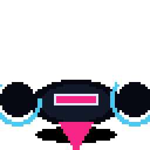
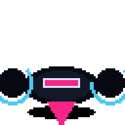
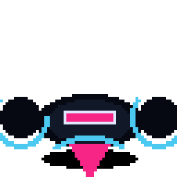
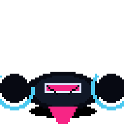
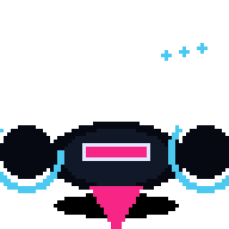
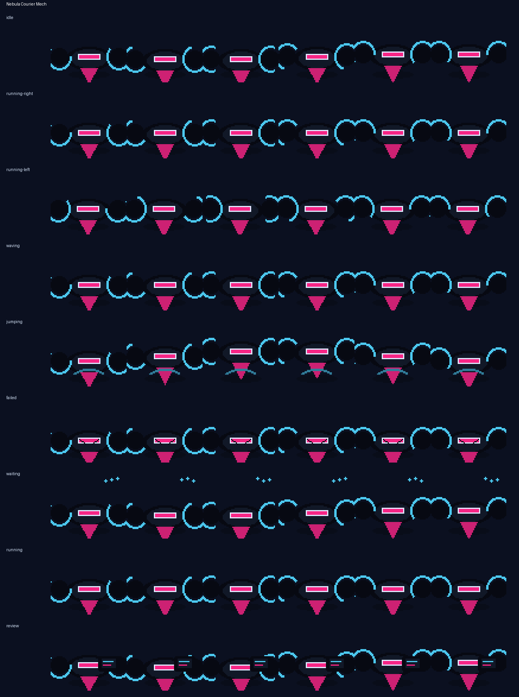

# Nebula Courier Mech

<p align="center">
  
</p>

**A star-courier micro-mech that sprints commits through hyperspace.**

Nebula Courier Mech is an original Codex-compatible coding familiar by **ObliviousOdin**. It combines a compact courier-mech body, bright star-post markings, thruster-boot motion, and hyperspace debug energy into a readable `64×64` sprite companion. The familiar is an original design and does not copy any named character, logo, costume, or insignia.

## Personality

Nebula Courier Mech is the repo's tiny interstellar dispatch runner:

- hovering in idle with a light engine bob,
- sprinting with rocket-boot bursts and courier urgency,
- waving like a delivery bot confirming a clean handoff,
- jumping on a powered thruster arc,
- sputtering into warning sparks when a route fails,
- waiting with beacon pulses and patient station-keeping,
- reviewing code like a navigation officer plotting a safe merge lane.

## Showcase

The top card stitches several real animation rows together — idle, run, jump, review, failed, and wave — so the familiar is not represented by a single idle loop.

## Animation preview

| State | Preview |
| --- | --- |
| Idle |  |
| Running right |  |
| Running left |  |
| Waving |  |
| Jumping |  |
| Failed |  |
| Waiting |  |
| Running |  |
| Review |  |

Full contact sheet:



## Install

From the repository root:

```bash
python3 scripts/install_pet.py nebula-courier-mech
```

Or from anywhere with Git:

```bash
PET=nebula-courier-mech; REPO=https://github.com/ObliviousOdin/ravenbyte-familiars.git; TMP=$(mktemp -d); git clone --depth 1 "$REPO" "$TMP" && python3 "$TMP/scripts/install_pet.py" "$PET" && echo "Installed to ${CODEX_HOME:-$HOME/.codex}/pets/$PET"
```

Import this sprite in Open Design:

```text
Settings → Pets → Import Codex sprite
```

Use this spritesheet after install:

```text
${CODEX_HOME:-$HOME/.codex}/pets/nebula-courier-mech/spritesheet.webp
```

## Package contents

```text
pet.json
spritesheet.webp
previews/
  nebula-courier-mech-showcase.gif
  nebula-courier-mech-idle.gif
  nebula-courier-mech-running-right.gif
  nebula-courier-mech-running-left.gif
  nebula-courier-mech-waving.gif
  nebula-courier-mech-jumping.gif
  nebula-courier-mech-failed.gif
  nebula-courier-mech-waiting.gif
  nebula-courier-mech-running.gif
  nebula-courier-mech-review.gif
  nebula-courier-mech-contact-sheet.png
generated/
  base.png
  imagegen-prompt.json
  strips/*.png
```

## Sprite metadata

- Frame size: `64×64`
- Frames per row: `6`
- Rows: `9`
- Spritesheet: `384×576`
- Symmetric design: yes
- `running-left`: mirrored from `running-right` because the courier-mech silhouette is intentionally symmetric
- Author: `ObliviousOdin`

## Design notes

The design is intentionally original. It uses broad visual language from space couriers, compact service mechs, thruster boots, star beacons, pixel companions, and coding robots, but does not copy any named character, logo, or exact costume design.
