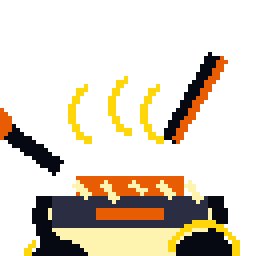
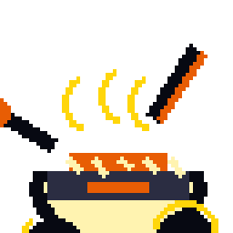
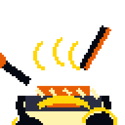
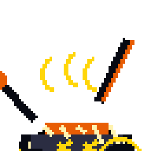
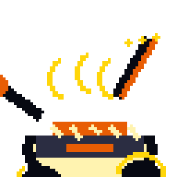
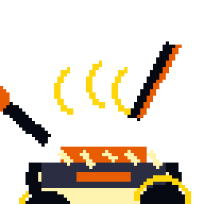
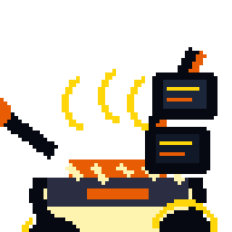
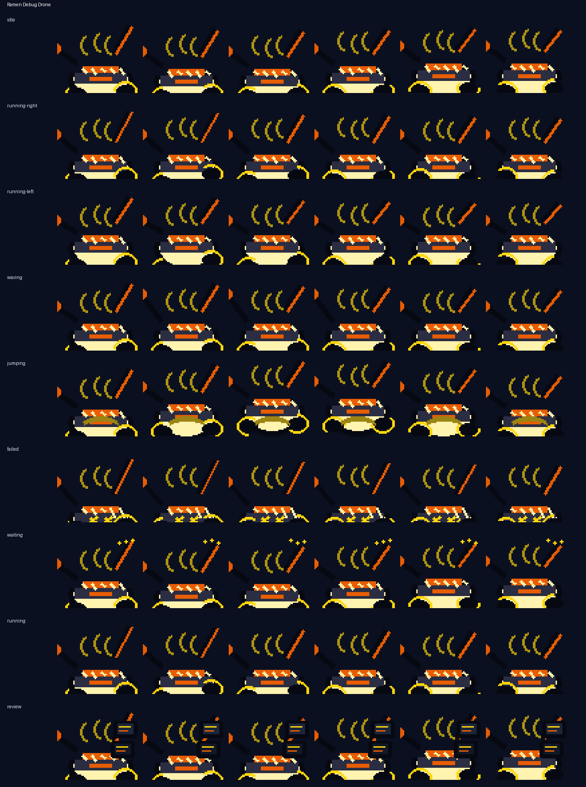

# Ramen Debug Drone

<p align="center">
  
</p>

**A noodle-shop hover drone that serves hot fixes in a tiny bowl.**

Ramen Debug Drone is an original Codex-compatible coding familiar by **ObliviousOdin**. It is built around friendly ramen shop hover robot with chopstick antenna and steam pixels, with a readable `64×64` silhouette and no copied named character, logo, costume, or insignia.

## Personality

Ramen Debug Drone brings a distinct motion language to Ravenbyte Familiars: hovering bowl-body drift, chopstick antenna wobble, steam-pixel bursts, hot-fix serving gestures, and review-tablet scan sweeps.

## Showcase

The top card stitches several real animation rows together — idle, run, jump, review, failed, and wave — so the familiar is not represented by a single idle loop.

## Animation preview

| State | Preview |
| --- | --- |
| Idle |  |
| Running Right |  |
| Running Left |  |
| Waving |  |
| Jumping |  |
| Failed |  |
| Waiting |  |
| Running |  |
| Review |  |

Full contact sheet:



## Install

From the repository root:

```bash
python3 scripts/install_pet.py ramen-debug-drone
```

Or from anywhere with Git:

```bash
PET=ramen-debug-drone; REPO=https://github.com/ObliviousOdin/ravenbyte-familiars.git; TMP=$(mktemp -d); git clone --depth 1 "$REPO" "$TMP" && python3 "$TMP/scripts/install_pet.py" "$PET" && echo "Installed to ${CODEX_HOME:-$HOME/.codex}/pets/$PET"
```

Import this sprite in Open Design:

```text
Settings → Pets → Import Codex sprite
```

Use this spritesheet after install:

```text
${CODEX_HOME:-$HOME/.codex}/pets/ramen-debug-drone/spritesheet.webp
```

## Package contents

```text
pet.json
spritesheet.webp
previews/
  ramen-debug-drone-showcase.gif
  ramen-debug-drone-idle.gif
  ramen-debug-drone-running-right.gif
  ramen-debug-drone-running-left.gif
  ramen-debug-drone-waving.gif
  ramen-debug-drone-jumping.gif
  ramen-debug-drone-failed.gif
  ramen-debug-drone-waiting.gif
  ramen-debug-drone-running.gif
  ramen-debug-drone-review.gif
  ramen-debug-drone-contact-sheet.png
generated/
  base.png
  imagegen-prompt.json
  strips/*.png
```

## Sprite metadata

- Frame size: `64×64`
- Frames per row: `6`
- Rows: `9`
- Spritesheet: `384×576`
- Symmetric design: no
- `running-left`: drawn as a separate row because this familiar has side-specific details
- Author: `ObliviousOdin`

## Design notes

The design is intentionally original. It uses broad visual language from friendly ramen shop hover robot with chopstick antenna and steam pixels, pixel companions, and coding robots, but does not copy any named character, logo, or exact costume design.
