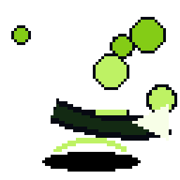
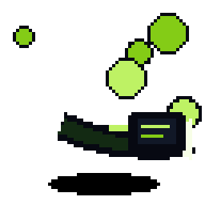
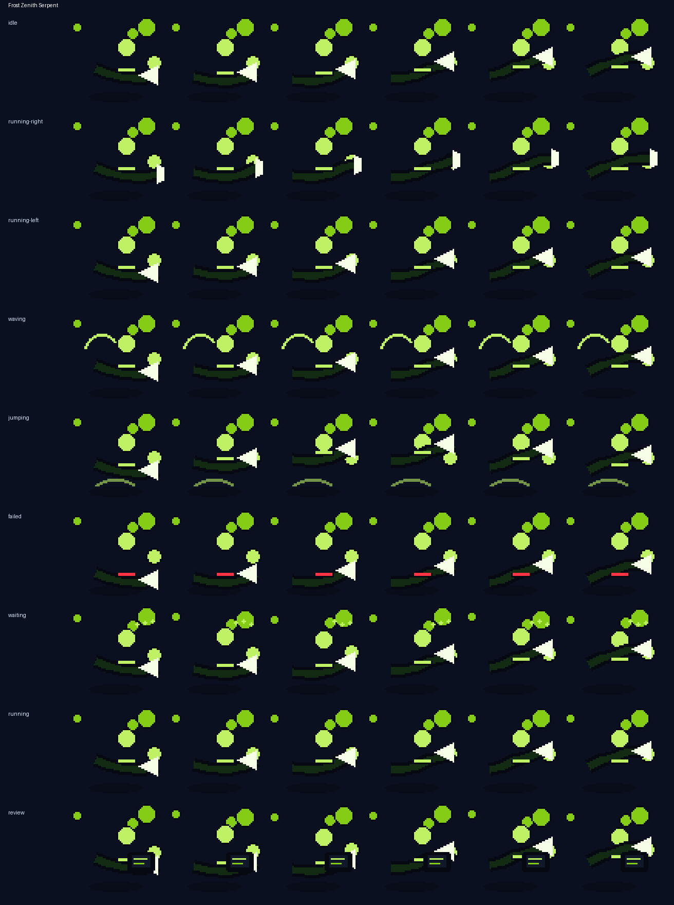

# Frost Zenith Serpent

<p align="center">
  
</p>

**A serpent-class Ravenbyte familiar that keeps zenith work moving during long coding runs.**

Frost Zenith Serpent is an original Codex-compatible coding familiar by **ObliviousOdin**. It is built around serpent ribbon automaton that coils around flaky tests, with a readable `64×64` silhouette and no copied named character, logo, costume, or insignia.

## Personality

Frost Zenith Serpent brings a distinct motion language to Ravenbyte Familiars: distinct idle, run, wave, jump, failed, waiting, and review poses rendered from the generated sprite rows.

## Showcase

The top card stitches several real animation rows together — idle, run, jump, review, failed, and wave — so the familiar is not represented by a single idle loop.

## Animation preview

| State | Preview |
| --- | --- |
| Idle |  |
| Running Right |  |
| Running Left |  |
| Waving |  |
| Jumping |  |
| Failed |  |
| Waiting |  |
| Running |  |
| Review |  |

Full contact sheet:



## Install

From the repository root:

```bash
python3 scripts/install_pet.py ravenbyte-230-frost-zenith-serpent
```

Or from anywhere with Git:

```bash
PET=ravenbyte-230-frost-zenith-serpent; REPO=https://github.com/ObliviousOdin/ravenbyte-familiars.git; TMP=$(mktemp -d); git clone --depth 1 "$REPO" "$TMP" && python3 "$TMP/scripts/install_pet.py" "$PET" && echo "Installed to ${CODEX_HOME:-$HOME/.codex}/pets/$PET"
```

Import this sprite in Open Design:

```text
Settings → Pets → Import Codex sprite
```

Use this spritesheet after install:

```text
${CODEX_HOME:-$HOME/.codex}/pets/ravenbyte-230-frost-zenith-serpent/spritesheet.webp
```

## Package contents

```text
pet.json
spritesheet.webp
previews/
  ravenbyte-230-frost-zenith-serpent-showcase.gif
  ravenbyte-230-frost-zenith-serpent-idle.gif
  ravenbyte-230-frost-zenith-serpent-running-right.gif
  ravenbyte-230-frost-zenith-serpent-running-left.gif
  ravenbyte-230-frost-zenith-serpent-waving.gif
  ravenbyte-230-frost-zenith-serpent-jumping.gif
  ravenbyte-230-frost-zenith-serpent-failed.gif
  ravenbyte-230-frost-zenith-serpent-waiting.gif
  ravenbyte-230-frost-zenith-serpent-running.gif
  ravenbyte-230-frost-zenith-serpent-review.gif
  ravenbyte-230-frost-zenith-serpent-contact-sheet.png
generated/
  base.png
  imagegen-prompt.json
  strips/*.png
```

## Sprite metadata

- Frame size: `64×64`
- Frames per row: `6`
- Rows: `9`
- Spritesheet: `384×576`
- Symmetric design: no
- `running-left`: drawn as a separate row because this familiar has side-specific details
- Author: `ObliviousOdin`

## Design notes

The design is intentionally original. It uses broad visual language from serpent ribbon automaton that coils around flaky tests, pixel companions, and coding robots, but does not copy any named character, logo, or exact costume design.
