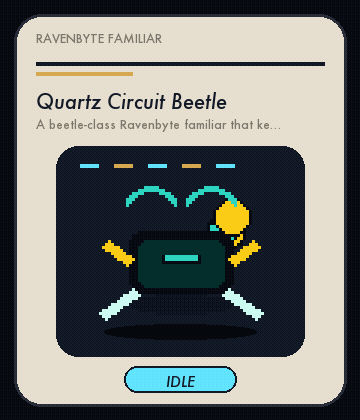
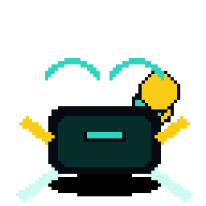
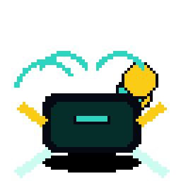
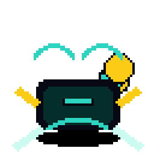
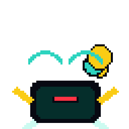
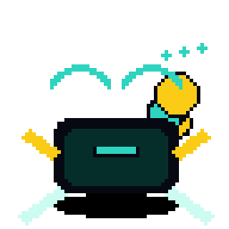
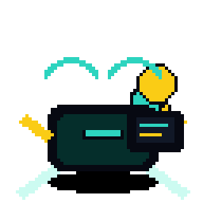
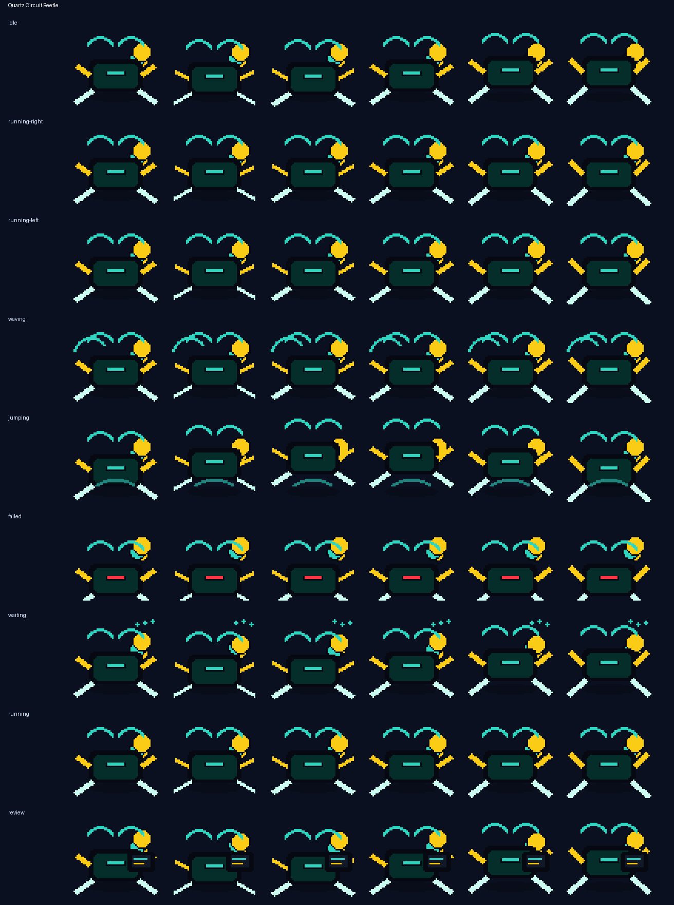

# Quartz Circuit Beetle

<p align="center">
  
</p>

**A beetle-class Ravenbyte familiar that keeps circuit work moving during long coding runs.**

Quartz Circuit Beetle is an original Codex-compatible coding familiar by **ObliviousOdin**. It is built around antenna beetle slab robot with code-shell wing plates, with a readable `64×64` silhouette and no copied named character, logo, costume, or insignia.

## Personality

Quartz Circuit Beetle brings a distinct motion language to Ravenbyte Familiars: distinct idle, run, wave, jump, failed, waiting, and review poses rendered from the generated sprite rows.

## Showcase

The top card stitches several real animation rows together — idle, run, jump, review, failed, and wave — so the familiar is not represented by a single idle loop.

## Animation preview

| State | Preview |
| --- | --- |
| Idle |  |
| Running Right |  |
| Running Left |  |
| Waving |  |
| Jumping |  |
| Failed |  |
| Waiting |  |
| Running |  |
| Review |  |

Full contact sheet:



## Install

From the repository root:

```bash
python3 scripts/install_pet.py ravenbyte-273-quartz-circuit-beetle
```

Or from anywhere with Git:

```bash
PET=ravenbyte-273-quartz-circuit-beetle; REPO=https://github.com/ObliviousOdin/ravenbyte-familiars.git; TMP=$(mktemp -d); git clone --depth 1 "$REPO" "$TMP" && python3 "$TMP/scripts/install_pet.py" "$PET" && echo "Installed to ${CODEX_HOME:-$HOME/.codex}/pets/$PET"
```

Import this sprite in Open Design:

```text
Settings → Pets → Import Codex sprite
```

Use this spritesheet after install:

```text
${CODEX_HOME:-$HOME/.codex}/pets/ravenbyte-273-quartz-circuit-beetle/spritesheet.webp
```

## Package contents

```text
pet.json
spritesheet.webp
previews/
  ravenbyte-273-quartz-circuit-beetle-showcase.gif
  ravenbyte-273-quartz-circuit-beetle-idle.gif
  ravenbyte-273-quartz-circuit-beetle-running-right.gif
  ravenbyte-273-quartz-circuit-beetle-running-left.gif
  ravenbyte-273-quartz-circuit-beetle-waving.gif
  ravenbyte-273-quartz-circuit-beetle-jumping.gif
  ravenbyte-273-quartz-circuit-beetle-failed.gif
  ravenbyte-273-quartz-circuit-beetle-waiting.gif
  ravenbyte-273-quartz-circuit-beetle-running.gif
  ravenbyte-273-quartz-circuit-beetle-review.gif
  ravenbyte-273-quartz-circuit-beetle-contact-sheet.png
generated/
  base.png
  imagegen-prompt.json
  strips/*.png
```

## Sprite metadata

- Frame size: `64×64`
- Frames per row: `6`
- Rows: `9`
- Spritesheet: `384×576`
- Symmetric design: no
- `running-left`: drawn as a separate row because this familiar has side-specific details
- Author: `ObliviousOdin`

## Design notes

The design is intentionally original. It uses broad visual language from antenna beetle slab robot with code-shell wing plates, pixel companions, and coding robots, but does not copy any named character, logo, or exact costume design.
