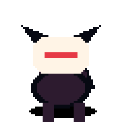
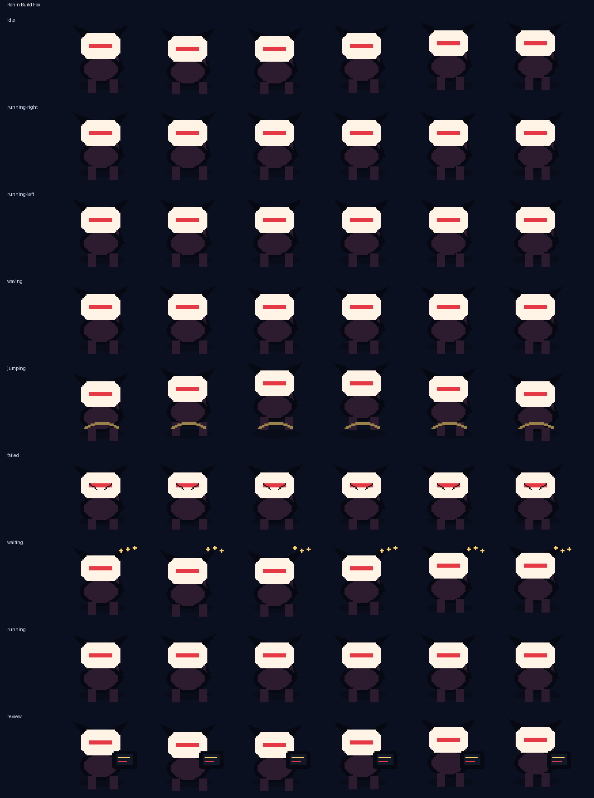

# Ronin Build Fox

<p align="center">
  
</p>

**A fox-masked build guardian with tiny servo tails and CI charms.**

Ronin Build Fox is an original Codex-compatible coding familiar by **ObliviousOdin**. It carries broad ronin adventure and fox-spirit energy without copying any named character, logo, costume, or insignia. Its warm mask, asymmetric servo tails, and little CI charms give it a creature-like silhouette designed to stay readable at `64×64`.

## Personality

Ronin Build Fox is the watchful build-guardian at the edge of your terminal:

- calm and mask-bright while idle,
- tail-sprung when work starts moving,
- courteous enough to wave after a clean run,
- visibly rattled when checks fail,
- patient during waits with charm-like status beats,
- focused during review mode with a tiny scan panel.

## Showcase

The top card stitches several real animation rows together — idle, run, jump, review, failed, and wave — so the familiar is not represented by a single idle loop.

## Animation preview

| State | Preview |
| --- | --- |
| Idle |  |
| Running right |  |
| Running left |  |
| Waving |  |
| Jumping |  |
| Failed |  |
| Waiting |  |
| Running |  |
| Review |  |

Full contact sheet:



## Install

From the repository root:

```bash
python3 scripts/install_pet.py ronin-build-fox
```

Or from anywhere with Git:

```bash
PET=ronin-build-fox; REPO=https://github.com/ObliviousOdin/ravenbyte-familiars.git; TMP=$(mktemp -d); git clone --depth 1 "$REPO" "$TMP" && python3 "$TMP/scripts/install_pet.py" "$PET" && echo "Installed to ${CODEX_HOME:-$HOME/.codex}/pets/$PET"
```

Import this sprite in Open Design:

```text
Settings → Pets → Import Codex sprite
```

Use this spritesheet after install:

```text
${CODEX_HOME:-$HOME/.codex}/pets/ronin-build-fox/spritesheet.webp
```

## Package contents

```text
pet.json
spritesheet.webp
previews/
  ronin-build-fox-showcase.gif
  ronin-build-fox-idle.gif
  ronin-build-fox-running-right.gif
  ronin-build-fox-running-left.gif
  ronin-build-fox-waving.gif
  ronin-build-fox-jumping.gif
  ronin-build-fox-failed.gif
  ronin-build-fox-waiting.gif
  ronin-build-fox-running.gif
  ronin-build-fox-review.gif
  ronin-build-fox-contact-sheet.png
generated/
  base.png
  imagegen-prompt.json
  strips/*.png
```

## Sprite metadata

- Frame size: `64×64`
- Frames per row: `6`
- Rows: `9`
- Spritesheet: `384×576`
- Symmetric design: no
- `running-left`: drawn separately to preserve the asymmetric servo tails and charms
- Author: `ObliviousOdin`

## Design notes

The design is intentionally original. It uses broad visual language from masked fox spirits, wandering guardians, pixel companions, and tiny build robots, but does not copy any named character, logo, or exact costume design.
