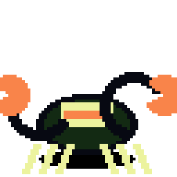
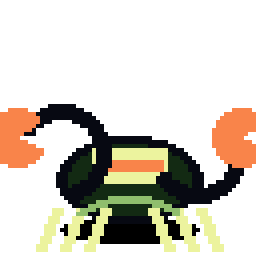
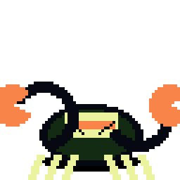
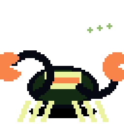
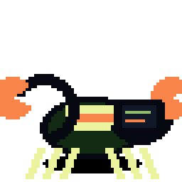
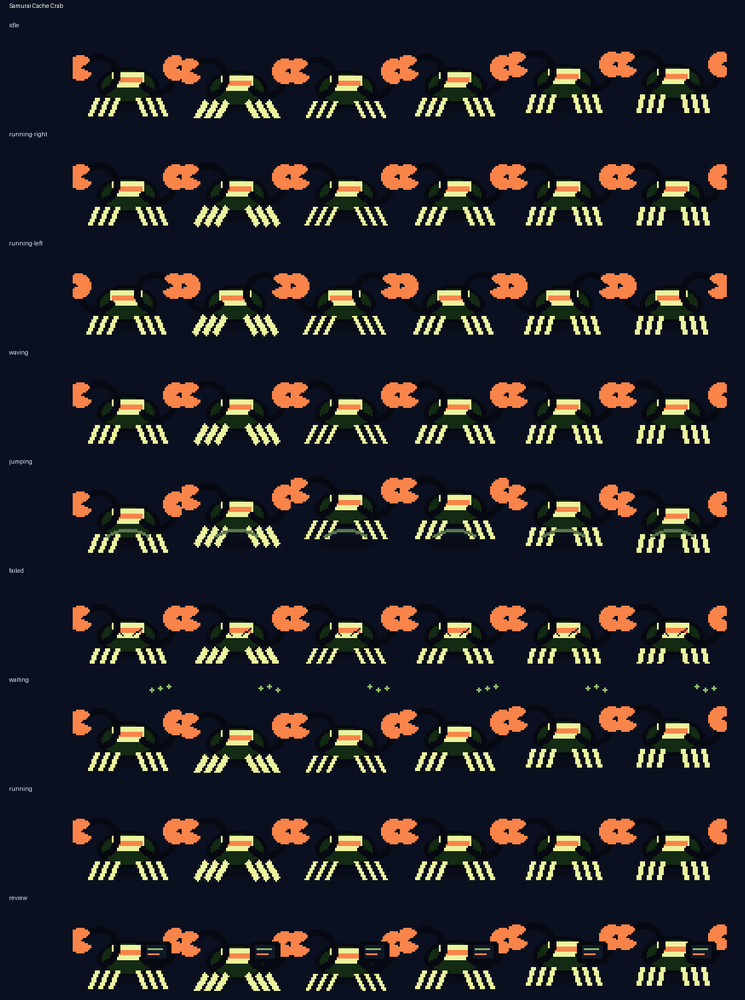

# Samurai Cache Crab

<p align="center">
  
</p>

**A side-stepping armor crab that guards build artifacts and cache hits.**

Samurai Cache Crab is an original Codex-compatible coding familiar by **ObliviousOdin**. It is built around samurai robot crab with tiny kabuto shell and cache crystal claws, with a readable `64×64` silhouette and no copied named character, logo, costume, or insignia.

## Personality

Samurai Cache Crab brings a distinct motion language to Ravenbyte Familiars: side-stepping with cache-crystal claws, kabuto-shell armor bob, waving pincer clicks, jump-snap arcs, failed-state spark slumps, waiting beacon dots, and review-tablet scan posture.

## Showcase

The top card stitches several real animation rows together — idle, run, jump, review, failed, and wave — so the familiar is not represented by a single idle loop.

## Animation preview

| State | Preview |
| --- | --- |
| Idle |  |
| Running Right |  |
| Running Left |  |
| Waving |  |
| Jumping |  |
| Failed |  |
| Waiting |  |
| Running |  |
| Review |  |

Full contact sheet:



## Install

From the repository root:

```bash
python3 scripts/install_pet.py samurai-cache-crab
```

Or from anywhere with Git:

```bash
PET=samurai-cache-crab; REPO=https://github.com/ObliviousOdin/ravenbyte-familiars.git; TMP=$(mktemp -d); git clone --depth 1 "$REPO" "$TMP" && python3 "$TMP/scripts/install_pet.py" "$PET" && echo "Installed to ${CODEX_HOME:-$HOME/.codex}/pets/$PET"
```

Import this sprite in Open Design:

```text
Settings → Pets → Import Codex sprite
```

Use this spritesheet after install:

```text
${CODEX_HOME:-$HOME/.codex}/pets/samurai-cache-crab/spritesheet.webp
```

## Package contents

```text
pet.json
spritesheet.webp
previews/
  samurai-cache-crab-showcase.gif
  samurai-cache-crab-idle.gif
  samurai-cache-crab-running-right.gif
  samurai-cache-crab-running-left.gif
  samurai-cache-crab-waving.gif
  samurai-cache-crab-jumping.gif
  samurai-cache-crab-failed.gif
  samurai-cache-crab-waiting.gif
  samurai-cache-crab-running.gif
  samurai-cache-crab-review.gif
  samurai-cache-crab-contact-sheet.png
generated/
  base.png
  imagegen-prompt.json
  strips/*.png
```

## Sprite metadata

- Frame size: `64×64`
- Frames per row: `6`
- Rows: `9`
- Spritesheet: `384×576`
- Symmetric design: yes
- `running-left`: mirrored from `running-right` because Samurai Cache Crab is intentionally symmetric
- Author: `ObliviousOdin`

## Design notes

The design is intentionally original. It uses broad visual language from samurai robot crab with tiny kabuto shell and cache crystal claws, pixel companions, and coding robots, but does not copy any named character, logo, or exact costume design.
