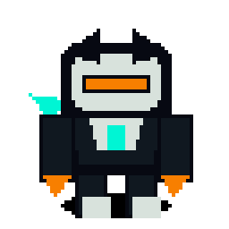
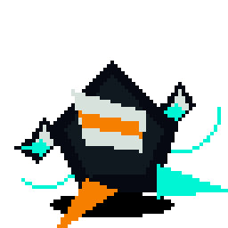
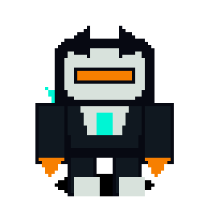
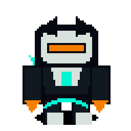
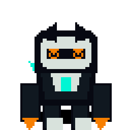
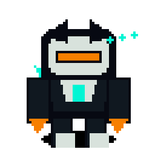
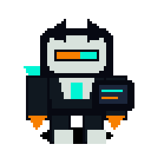
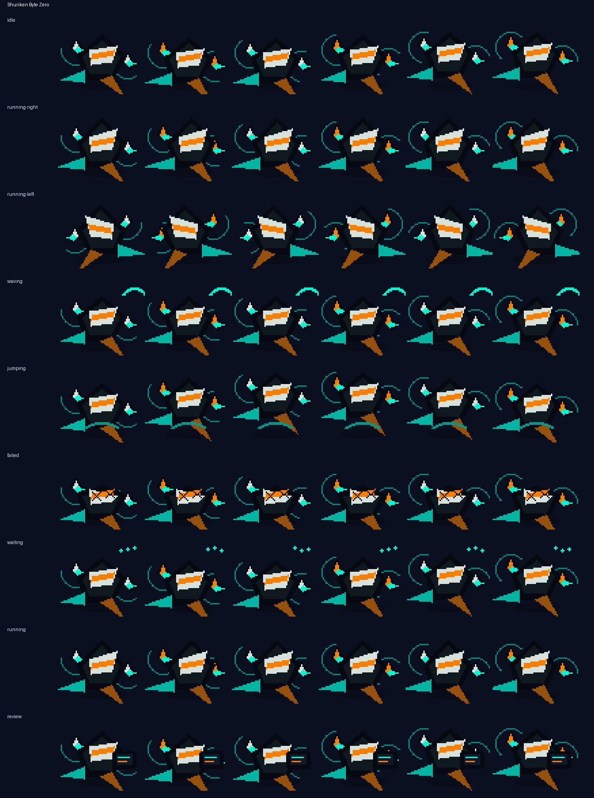

# Shuriken Byte Zero


**A stealthy robot courier with spinning debug shuriken drones.**

Shuriken Byte Zero is an original Codex-compatible coding familiar by **ObliviousOdin**. It blends broad ninja-robot and mecha adventure inspiration into a compact black-chrome desk companion with bright teal debug drones, orange signal accents, and a fast courier silhouette designed to stay readable at `64×64`.

## Personality

Shuriken Byte Zero is the quiet delivery specialist for your coding session:

- still and watchful while idle,
- quick-footed when tasks start moving,
- friendly enough to wave between builds,
- expressive when a command fails,
- patient during waits,
- focused during review mode with a tiny scanning panel.

## Animation preview

| State | Preview |
| --- | --- |
| Idle |  |
| Running right |  |
| Running left |  |
| Waving |  |
| Jumping |  |
| Failed |  |
| Waiting |  |
| Running |  |
| Review |  |

Full contact sheet:



## Install

From the repository root:

```bash
python3 scripts/install_pet.py shuriken-byte-zero
```

Or from anywhere with Git:

```bash
PET=shuriken-byte-zero; REPO=https://github.com/ObliviousOdin/ravenbyte-familiars.git; TMP=$(mktemp -d); git clone --depth 1 "$REPO" "$TMP" && python3 "$TMP/scripts/install_pet.py" "$PET" && echo "Installed to ${CODEX_HOME:-$HOME/.codex}/pets/$PET"
```

Import this sprite in Open Design:

```text
Settings → Pets → Import Codex sprite
```

Use this spritesheet after install:

```text
${CODEX_HOME:-$HOME/.codex}/pets/shuriken-byte-zero/spritesheet.webp
```

## Package contents

```text
pet.json
spritesheet.webp
previews/
  shuriken-byte-zero-idle.gif
  shuriken-byte-zero-running-right.gif
  shuriken-byte-zero-running-left.gif
  shuriken-byte-zero-waving.gif
  shuriken-byte-zero-jumping.gif
  shuriken-byte-zero-failed.gif
  shuriken-byte-zero-waiting.gif
  shuriken-byte-zero-running.gif
  shuriken-byte-zero-review.gif
  shuriken-byte-zero-contact-sheet.png
generated/
  base.png
  imagegen-prompt.json
  strips/*.png
```

## Sprite metadata

- Frame size: `64×64`
- Frames per row: `6`
- Rows: `9`
- Spritesheet: `384×576`
- Symmetric design: yes
- `running-left`: mirrored from `running-right`
- Author: `ObliviousOdin`

## Design notes

The design is intentionally original. It uses broad visual language from mecha, pixel companions, and ninja robots, but does not copy any named character, logo, or exact costume design.
